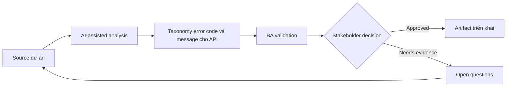

# Taxonomy error code và message cho API

<div class="case-meta">
  <span>Backend and API</span>
  <span>Error handling</span>
  <span>Use case dự án</span>
</div>

## Project context

Mobile app consume backend API trả error inconsistent. Một số error generic, một số expose technical detail, một số không cho UI biết user action nào possible. Trong môi trường delivery thật, tình huống này thường xuất hiện dưới áp lực thời gian: stakeholder cần clarity, delivery cần backlog, QA cần behavior test được, operations cần process chịu được exception. BA dùng AI để tăng tốc analysis và synthesis, nhưng BA vẫn chịu trách nhiệm về evidence, business meaning, stakeholder decisioning và artifact quality.

## BA challenge

BA phải define error taxonomy như product behavior. Error code cần support user guidance, support diagnostics, security, retry logic và QA testability. Khó khăn thực tế là AI có thể làm material ban đầu trông hoàn chỉnh hơn mức thật sự. BA giỏi giữ output ở trạng thái reviewable bằng cách tách source-backed fact, assumption, unsupported claim, decision gap và recommended next action. Mục tiêu không phải làm document dài hơn; mục tiêu là làm project decision rõ hơn và an toàn hơn.

## Where AI fits

<div class="ba-workbench-panel">
AI hữu ích trong use case này khi được giới hạn vào analysis support, pattern detection, structured drafting và critique. AI không được approve scope, invent policy, quyết định business trade-off hoặc thay thế judgment của stakeholder chịu trách nhiệm.
</div>

- Cluster existing API error thành business category.
- Draft error taxonomy có frontend action và support meaning.
- Identify message sensitive về security cần safe wording.
- Generate negative API test scenario.

## Inputs to prepare

- Existing error responses
- API contract
- Security guidelines
- Support runbooks
- UI error message catalog

BA nên label các input này trước khi dùng AI: source owner, source date, approval status, sensitivity level, và source đó là fact, opinion, policy, draft hay historical evidence. Việc chuẩn bị này ngăn model xem mọi input đều current và authoritative như nhau.

## BA workflow

1. Inventory current error response và user-facing effect.
2. Yêu cầu AI cluster error theo business condition và recovery action.
3. Define error code, HTTP status, safe message, frontend action, support meaning và retry behavior.
4. Review error sensitive với security owner.
5. Thêm acceptance criteria cho negative case và retry behavior.
6. Publish taxonomy và update frontend copy.

Workflow hiệu quả nhất khi dùng AI theo từng stage: trước hết organize evidence, sau đó yêu cầu analysis, tiếp theo tạo artifact, rồi chạy critique pass. BA nên giữ decision log visible xuyên suốt để suggestion do AI sinh ra không âm thầm trở thành approved scope.

## Diagram



## Deliverables

| Deliverable | Nội dung | Owner | Done signal |
| --- | --- | --- | --- |
| Error taxonomy | Condition, code, status, safe message, frontend action và retry behavior | BA và backend | Error consistent |
| Security message review | Sensitive error, exposure risk, safe copy và approval | Security | Message không leak internals |
| Frontend error action map | Code, UI message, user action, support path và analytics | Frontend và UX | UI guide được recovery |
| Negative test set | Input, expected error code, expected UI và support meaning | QA | Error behavior testable |

Các deliverable này nên được xem là artifact do BA own. AI có thể draft, nhưng BA phải validate source support, stakeholder meaning, traceability và artifact đã sẵn sàng handoff hay chưa.

## Prompt to try

```text
Hãy đóng vai senior Business Analyst hiểu AI. Hỗ trợ tôi áp dụng use case "Taxonomy error code và message cho API" vào dự án. Trước hết hỏi source evidence và constraint. Sau đó tạo structured analysis gồm project context, assumption, AI-fit boundary, workflow step, deliverable, risk, control, open question và stakeholder decision. Không tự bịa policy, threshold hoặc approval.
```

## Review checklist

- Mọi statement do AI hỗ trợ đều gắn với source, assumption hoặc validation question.
- BA đã tách drafting assistance khỏi business approval.
- Workflow step có human owner cho decision, review và exception.
- Deliverable trace được về project input và review được bởi QA, product hoặc operations.
- Risk control đủ thực tế để dùng trong meeting dự án thật.
- Success metric: API error trở thành product behavior consistent để frontend, QA và support sử dụng.

## Risks and controls

| Rủi ro | Vì sao quan trọng | Control của BA |
| --- | --- | --- |
| Generic error | User không recover và support không diagnose được | Map từng error tới user/support action |
| Sensitive leakage | Error có thể expose system internal | Dùng safe message và security review |
| Retry confusion | UI retry khi không nên retry | Define retryable vs non-retryable |
| Inconsistent teams | API dùng code khác nhau cho cùng condition | Publish shared taxonomy |

Control quan trọng nhất là làm uncertainty visible. Nếu evidence yếu, output nên tạo validation question hoặc decision item, không phải final requirement. Nếu artifact ảnh hưởng delivery, release, compliance, customer experience hoặc operational workload, BA nên yêu cầu human review explicit trước khi handoff.
