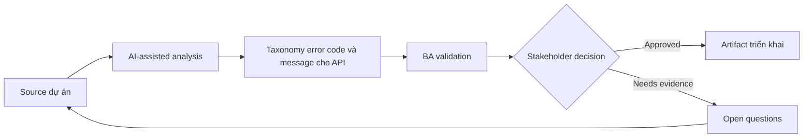

# Taxonomy error code và message cho API

<div class="case-meta">
  <span>Backend and API</span>
  <span>Error handling</span>
  <span>Backend/API refinement</span>
  <span>Practitioner</span>
  <span>Error taxonomy</span>
  <span>Use case dự án</span>
</div>

## Project context

Mobile app consume backend API trả error inconsistent. Một số error generic, một số expose technical detail, một số không cho UI biết user action nào possible. Trong Error handling, công việc này thường bắt đầu khi API contract, permission, error, audit và operational behavior phải đủ explicit cho backend delivery. BA nên xem Existing error responses và API contract là evidence cần organize, không phải raw material để AI trả lời không kiểm soát. Mục tiêu là làm decision tiếp theo rõ hơn cho người own outcome.

## BA challenge

BA phải define error taxonomy như product behavior. Error code cần support user guidance, support diagnostics, security, retry logic và QA testability. Với Taxonomy error code và message cho API, khó khăn thực tế là service behavior mơ hồ và security gap. AI có thể tăng tốc contract critique, rule extraction, error taxonomy, permission review và NFR gap detection, nhưng BA vẫn phải làm rõ assumption, approval còn thiếu và điểm cần stakeholder judgment.

## Where AI fits

<div class="ba-workbench-panel">
AI phù hợp với use case Backend và API khi được giới hạn vào contract critique, rule extraction, error taxonomy, permission review và NFR gap detection. AI task hữu ích đầu tiên là: Cluster existing API error thành business category. AI không được approve scope, invent policy, bỏ qua API draft, data model, auth rule, error sample, audit policy và integration need, hoặc biến draft thành final decision.
</div>

- Cluster existing API error thành business category.
- Draft error taxonomy có frontend action và support meaning.
- Identify message sensitive về security cần safe wording.
- Generate negative API test scenario.

## Inputs to prepare

- Existing error responses
- API contract
- Security guidelines
- Support runbooks
- UI error message catalog

Trước khi prompt cho Taxonomy error code và message cho API, hãy label từng input theo owner, date, approval status, sensitivity và vai trò trong decision. Evidence lens quan trọng nhất là API draft, data model, auth rule, error sample, audit policy và integration need; nếu thiếu, AI có thể xem old note, draft design và approved rule có authority như nhau.

## BA workflow

1. Inventory current error response và user-facing effect.
2. Yêu cầu AI cluster error theo business condition và recovery action.
3. Define error code, HTTP status, safe message, frontend action, support meaning và retry behavior.
4. Review error sensitive với security owner.
5. Thêm acceptance criteria cho negative case và retry behavior.
6. Publish taxonomy và update frontend copy.

Chạy workflow như contract validation trước implementation: bắt đầu với "Inventory current error response và user-facing effect.", sau đó giữ decision log visible khi artifact tiến tới Error taxonomy. Cách này ngăn suggestion của AI âm thầm trở thành backlog, design, release hoặc operational commitment.

## Diagram



## Deliverables

| Deliverable | Nội dung | Owner | Done signal |
| --- | --- | --- | --- |
| Error taxonomy | Condition, code, status, safe message, frontend action và retry behavior | BA và backend | Error consistent |
| Security message review | Sensitive error, exposure risk, safe copy và approval | Security | Message không leak internals |
| Frontend error action map | Code, UI message, user action, support path và analytics | Frontend và UX | UI guide được recovery |
| Negative test set | Input, expected error code, expected UI và support meaning | QA | Error behavior testable |

Hãy xem Error taxonomy là backend behavior contract do BA own. AI có thể draft structure, nhưng BA phải validate "Error consistent" có thật sự đúng không, artifact có trace được về evidence không và receiving team có hành động được không.

## Prompt to try

```text
Hãy đóng vai senior Business Analyst hiểu AI. Hỗ trợ tôi áp dụng use case "Taxonomy error code và message cho API" vào dự án. Trước hết hỏi source evidence và constraint. Sau đó tạo structured analysis gồm project context, assumption, AI-fit boundary, workflow step, deliverable, risk, control, open question và stakeholder decision. Không tự bịa policy, threshold hoặc approval.
```

## Review checklist

- Existing error responses được label owner, date, approval status và sensitivity.
- Error taxonomy trace được về source evidence và có human owner rõ.
- AI task nằm trong boundary contract critique, rule extraction, error taxonomy, permission review và NFR gap detection và không approve scope hoặc policy.
- Risk "Generic error" có control thực tế: Map từng error tới user/support action.
- Open assumption được chuyển thành validation question hoặc stakeholder decision.
- Success metric: API error trở thành product behavior consistent để frontend, QA và support sử dụng.

## Risks and controls

| Rủi ro | Vì sao quan trọng | Control của BA |
| --- | --- | --- |
| Generic error | User không recover và support không diagnose được | Map từng error tới user/support action |
| Sensitive leakage | Error có thể expose system internal | Dùng safe message và security review |
| Retry confusion | UI retry khi không nên retry | Define retryable vs non-retryable |
| Inconsistent teams | API dùng code khác nhau cho cùng condition | Publish shared taxonomy |

Control chính cho risk "Generic error" là human accountability explicit: Map từng error tới user/support action. Nếu evidence yếu, output nên tạo validation question hoặc decision item, không phải final requirement.
