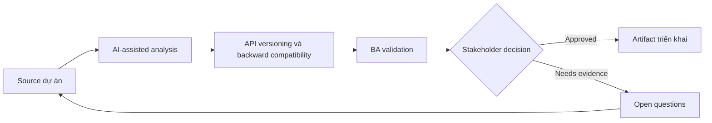

# API versioning và backward compatibility

<div class="case-meta">
  <span>Backend and API</span>
  <span>API lifecycle</span>
  <span>Use case dự án</span>
</div>

## Project context

Public API được partner dùng cần thêm field và behavior mới. Một số partner không upgrade nhanh được, breaking change có thể disrupt revenue operations. Trong môi trường delivery thật, tình huống này thường xuất hiện dưới áp lực thời gian: stakeholder cần clarity, delivery cần backlog, QA cần behavior test được, operations cần process chịu được exception. BA dùng AI để tăng tốc analysis và synthesis, nhưng BA vẫn chịu trách nhiệm về evidence, business meaning, stakeholder decisioning và artifact quality.

## BA challenge

BA phải specify versioning và compatibility behavior bằng business term: ai affected, change nào breaking, migration timeline, deprecation communication và support path. Khó khăn thực tế là AI có thể làm material ban đầu trông hoàn chỉnh hơn mức thật sự. BA giỏi giữ output ở trạng thái reviewable bằng cách tách source-backed fact, assumption, unsupported claim, decision gap và recommended next action. Mục tiêu không phải làm document dài hơn; mục tiêu là làm project decision rõ hơn và an toàn hơn.

## Where AI fits

<div class="ba-workbench-panel">
AI hữu ích trong use case này khi được giới hạn vào analysis support, pattern detection, structured drafting và critique. AI không được approve scope, invent policy, quyết định business trade-off hoặc thay thế judgment của stakeholder chịu trách nhiệm.
</div>

- Classify proposed API change là breaking hoặc non-breaking.
- Generate partner impact question và migration scenario.
- Draft deprecation communication requirement.
- Tạo compatibility test case.

## Inputs to prepare

- Existing API contract
- Proposed changes
- Partner usage data
- Support commitments
- Deprecation policy

BA nên label các input này trước khi dùng AI: source owner, source date, approval status, sensitivity level, và source đó là fact, opinion, policy, draft hay historical evidence. Việc chuẩn bị này ngăn model xem mọi input đều current và authoritative như nhau.

## BA workflow

1. Inventory current consumer và usage pattern.
2. Yêu cầu AI classify change impact và identify migration question.
3. Define versioning strategy, compatibility behavior và support window.
4. Review revenue và partner impact với business owner.
5. Tạo migration, documentation và communication requirement.
6. Thêm compatibility và regression test cho version cũ và mới.

Workflow hiệu quả nhất khi dùng AI theo từng stage: trước hết organize evidence, sau đó yêu cầu analysis, tiếp theo tạo artifact, rồi chạy critique pass. BA nên giữ decision log visible xuyên suốt để suggestion do AI sinh ra không âm thầm trở thành approved scope.

## Diagram



## Deliverables

| Deliverable | Nội dung | Owner | Done signal |
| --- | --- | --- | --- |
| Change impact matrix | Change, breaking status, affected consumer, mitigation và owner | BA | Impact visible |
| Versioning requirement | Version strategy, support window, default behavior và migration path | Backend | Compatibility behavior rõ |
| Partner communication plan | Notice, documentation, timeline, support và escalation | Partner manager | Partner biết cần làm gì |
| Compatibility test set | Old contract, new contract, edge case và regression expectation | QA | Behavior cũ và mới được test |

Các deliverable này nên được xem là artifact do BA own. AI có thể draft, nhưng BA phải validate source support, stakeholder meaning, traceability và artifact đã sẵn sàng handoff hay chưa.

## Prompt to try

```text
Hãy đóng vai senior Business Analyst hiểu AI. Hỗ trợ tôi áp dụng use case "API versioning và backward compatibility" vào dự án. Trước hết hỏi source evidence và constraint. Sau đó tạo structured analysis gồm project context, assumption, AI-fit boundary, workflow step, deliverable, risk, control, open question và stakeholder decision. Không tự bịa policy, threshold hoặc approval.
```

## Review checklist

- Mọi statement do AI hỗ trợ đều gắn với source, assumption hoặc validation question.
- BA đã tách drafting assistance khỏi business approval.
- Workflow step có human owner cho decision, review và exception.
- Deliverable trace được về project input và review được bởi QA, product hoặc operations.
- Risk control đủ thực tế để dùng trong meeting dự án thật.
- Success metric: API change ship với compatibility behavior, migration support và partner impact visibility rõ.

## Risks and controls

| Rủi ro | Vì sao quan trọng | Control của BA |
| --- | --- | --- |
| Unexpected breaking change | Partner có thể fail sau release | Classify và test breaking change |
| Communication gap | Consumer không biết migration timeline | Define notice và support plan |
| Long tail support | Old version có thể linger | Set deprecation window và owner |
| Revenue disruption | Critical partner có thể affected | Prioritize partner impact review |

Control quan trọng nhất là làm uncertainty visible. Nếu evidence yếu, output nên tạo validation question hoặc decision item, không phải final requirement. Nếu artifact ảnh hưởng delivery, release, compliance, customer experience hoặc operational workload, BA nên yêu cầu human review explicit trước khi handoff.
