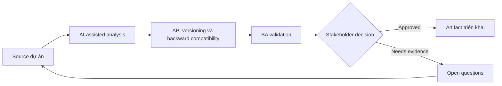

# API versioning và backward compatibility

<div class="case-meta">
  <span>Backend and API</span>
  <span>API lifecycle</span>
  <span>Backend/API refinement</span>
  <span>Practitioner</span>
  <span>Change impact matrix</span>
  <span>Use case dự án</span>
</div>

## Project context

Public API được partner dùng cần thêm field và behavior mới. Một số partner không upgrade nhanh được, breaking change có thể disrupt revenue operations. Trong API lifecycle, công việc này thường bắt đầu khi API contract, permission, error, audit và operational behavior phải đủ explicit cho backend delivery. BA nên xem Existing API contract và Proposed changes là evidence cần organize, không phải raw material để AI trả lời không kiểm soát. Mục tiêu là làm decision tiếp theo rõ hơn cho người own outcome.

## BA challenge

BA phải specify versioning và compatibility behavior bằng business term: ai affected, change nào breaking, migration timeline, deprecation communication và support path. Với API versioning và backward compatibility, khó khăn thực tế là service behavior mơ hồ và security gap. AI có thể tăng tốc contract critique, rule extraction, error taxonomy, permission review và NFR gap detection, nhưng BA vẫn phải làm rõ assumption, approval còn thiếu và điểm cần stakeholder judgment.

## Where AI fits

<div class="ba-workbench-panel">
AI phù hợp với use case Backend và API khi được giới hạn vào contract critique, rule extraction, error taxonomy, permission review và NFR gap detection. AI task hữu ích đầu tiên là: Classify proposed API change là breaking hoặc non-breaking. AI không được approve scope, invent policy, bỏ qua API draft, data model, auth rule, error sample, audit policy và integration need, hoặc biến draft thành final decision.
</div>

- Classify proposed API change là breaking hoặc non-breaking.
- Generate partner impact question và migration scenario.
- Draft deprecation communication requirement.
- Tạo compatibility test case.

## Inputs to prepare

- Existing API contract
- Proposed changes
- Partner usage data
- Support commitments
- Deprecation policy

Trước khi prompt cho API versioning và backward compatibility, hãy label từng input theo owner, date, approval status, sensitivity và vai trò trong decision. Evidence lens quan trọng nhất là API draft, data model, auth rule, error sample, audit policy và integration need; nếu thiếu, AI có thể xem old note, draft design và approved rule có authority như nhau.

## BA workflow

1. Inventory current consumer và usage pattern.
2. Yêu cầu AI classify change impact và identify migration question.
3. Define versioning strategy, compatibility behavior và support window.
4. Review revenue và partner impact với business owner.
5. Tạo migration, documentation và communication requirement.
6. Thêm compatibility và regression test cho version cũ và mới.

Chạy workflow như contract validation trước implementation: bắt đầu với "Inventory current consumer và usage pattern.", sau đó giữ decision log visible khi artifact tiến tới Change impact matrix. Cách này ngăn suggestion của AI âm thầm trở thành backlog, design, release hoặc operational commitment.

## Diagram



## Deliverables

| Deliverable | Nội dung | Owner | Done signal |
| --- | --- | --- | --- |
| Change impact matrix | Change, breaking status, affected consumer, mitigation và owner | BA | Impact visible |
| Versioning requirement | Version strategy, support window, default behavior và migration path | Backend | Compatibility behavior rõ |
| Partner communication plan | Notice, documentation, timeline, support và escalation | Partner manager | Partner biết cần làm gì |
| Compatibility test set | Old contract, new contract, edge case và regression expectation | QA | Behavior cũ và mới được test |

Hãy xem Change impact matrix là backend behavior contract do BA own. AI có thể draft structure, nhưng BA phải validate "Impact visible" có thật sự đúng không, artifact có trace được về evidence không và receiving team có hành động được không.

## Prompt to try

```text
Hãy đóng vai senior Business Analyst hiểu AI. Hỗ trợ tôi áp dụng use case "API versioning và backward compatibility" vào dự án. Trước hết hỏi source evidence và constraint. Sau đó tạo structured analysis gồm project context, assumption, AI-fit boundary, workflow step, deliverable, risk, control, open question và stakeholder decision. Không tự bịa policy, threshold hoặc approval.
```

## Review checklist

- Existing API contract được label owner, date, approval status và sensitivity.
- Change impact matrix trace được về source evidence và có human owner rõ.
- AI task nằm trong boundary contract critique, rule extraction, error taxonomy, permission review và NFR gap detection và không approve scope hoặc policy.
- Risk "Unexpected breaking change" có control thực tế: Classify và test breaking change.
- Open assumption được chuyển thành validation question hoặc stakeholder decision.
- Success metric: API change ship với compatibility behavior, migration support và partner impact visibility rõ.

## Risks and controls

| Rủi ro | Vì sao quan trọng | Control của BA |
| --- | --- | --- |
| Unexpected breaking change | Partner có thể fail sau release | Classify và test breaking change |
| Communication gap | Consumer không biết migration timeline | Define notice và support plan |
| Long tail support | Old version có thể linger | Set deprecation window và owner |
| Revenue disruption | Critical partner có thể affected | Prioritize partner impact review |

Control chính cho risk "Unexpected breaking change" là human accountability explicit: Classify và test breaking change. Nếu evidence yếu, output nên tạo validation question hoặc decision item, không phải final requirement.
