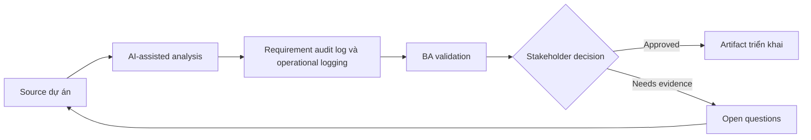

# Requirement audit log và operational logging

<div class="case-meta">
  <span>Backend and API</span>
  <span>Audit and observability</span>
  <span>Use case dự án</span>
</div>

## Project context

Regulated admin module cho user đổi customer status, override limit, export data và approve exception. Compliance hỏi evidence nào tồn tại khi decision bị challenge. Trong môi trường delivery thật, tình huống này thường xuất hiện dưới áp lực thời gian: stakeholder cần clarity, delivery cần backlog, QA cần behavior test được, operations cần process chịu được exception. BA dùng AI để tăng tốc analysis và synthesis, nhưng BA vẫn chịu trách nhiệm về evidence, business meaning, stakeholder decisioning và artifact quality.

## BA challenge

BA phải tách audit log cho accountability khỏi operational log cho support và monitoring. Requirement cần define event, actor, timestamp, before/after value, reason, correlation ID, retention và access. Khó khăn thực tế là AI có thể làm material ban đầu trông hoàn chỉnh hơn mức thật sự. BA giỏi giữ output ở trạng thái reviewable bằng cách tách source-backed fact, assumption, unsupported claim, decision gap và recommended next action. Mục tiêu không phải làm document dài hơn; mục tiêu là làm project decision rõ hơn và an toàn hơn.

## Where AI fits

<div class="ba-workbench-panel">
AI hữu ích trong use case này khi được giới hạn vào analysis support, pattern detection, structured drafting và critique. AI không được approve scope, invent policy, quyết định business trade-off hoặc thay thế judgment của stakeholder chịu trách nhiệm.
</div>

- Generate audit event candidate từ sensitive workflow.
- Identify missing reason code và before/after field.
- Draft operational logging question cho support diagnostics.
- Tạo retention và access control checklist.

## Inputs to prepare

- Sensitive action list
- Compliance policy
- Support runbook
- Data retention rules
- Admin workflow specs

BA nên label các input này trước khi dùng AI: source owner, source date, approval status, sensitivity level, và source đó là fact, opinion, policy, draft hay historical evidence. Việc chuẩn bị này ngăn model xem mọi input đều current và authoritative như nhau.

## BA workflow

1. List action cần accountability, support diagnostics hoặc monitoring.
2. Yêu cầu AI draft audit và operational event catalog.
3. Define required field, reason code, correlation ID và retention.
4. Review access rule cho người được view log.
5. Thêm acceptance criteria cho log creation, export và search.
6. Tạo QA scenario cho sensitive action và failed attempt.

Workflow hiệu quả nhất khi dùng AI theo từng stage: trước hết organize evidence, sau đó yêu cầu analysis, tiếp theo tạo artifact, rồi chạy critique pass. BA nên giữ decision log visible xuyên suốt để suggestion do AI sinh ra không âm thầm trở thành approved scope.

## Diagram



## Deliverables

| Deliverable | Nội dung | Owner | Done signal |
| --- | --- | --- | --- |
| Audit event catalog | Action, actor, before/after value, reason, source và retention | BA và compliance | Audit evidence complete |
| Operational log requirements | Event, correlation ID, diagnostic field, severity và owner | Operations | Support diagnose được issue |
| Reason code set | Allowed reason, khi required, reviewer và reporting use | Product owner | Sensitive action có rationale |
| Log access matrix | Role, log type, visibility, export và retention | Security | Log protected |

Các deliverable này nên được xem là artifact do BA own. AI có thể draft, nhưng BA phải validate source support, stakeholder meaning, traceability và artifact đã sẵn sàng handoff hay chưa.

## Prompt to try

```text
Hãy đóng vai senior Business Analyst hiểu AI. Hỗ trợ tôi áp dụng use case "Requirement audit log và operational logging" vào dự án. Trước hết hỏi source evidence và constraint. Sau đó tạo structured analysis gồm project context, assumption, AI-fit boundary, workflow step, deliverable, risk, control, open question và stakeholder decision. Không tự bịa policy, threshold hoặc approval.
```

## Review checklist

- Mọi statement do AI hỗ trợ đều gắn với source, assumption hoặc validation question.
- BA đã tách drafting assistance khỏi business approval.
- Workflow step có human owner cho decision, review và exception.
- Deliverable trace được về project input và review được bởi QA, product hoặc operations.
- Risk control đủ thực tế để dùng trong meeting dự án thật.
- Success metric: Sensitive backend action tạo audit evidence và operational log support compliance và support work.

## Risks and controls

| Rủi ro | Vì sao quan trọng | Control của BA |
| --- | --- | --- |
| Audit gap | Decision không reconstruct được sau này | Capture actor, reason, source và before/after value |
| Log leakage | Log có thể expose sensitive data | Define access và masking |
| Operational blindness | Support không trace được failure | Specify correlation ID và diagnostic event |
| Reason quality | User chọn reason vô nghĩa | Use controlled reason code và comment khi cần |

Control quan trọng nhất là làm uncertainty visible. Nếu evidence yếu, output nên tạo validation question hoặc decision item, không phải final requirement. Nếu artifact ảnh hưởng delivery, release, compliance, customer experience hoặc operational workload, BA nên yêu cầu human review explicit trước khi handoff.
