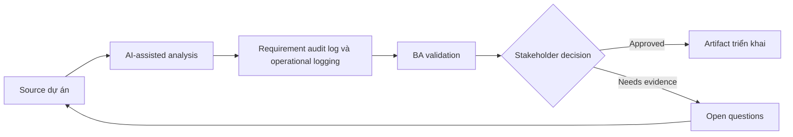

# Requirement audit log và operational logging

<div class="case-meta">
  <span>Backend and API</span>
  <span>Audit and observability</span>
  <span>Use case dự án</span>
</div>

## Project context

Regulated admin module cho user đổi customer status, override limit, export data và approve exception. Compliance hỏi evidence nào tồn tại khi decision bị challenge. Trong Audit and observability, công việc này thường bắt đầu khi API contract, permission, error, audit và operational behavior phải đủ explicit cho backend delivery. BA nên xem Sensitive action list và Compliance policy là evidence cần organize, không phải raw material để AI trả lời không kiểm soát. Mục tiêu là làm decision tiếp theo rõ hơn cho người own outcome.

## BA challenge

BA phải tách audit log cho accountability khỏi operational log cho support và monitoring. Requirement cần define event, actor, timestamp, before/after value, reason, correlation ID, retention và access. Với Requirement audit log và operational logging, khó khăn thực tế là service behavior mơ hồ và security gap. AI có thể tăng tốc contract critique, rule extraction, error taxonomy, permission review và NFR gap detection, nhưng BA vẫn phải làm rõ assumption, approval còn thiếu và điểm cần stakeholder judgment.

## Where AI fits

<div class="ba-workbench-panel">
AI phù hợp với use case Backend và API khi được giới hạn vào contract critique, rule extraction, error taxonomy, permission review và NFR gap detection. AI task hữu ích đầu tiên là: Generate audit event candidate từ sensitive workflow. AI không được approve scope, invent policy, bỏ qua API draft, data model, auth rule, error sample, audit policy và integration need, hoặc biến draft thành final decision.
</div>

- Generate audit event candidate từ sensitive workflow.
- Identify missing reason code và before/after field.
- Draft operational logging question cho support diagnostics.
- Tạo retention và access control checklist.

## Inputs to prepare

- Sensitive action list
- Compliance policy
- Support runbook
- Data retention rules
- Admin workflow specs

Trước khi prompt cho Requirement audit log và operational logging, hãy label từng input theo owner, date, approval status, sensitivity và vai trò trong decision. Evidence lens quan trọng nhất là API draft, data model, auth rule, error sample, audit policy và integration need; nếu thiếu, AI có thể xem old note, draft design và approved rule có authority như nhau.

## BA workflow

1. List action cần accountability, support diagnostics hoặc monitoring.
2. Yêu cầu AI draft audit và operational event catalog.
3. Define required field, reason code, correlation ID và retention.
4. Review access rule cho người được view log.
5. Thêm acceptance criteria cho log creation, export và search.
6. Tạo QA scenario cho sensitive action và failed attempt.

Chạy workflow như contract validation trước implementation: bắt đầu với "List action cần accountability, support diagnostics hoặc monitoring.", sau đó giữ decision log visible khi artifact tiến tới Audit event catalog. Cách này ngăn suggestion của AI âm thầm trở thành backlog, design, release hoặc operational commitment.

## Diagram



## Deliverables

| Deliverable | Nội dung | Owner | Done signal |
| --- | --- | --- | --- |
| Audit event catalog | Action, actor, before/after value, reason, source và retention | BA và compliance | Audit evidence complete |
| Operational log requirements | Event, correlation ID, diagnostic field, severity và owner | Operations | Support diagnose được issue |
| Reason code set | Allowed reason, khi required, reviewer và reporting use | Product owner | Sensitive action có rationale |
| Log access matrix | Role, log type, visibility, export và retention | Security | Log protected |

Hãy xem Audit event catalog là backend behavior contract do BA own. AI có thể draft structure, nhưng BA phải validate "Audit evidence complete" có thật sự đúng không, artifact có trace được về evidence không và receiving team có hành động được không.

## Prompt to try

```text
Hãy đóng vai senior Business Analyst hiểu AI. Hỗ trợ tôi áp dụng use case "Requirement audit log và operational logging" vào dự án. Trước hết hỏi source evidence và constraint. Sau đó tạo structured analysis gồm project context, assumption, AI-fit boundary, workflow step, deliverable, risk, control, open question và stakeholder decision. Không tự bịa policy, threshold hoặc approval.
```

## Review checklist

- Sensitive action list được label owner, date, approval status và sensitivity.
- Audit event catalog trace được về source evidence và có human owner rõ.
- AI task nằm trong boundary contract critique, rule extraction, error taxonomy, permission review và NFR gap detection và không approve scope hoặc policy.
- Risk "Audit gap" có control thực tế: Capture actor, reason, source và before/after value.
- Open assumption được chuyển thành validation question hoặc stakeholder decision.
- Success metric: Sensitive backend action tạo audit evidence và operational log support compliance và support work.

## Risks and controls

| Rủi ro | Vì sao quan trọng | Control của BA |
| --- | --- | --- |
| Audit gap | Decision không reconstruct được sau này | Capture actor, reason, source và before/after value |
| Log leakage | Log có thể expose sensitive data | Define access và masking |
| Operational blindness | Support không trace được failure | Specify correlation ID và diagnostic event |
| Reason quality | User chọn reason vô nghĩa | Use controlled reason code và comment khi cần |

Control chính cho risk "Audit gap" là human accountability explicit: Capture actor, reason, source và before/after value. Nếu evidence yếu, output nên tạo validation question hoặc decision item, không phải final requirement.
