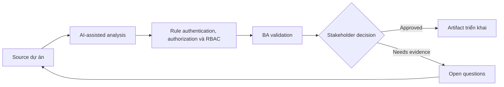

# Rule authentication, authorization và RBAC

<div class="case-meta">
  <span>Backend and API</span>
  <span>Authorization</span>
  <span>Use case dự án</span>
</div>

## Project context

SaaS admin system giới thiệu tenant admin, billing admin, read-only auditor và external partner. Role permission ảnh hưởng screen, API, export, approval và audit log. Trong môi trường delivery thật, tình huống này thường xuất hiện dưới áp lực thời gian: stakeholder cần clarity, delivery cần backlog, QA cần behavior test được, operations cần process chịu được exception. BA dùng AI để tăng tốc analysis và synthesis, nhưng BA vẫn chịu trách nhiệm về evidence, business meaning, stakeholder decisioning và artifact quality.

## BA challenge

BA phải tạo RBAC requirement đủ precise cho backend enforcement và frontend behavior. BA cũng phải capture authentication assumption, session behavior, escalation và audit need. Khó khăn thực tế là AI có thể làm material ban đầu trông hoàn chỉnh hơn mức thật sự. BA giỏi giữ output ở trạng thái reviewable bằng cách tách source-backed fact, assumption, unsupported claim, decision gap và recommended next action. Mục tiêu không phải làm document dài hơn; mục tiêu là làm project decision rõ hơn và an toàn hơn.

## Where AI fits

<div class="ba-workbench-panel">
AI hữu ích trong use case này khi được giới hạn vào analysis support, pattern detection, structured drafting và critique. AI không được approve scope, invent policy, quyết định business trade-off hoặc thay thế judgment của stakeholder chịu trách nhiệm.
</div>

- Generate permission matrix từ role và user task.
- Identify conflicting permission và segregation-of-duty risk.
- Draft API authorization scenario và UI visibility rule.
- Tạo QA case cho unauthorized access và audit event.

## Inputs to prepare

- Role definitions
- User task list
- API operations
- Screen list
- Security và audit policy

BA nên label các input này trước khi dùng AI: source owner, source date, approval status, sensitivity level, và source đó là fact, opinion, policy, draft hay historical evidence. Việc chuẩn bị này ngăn model xem mọi input đều current và authoritative như nhau.

## BA workflow

1. List role, business task, screen, data object và API operation.
2. Yêu cầu AI draft permission matrix và find conflict.
3. Review matrix với security, product, backend, frontend và operations.
4. Define authentication và session behavior khi relevant.
5. Tạo acceptance criteria cho allowed và blocked action.
6. Thêm audit/reporting requirement cho sensitive action.

Workflow hiệu quả nhất khi dùng AI theo từng stage: trước hết organize evidence, sau đó yêu cầu analysis, tiếp theo tạo artifact, rồi chạy critique pass. BA nên giữ decision log visible xuyên suốt để suggestion do AI sinh ra không âm thầm trở thành approved scope.

## Diagram



## Deliverables

| Deliverable | Nội dung | Owner | Done signal |
| --- | --- | --- | --- |
| RBAC matrix | Role, task, data object, API operation, UI behavior và audit | BA và security | Permission explicit |
| Authorization scenario set | Allowed, denied, cross-tenant, expired session và escalation case | QA | Security case testable |
| Segregation risk list | Conflicting role, sensitive action và approval rule | Security | High-risk combination controlled |
| Session behavior spec | Login, timeout, refresh, logout và re-authentication rule | Backend | Auth behavior predictable |

Các deliverable này nên được xem là artifact do BA own. AI có thể draft, nhưng BA phải validate source support, stakeholder meaning, traceability và artifact đã sẵn sàng handoff hay chưa.

## Prompt to try

```text
Hãy đóng vai senior Business Analyst hiểu AI. Hỗ trợ tôi áp dụng use case "Rule authentication, authorization và RBAC" vào dự án. Trước hết hỏi source evidence và constraint. Sau đó tạo structured analysis gồm project context, assumption, AI-fit boundary, workflow step, deliverable, risk, control, open question và stakeholder decision. Không tự bịa policy, threshold hoặc approval.
```

## Review checklist

- Mọi statement do AI hỗ trợ đều gắn với source, assumption hoặc validation question.
- BA đã tách drafting assistance khỏi business approval.
- Workflow step có human owner cho decision, review và exception.
- Deliverable trace được về project input và review được bởi QA, product hoặc operations.
- Risk control đủ thực tế để dùng trong meeting dự án thật.
- Success metric: RBAC behavior enforce được bởi backend, dễ hiểu trên UI và testable bởi QA.

## Risks and controls

| Rủi ro | Vì sao quan trọng | Control của BA |
| --- | --- | --- |
| Role ambiguity | Cùng role name có thể có permission khác | Define permission theo task và data object |
| Backend-only thinking | UI behavior có thể không match authorization | Trace backend permission tới UI state |
| Tenant leakage | Cross-tenant access rất nghiêm trọng | Thêm cross-tenant negative scenario |
| Missing audit | Sensitive action có thể thiếu trace | Specify audit event và reportability |

Control quan trọng nhất là làm uncertainty visible. Nếu evidence yếu, output nên tạo validation question hoặc decision item, không phải final requirement. Nếu artifact ảnh hưởng delivery, release, compliance, customer experience hoặc operational workload, BA nên yêu cầu human review explicit trước khi handoff.
