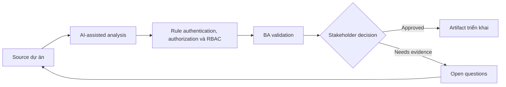

# Rule authentication, authorization và RBAC

<div class="case-meta">
  <span>Backend and API</span>
  <span>Authorization</span>
  <span>Backend/API refinement</span>
  <span>Practitioner</span>
  <span>RBAC matrix</span>
  <span>Use case dự án</span>
</div>

## Project context

SaaS admin system giới thiệu tenant admin, billing admin, read-only auditor và external partner. Role permission ảnh hưởng screen, API, export, approval và audit log. Trong Authorization, công việc này thường bắt đầu khi API contract, permission, error, audit và operational behavior phải đủ explicit cho backend delivery. BA nên xem Role definitions và User task list là evidence cần organize, không phải raw material để AI trả lời không kiểm soát. Mục tiêu là làm decision tiếp theo rõ hơn cho người own outcome.

## BA challenge

BA phải tạo RBAC requirement đủ precise cho backend enforcement và frontend behavior. BA cũng phải capture authentication assumption, session behavior, escalation và audit need. Với Rule authentication, authorization và RBAC, khó khăn thực tế là service behavior mơ hồ và security gap. AI có thể tăng tốc contract critique, rule extraction, error taxonomy, permission review và NFR gap detection, nhưng BA vẫn phải làm rõ assumption, approval còn thiếu và điểm cần stakeholder judgment.

## Where AI fits

<div class="ba-workbench-panel">
AI phù hợp với use case Backend và API khi được giới hạn vào contract critique, rule extraction, error taxonomy, permission review và NFR gap detection. AI task hữu ích đầu tiên là: Generate permission matrix từ role và user task. AI không được approve scope, invent policy, bỏ qua API draft, data model, auth rule, error sample, audit policy và integration need, hoặc biến draft thành final decision.
</div>

- Generate permission matrix từ role và user task.
- Identify conflicting permission và segregation-of-duty risk.
- Draft API authorization scenario và UI visibility rule.
- Tạo QA case cho unauthorized access và audit event.

## Inputs to prepare

- Role definitions
- User task list
- API operations
- Screen list
- Security và audit policy

Trước khi prompt cho Rule authentication, authorization và RBAC, hãy label từng input theo owner, date, approval status, sensitivity và vai trò trong decision. Evidence lens quan trọng nhất là API draft, data model, auth rule, error sample, audit policy và integration need; nếu thiếu, AI có thể xem old note, draft design và approved rule có authority như nhau.

## BA workflow

1. List role, business task, screen, data object và API operation.
2. Yêu cầu AI draft permission matrix và find conflict.
3. Review matrix với security, product, backend, frontend và operations.
4. Define authentication và session behavior khi relevant.
5. Tạo acceptance criteria cho allowed và blocked action.
6. Thêm audit/reporting requirement cho sensitive action.

Chạy workflow như contract validation trước implementation: bắt đầu với "List role, business task, screen, data object và API operation.", sau đó giữ decision log visible khi artifact tiến tới RBAC matrix. Cách này ngăn suggestion của AI âm thầm trở thành backlog, design, release hoặc operational commitment.

## Diagram



## Deliverables

| Deliverable | Nội dung | Owner | Done signal |
| --- | --- | --- | --- |
| RBAC matrix | Role, task, data object, API operation, UI behavior và audit | BA và security | Permission explicit |
| Authorization scenario set | Allowed, denied, cross-tenant, expired session và escalation case | QA | Security case testable |
| Segregation risk list | Conflicting role, sensitive action và approval rule | Security | High-risk combination controlled |
| Session behavior spec | Login, timeout, refresh, logout và re-authentication rule | Backend | Auth behavior predictable |

Hãy xem RBAC matrix là backend behavior contract do BA own. AI có thể draft structure, nhưng BA phải validate "Permission explicit" có thật sự đúng không, artifact có trace được về evidence không và receiving team có hành động được không.

## Prompt to try

```text
Hãy đóng vai senior Business Analyst hiểu AI. Hỗ trợ tôi áp dụng use case "Rule authentication, authorization và RBAC" vào dự án. Trước hết hỏi source evidence và constraint. Sau đó tạo structured analysis gồm project context, assumption, AI-fit boundary, workflow step, deliverable, risk, control, open question và stakeholder decision. Không tự bịa policy, threshold hoặc approval.
```

## Review checklist

- Role definitions được label owner, date, approval status và sensitivity.
- RBAC matrix trace được về source evidence và có human owner rõ.
- AI task nằm trong boundary contract critique, rule extraction, error taxonomy, permission review và NFR gap detection và không approve scope hoặc policy.
- Risk "Role ambiguity" có control thực tế: Define permission theo task và data object.
- Open assumption được chuyển thành validation question hoặc stakeholder decision.
- Success metric: RBAC behavior enforce được bởi backend, dễ hiểu trên UI và testable bởi QA.

## Risks and controls

| Rủi ro | Vì sao quan trọng | Control của BA |
| --- | --- | --- |
| Role ambiguity | Cùng role name có thể có permission khác | Define permission theo task và data object |
| Backend-only thinking | UI behavior có thể không match authorization | Trace backend permission tới UI state |
| Tenant leakage | Cross-tenant access rất nghiêm trọng | Thêm cross-tenant negative scenario |
| Missing audit | Sensitive action có thể thiếu trace | Specify audit event và reportability |

Control chính cho risk "Role ambiguity" là human accountability explicit: Define permission theo task và data object. Nếu evidence yếu, output nên tạo validation question hoặc decision item, không phải final requirement.
