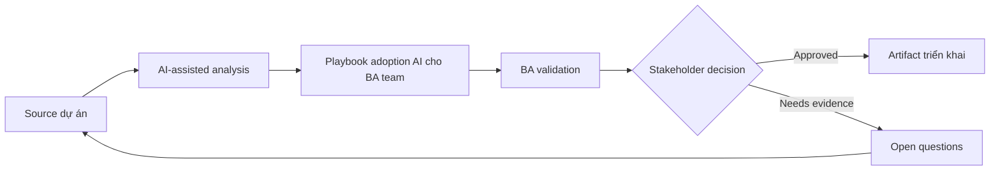

# Playbook adoption AI cho BA team

<div class="case-meta">
  <span>Governance and adoption</span>
  <span>BA practice leadership</span>
  <span>Governance</span>
  <span>Advanced</span>
  <span>Use-case portfolio</span>
  <span>Use case dự án</span>
</div>

## Project context

BA manager muốn scale AI use trong BA practice 20 người. Một số BA advanced, một số skeptical, và chưa có shared standard cho prompt, data handling, review hoặc artifact quality. Trong BA practice leadership, công việc này thường bắt đầu khi cách dùng AI phải scale qua nhiều team mà không leak sensitive data hoặc tạo decision không review được. BA nên xem BA workflow list và Current artifacts là evidence cần organize, không phải raw material để AI trả lời không kiểm soát. Mục tiêu là làm decision tiếp theo rõ hơn cho người own outcome.

## BA challenge

BA lead phải biến AI enthusiasm thành managed capability có use-case tier, training, prompt library, quality gate, governance, measurement và coaching. Adoption phải cải thiện BA quality, không chỉ tăng activity. Với Playbook adoption AI cho BA team, khó khăn thực tế là shadow AI use và accountability yếu. AI có thể tăng tốc portfolio analysis, policy drafting, risk-tiering, playbook creation và adoption measurement, nhưng BA vẫn phải làm rõ assumption, approval còn thiếu và điểm cần stakeholder judgment.

## Where AI fits

<div class="ba-workbench-panel">
AI phù hợp với use case Governance và adoption khi được giới hạn vào portfolio analysis, policy drafting, risk-tiering, playbook creation và adoption measurement. AI task hữu ích đầu tiên là: Inventory BA workflow và classify AI use case theo value và risk. AI không được approve scope, invent policy, bỏ qua data policy, approved tool, risk appetite, audit need và capability của team, hoặc biến draft thành final decision.
</div>

- Inventory BA workflow và classify AI use case theo value và risk.
- Generate standard prompt pattern và review rubric.
- Draft training path theo skill level.
- Tạo adoption metric beyond tool usage.

## Inputs to prepare

- BA workflow list
- Current artifacts
- Tool policy
- Quality pain points
- Team skill assessment

Trước khi prompt cho Playbook adoption AI cho BA team, hãy label từng input theo owner, date, approval status, sensitivity và vai trò trong decision. Evidence lens quan trọng nhất là data policy, approved tool, risk appetite, audit need và capability của team; nếu thiếu, AI có thể xem old note, draft design và approved rule có authority như nhau.

## BA workflow

1. Map BA workflow nơi AI support drafting, synthesis, review và analysis.
2. Classify use case thành low, medium và high-risk tier.
3. Tạo approved prompt pattern có context và evidence rule.
4. Define quality gate cho AI-assisted artifact.
5. Pilot với BA được chọn và measure quality, cycle time và rework.
6. Scale qua coaching, playbook và community review ritual.

Chạy workflow như governance design trước rollout rộng: bắt đầu với "Map BA workflow nơi AI support drafting, synthesis, review và analysis.", sau đó giữ decision log visible khi artifact tiến tới Use-case portfolio. Cách này ngăn suggestion của AI âm thầm trở thành backlog, design, release hoặc operational commitment.

## Diagram



## Deliverables

| Deliverable | Nội dung | Owner | Done signal |
| --- | --- | --- | --- |
| Use-case portfolio | Workflow, value, risk, allowed data, approved tool và review need | BA lead | Use case risk-tiered |
| Prompt and context library | Reusable prompt, input checklist, output schema và review rubric | BA practice | BA reuse shared standard |
| Training plan | Foundation, practitioner, reviewer và lead module | BA manager | Training match skill level |
| Adoption scorecard | Usage, artifact quality, cycle time, defect và rework | Sponsor | Success quality-based |

Hãy xem Use-case portfolio là AI adoption control pack do BA own. AI có thể draft structure, nhưng BA phải validate "Use case risk-tiered" có thật sự đúng không, artifact có trace được về evidence không và receiving team có hành động được không.

## Prompt to try

```text
Hãy đóng vai senior Business Analyst hiểu AI. Hỗ trợ tôi áp dụng use case "Playbook adoption AI cho BA team" vào dự án. Trước hết hỏi source evidence và constraint. Sau đó tạo structured analysis gồm project context, assumption, AI-fit boundary, workflow step, deliverable, risk, control, open question và stakeholder decision. Không tự bịa policy, threshold hoặc approval.
```

## Review checklist

- BA workflow list được label owner, date, approval status và sensitivity.
- Use-case portfolio trace được về source evidence và có human owner rõ.
- AI task nằm trong boundary portfolio analysis, policy drafting, risk-tiering, playbook creation và adoption measurement và không approve scope hoặc policy.
- Risk "Tool-first adoption" có control thực tế: Start từ BA workflow và problem.
- Open assumption được chuyển thành validation question hoặc stakeholder decision.
- Success metric: BA practice adopt AI bằng shared pattern, review gate và quality improvement đo được.

## Risks and controls

| Rủi ro | Vì sao quan trọng | Control của BA |
| --- | --- | --- |
| Tool-first adoption | Team focus tool feature thay vì work quality | Start từ BA workflow và problem |
| Inconsistent artifacts | Mỗi BA có thể tạo standard khác nhau | Dùng shared prompt library và rubric |
| Unsafe data use | Người dùng có thể paste sensitive data vào AI tool | Define approved tool và data rule |
| No quality proof | Adoption nhìn thành công nhưng không cải thiện outcome | Measure defect, rework và stakeholder confidence |

Control chính cho risk "Tool-first adoption" là human accountability explicit: Start từ BA workflow và problem. Nếu evidence yếu, output nên tạo validation question hoặc decision item, không phải final requirement.
