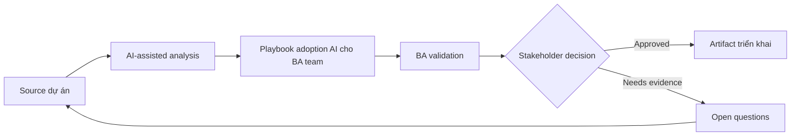

# Playbook adoption AI cho BA team

<div class="case-meta">
  <span>Governance and adoption</span>
  <span>BA practice leadership</span>
  <span>Use case dự án</span>
</div>

## Project context

BA manager muốn scale AI use trong BA practice 20 người. Một số BA advanced, một số skeptical, và chưa có shared standard cho prompt, data handling, review hoặc artifact quality. Trong môi trường delivery thật, tình huống này thường xuất hiện dưới áp lực thời gian: stakeholder cần clarity, delivery cần backlog, QA cần behavior test được, operations cần process chịu được exception. BA dùng AI để tăng tốc analysis và synthesis, nhưng BA vẫn chịu trách nhiệm về evidence, business meaning, stakeholder decisioning và artifact quality.

## BA challenge

BA lead phải biến AI enthusiasm thành managed capability có use-case tier, training, prompt library, quality gate, governance, measurement và coaching. Adoption phải cải thiện BA quality, không chỉ tăng activity. Khó khăn thực tế là AI có thể làm material ban đầu trông hoàn chỉnh hơn mức thật sự. BA giỏi giữ output ở trạng thái reviewable bằng cách tách source-backed fact, assumption, unsupported claim, decision gap và recommended next action. Mục tiêu không phải làm document dài hơn; mục tiêu là làm project decision rõ hơn và an toàn hơn.

## Where AI fits

<div class="ba-workbench-panel">
AI hữu ích trong use case này khi được giới hạn vào analysis support, pattern detection, structured drafting và critique. AI không được approve scope, invent policy, quyết định business trade-off hoặc thay thế judgment của stakeholder chịu trách nhiệm.
</div>

- Inventory BA workflow và classify AI use case theo value và risk.
- Generate standard prompt pattern và review rubric.
- Draft training path theo skill level.
- Tạo adoption metric beyond tool usage.

## Inputs to prepare

- BA workflow list
- Current artifacts
- Tool policy
- Quality pain points
- Team skill assessment

BA nên label các input này trước khi dùng AI: source owner, source date, approval status, sensitivity level, và source đó là fact, opinion, policy, draft hay historical evidence. Việc chuẩn bị này ngăn model xem mọi input đều current và authoritative như nhau.

## BA workflow

1. Map BA workflow nơi AI support drafting, synthesis, review và analysis.
2. Classify use case thành low, medium và high-risk tier.
3. Tạo approved prompt pattern có context và evidence rule.
4. Define quality gate cho AI-assisted artifact.
5. Pilot với BA được chọn và measure quality, cycle time và rework.
6. Scale qua coaching, playbook và community review ritual.

Workflow hiệu quả nhất khi dùng AI theo từng stage: trước hết organize evidence, sau đó yêu cầu analysis, tiếp theo tạo artifact, rồi chạy critique pass. BA nên giữ decision log visible xuyên suốt để suggestion do AI sinh ra không âm thầm trở thành approved scope.

## Diagram



## Deliverables

| Deliverable | Nội dung | Owner | Done signal |
| --- | --- | --- | --- |
| Use-case portfolio | Workflow, value, risk, allowed data, approved tool và review need | BA lead | Use case risk-tiered |
| Prompt and context library | Reusable prompt, input checklist, output schema và review rubric | BA practice | BA reuse shared standard |
| Training plan | Foundation, practitioner, reviewer và lead module | BA manager | Training match skill level |
| Adoption scorecard | Usage, artifact quality, cycle time, defect và rework | Sponsor | Success quality-based |

Các deliverable này nên được xem là artifact do BA own. AI có thể draft, nhưng BA phải validate source support, stakeholder meaning, traceability và artifact đã sẵn sàng handoff hay chưa.

## Prompt to try

```text
Hãy đóng vai senior Business Analyst hiểu AI. Hỗ trợ tôi áp dụng use case "Playbook adoption AI cho BA team" vào dự án. Trước hết hỏi source evidence và constraint. Sau đó tạo structured analysis gồm project context, assumption, AI-fit boundary, workflow step, deliverable, risk, control, open question và stakeholder decision. Không tự bịa policy, threshold hoặc approval.
```

## Review checklist

- Mọi statement do AI hỗ trợ đều gắn với source, assumption hoặc validation question.
- BA đã tách drafting assistance khỏi business approval.
- Workflow step có human owner cho decision, review và exception.
- Deliverable trace được về project input và review được bởi QA, product hoặc operations.
- Risk control đủ thực tế để dùng trong meeting dự án thật.
- Success metric: BA practice adopt AI bằng shared pattern, review gate và quality improvement đo được.

## Risks and controls

| Rủi ro | Vì sao quan trọng | Control của BA |
| --- | --- | --- |
| Tool-first adoption | Team focus tool feature thay vì work quality | Start từ BA workflow và problem |
| Inconsistent artifacts | Mỗi BA có thể tạo standard khác nhau | Dùng shared prompt library và rubric |
| Unsafe data use | Người dùng có thể paste sensitive data vào AI tool | Define approved tool và data rule |
| No quality proof | Adoption nhìn thành công nhưng không cải thiện outcome | Measure defect, rework và stakeholder confidence |

Control quan trọng nhất là làm uncertainty visible. Nếu evidence yếu, output nên tạo validation question hoặc decision item, không phải final requirement. Nếu artifact ảnh hưởng delivery, release, compliance, customer experience hoặc operational workload, BA nên yêu cầu human review explicit trước khi handoff.
