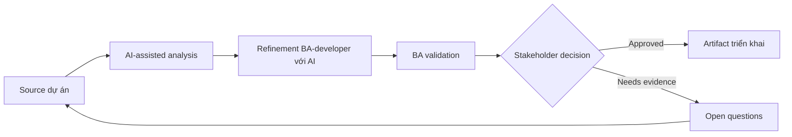

# Refinement BA-developer với AI

<div class="case-meta">
  <span>Cross-functional BA Collaboration</span>
  <span>BA and developers</span>
  <span>Use case dự án</span>
</div>

## Project context

Squad chuẩn bị backlog refinement cho feature chạm UI, API, validation và permission. Developer cần behavior rõ hơn và BA muốn tìm gap trước meeting. Trong BA and developers, công việc này thường bắt đầu khi mỗi role cần artifact khác nhau, nhưng BA phải giữ decision nhất quán giữa product, design, engineering, QA, data và operations. BA nên xem User stories và Design notes là evidence cần organize, không phải raw material để AI trả lời không kiểm soát. Mục tiêu là làm decision tiếp theo rõ hơn cho người own outcome.

## BA challenge

BA phải dùng AI để chuẩn bị refinement tốt hơn, không thay thế developer judgment. Output cần làm lộ assumption, technical question, API dependency, edge case và decision needed. Với Refinement BA-developer với AI, khó khăn thực tế là role misalignment và hidden trade-off. AI có thể tăng tốc role-specific synthesis, decision memo drafting, conflict surfacing và shared artifact critique, nhưng BA vẫn phải làm rõ assumption, approval còn thiếu và điểm cần stakeholder judgment.

## Where AI fits

<div class="ba-workbench-panel">
AI phù hợp với use case Collaboration cross-functional của BA khi được giới hạn vào role-specific synthesis, decision memo drafting, conflict surfacing và shared artifact critique. AI task hữu ích đầu tiên là: Critique story theo perspective developer, API, data và integration. AI không được approve scope, invent policy, bỏ qua role feedback, decision log, design note, technical constraint, test concern và support need, hoặc biến draft thành final decision.
</div>

- Critique story theo perspective developer, API, data và integration.
- Generate refinement question và missing behavior list.
- Draft acceptance criteria và technical dependency note.
- Tạo meeting agenda tập trung decision.

## Inputs to prepare

- User stories
- Design notes
- API notes
- Current architecture constraints
- Open decisions

Trước khi prompt cho Refinement BA-developer với AI, hãy label từng input theo owner, date, approval status, sensitivity và vai trò trong decision. Evidence lens quan trọng nhất là role feedback, decision log, design note, technical constraint, test concern và support need; nếu thiếu, AI có thể xem old note, draft design và approved rule có authority như nhau.

## BA workflow

1. Package story context, design, known rule và constraint.
2. Yêu cầu AI review từ lens frontend, backend, QA và operations.
3. Chuyển finding thành refinement question có owner.
4. Tách business decision khỏi technical design question.
5. Update story và acceptance criteria trước meeting.
6. Dùng meeting để close decision và confirm dependency.

Chạy workflow như cross-role decision alignment trước handoff: bắt đầu với "Package story context, design, known rule và constraint.", sau đó giữ decision log visible khi artifact tiến tới Refinement prep pack. Cách này ngăn suggestion của AI âm thầm trở thành backlog, design, release hoặc operational commitment.

## Diagram



## Deliverables

| Deliverable | Nội dung | Owner | Done signal |
| --- | --- | --- | --- |
| Refinement prep pack | Story context, assumption, gap, question và dependency note | BA | Meeting bắt đầu bằng decision |
| Technical question log | Question, category, owner, impact và resolution | BA và tech lead | Question được track |
| Updated acceptance criteria | Behavior, edge case, API dependency và test signal | BA | Story development-ready |
| Decision summary | Decision, rationale, owner và impact backlog | Product owner | Outcome refinement captured |

Hãy xem Refinement prep pack là collaboration decision artifact do BA own. AI có thể draft structure, nhưng BA phải validate "Meeting bắt đầu bằng decision" có thật sự đúng không, artifact có trace được về evidence không và receiving team có hành động được không.

## Prompt to try

```text
Hãy đóng vai senior Business Analyst hiểu AI. Hỗ trợ tôi áp dụng use case "Refinement BA-developer với AI" vào dự án. Trước hết hỏi source evidence và constraint. Sau đó tạo structured analysis gồm project context, assumption, AI-fit boundary, workflow step, deliverable, risk, control, open question và stakeholder decision. Không tự bịa policy, threshold hoặc approval.
```

## Review checklist

- User stories được label owner, date, approval status và sensitivity.
- Refinement prep pack trace được về source evidence và có human owner rõ.
- AI task nằm trong boundary role-specific synthesis, decision memo drafting, conflict surfacing và shared artifact critique và không approve scope hoặc policy.
- Risk "AI oversteps technical design" có control thực tế: Dùng AI để hỏi question, không quyết architecture.
- Open assumption được chuyển thành validation question hoặc stakeholder decision.
- Success metric: Refinement meeting dành nhiều thời gian decision hơn và ít thời gian phát hiện thiếu requirement cơ bản.

## Risks and controls

| Rủi ro | Vì sao quan trọng | Control của BA |
| --- | --- | --- |
| AI oversteps technical design | AI suggest architecture thiếu context | Dùng AI để hỏi question, không quyết architecture |
| Meeting overload | Quá nhiều generated question làm waste time | Prioritize theo risk và dependency |
| Business/technical confusion | Team trộn decision type | Tách business decision và design question |
| Untracked decisions | Conclusion refinement biến mất | Capture decision summary |

Control chính cho risk "AI oversteps technical design" là human accountability explicit: Dùng AI để hỏi question, không quyết architecture. Nếu evidence yếu, output nên tạo validation question hoặc decision item, không phải final requirement.
