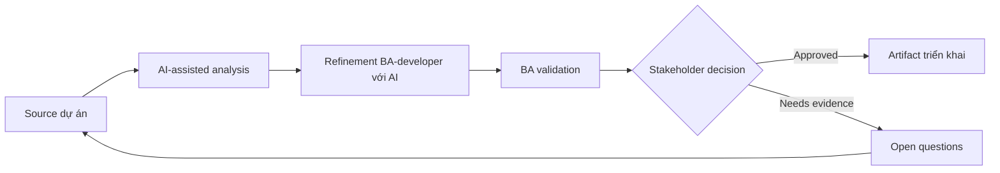

# Refinement BA-developer với AI

<div class="case-meta">
  <span>Cross-functional BA Collaboration</span>
  <span>BA and developers</span>
  <span>Use case dự án</span>
</div>

## Project context

Squad chuẩn bị backlog refinement cho feature chạm UI, API, validation và permission. Developer cần behavior rõ hơn và BA muốn tìm gap trước meeting. Trong môi trường delivery thật, tình huống này thường xuất hiện dưới áp lực thời gian: stakeholder cần clarity, delivery cần backlog, QA cần behavior test được, operations cần process chịu được exception. BA dùng AI để tăng tốc analysis và synthesis, nhưng BA vẫn chịu trách nhiệm về evidence, business meaning, stakeholder decisioning và artifact quality.

## BA challenge

BA phải dùng AI để chuẩn bị refinement tốt hơn, không thay thế developer judgment. Output cần làm lộ assumption, technical question, API dependency, edge case và decision needed. Khó khăn thực tế là AI có thể làm material ban đầu trông hoàn chỉnh hơn mức thật sự. BA giỏi giữ output ở trạng thái reviewable bằng cách tách source-backed fact, assumption, unsupported claim, decision gap và recommended next action. Mục tiêu không phải làm document dài hơn; mục tiêu là làm project decision rõ hơn và an toàn hơn.

## Where AI fits

<div class="ba-workbench-panel">
AI hữu ích trong use case này khi được giới hạn vào analysis support, pattern detection, structured drafting và critique. AI không được approve scope, invent policy, quyết định business trade-off hoặc thay thế judgment của stakeholder chịu trách nhiệm.
</div>

- Critique story theo perspective developer, API, data và integration.
- Generate refinement question và missing behavior list.
- Draft acceptance criteria và technical dependency note.
- Tạo meeting agenda tập trung decision.

## Inputs to prepare

- User stories
- Design notes
- API notes
- Current architecture constraints
- Open decisions

BA nên label các input này trước khi dùng AI: source owner, source date, approval status, sensitivity level, và source đó là fact, opinion, policy, draft hay historical evidence. Việc chuẩn bị này ngăn model xem mọi input đều current và authoritative như nhau.

## BA workflow

1. Package story context, design, known rule và constraint.
2. Yêu cầu AI review từ lens frontend, backend, QA và operations.
3. Chuyển finding thành refinement question có owner.
4. Tách business decision khỏi technical design question.
5. Update story và acceptance criteria trước meeting.
6. Dùng meeting để close decision và confirm dependency.

Workflow hiệu quả nhất khi dùng AI theo từng stage: trước hết organize evidence, sau đó yêu cầu analysis, tiếp theo tạo artifact, rồi chạy critique pass. BA nên giữ decision log visible xuyên suốt để suggestion do AI sinh ra không âm thầm trở thành approved scope.

## Diagram



## Deliverables

| Deliverable | Nội dung | Owner | Done signal |
| --- | --- | --- | --- |
| Refinement prep pack | Story context, assumption, gap, question và dependency note | BA | Meeting bắt đầu bằng decision |
| Technical question log | Question, category, owner, impact và resolution | BA và tech lead | Question được track |
| Updated acceptance criteria | Behavior, edge case, API dependency và test signal | BA | Story development-ready |
| Decision summary | Decision, rationale, owner và impact backlog | Product owner | Outcome refinement captured |

Các deliverable này nên được xem là artifact do BA own. AI có thể draft, nhưng BA phải validate source support, stakeholder meaning, traceability và artifact đã sẵn sàng handoff hay chưa.

## Prompt to try

```text
Hãy đóng vai senior Business Analyst hiểu AI. Hỗ trợ tôi áp dụng use case "Refinement BA-developer với AI" vào dự án. Trước hết hỏi source evidence và constraint. Sau đó tạo structured analysis gồm project context, assumption, AI-fit boundary, workflow step, deliverable, risk, control, open question và stakeholder decision. Không tự bịa policy, threshold hoặc approval.
```

## Review checklist

- Mọi statement do AI hỗ trợ đều gắn với source, assumption hoặc validation question.
- BA đã tách drafting assistance khỏi business approval.
- Workflow step có human owner cho decision, review và exception.
- Deliverable trace được về project input và review được bởi QA, product hoặc operations.
- Risk control đủ thực tế để dùng trong meeting dự án thật.
- Success metric: Refinement meeting dành nhiều thời gian decision hơn và ít thời gian phát hiện thiếu requirement cơ bản.

## Risks and controls

| Rủi ro | Vì sao quan trọng | Control của BA |
| --- | --- | --- |
| AI oversteps technical design | AI suggest architecture thiếu context | Dùng AI để hỏi question, không quyết architecture |
| Meeting overload | Quá nhiều generated question làm waste time | Prioritize theo risk và dependency |
| Business/technical confusion | Team trộn decision type | Tách business decision và design question |
| Untracked decisions | Conclusion refinement biến mất | Capture decision summary |

Control quan trọng nhất là làm uncertainty visible. Nếu evidence yếu, output nên tạo validation question hoặc decision item, không phải final requirement. Nếu artifact ảnh hưởng delivery, release, compliance, customer experience hoặc operational workload, BA nên yêu cầu human review explicit trước khi handoff.
