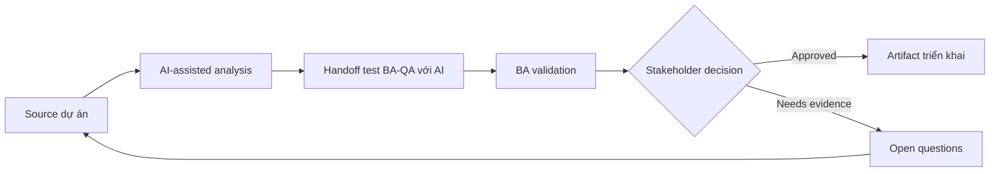

# Handoff test BA-QA với AI

<div class="case-meta">
  <span>Cross-functional BA Collaboration</span>
  <span>BA and QA</span>
  <span>Cross-functional alignment</span>
  <span>Practitioner</span>
  <span>QA handoff matrix</span>
  <span>Use case dự án</span>
</div>

## Project context

QA nhận story muộn và phải tạo test cho UI state, API error, permission và integration failure. BA muốn cải thiện handoff quality trước khi test design bắt đầu. Trong BA and QA, công việc này thường bắt đầu khi mỗi role cần artifact khác nhau, nhưng BA phải giữ decision nhất quán giữa product, design, engineering, QA, data và operations. BA nên xem User stories và Acceptance criteria là evidence cần organize, không phải raw material để AI trả lời không kiểm soát. Mục tiêu là làm decision tiếp theo rõ hơn cho người own outcome.

## BA challenge

BA phải cung cấp cho QA behavior traceable, không chỉ story text. AI có thể generate test idea, nhưng BA và QA phải validate source support, risk và expected result. Với Handoff test BA-QA với AI, khó khăn thực tế là role misalignment và hidden trade-off. AI có thể tăng tốc role-specific synthesis, decision memo drafting, conflict surfacing và shared artifact critique, nhưng BA vẫn phải làm rõ assumption, approval còn thiếu và điểm cần stakeholder judgment.

## Where AI fits

<div class="ba-workbench-panel">
AI phù hợp với use case Collaboration cross-functional của BA khi được giới hạn vào role-specific synthesis, decision memo drafting, conflict surfacing và shared artifact critique. AI task hữu ích đầu tiên là: Generate test scenario từ acceptance criteria và use case flow. AI không được approve scope, invent policy, bỏ qua role feedback, decision log, design note, technical constraint, test concern và support need, hoặc biến draft thành final decision.
</div>

- Generate test scenario từ acceptance criteria và use case flow.
- Identify missing negative, boundary, permission và API failure case.
- Draft test data need và expected result.
- Tạo QA handoff checklist và risk priority.

## Inputs to prepare

- User stories
- Acceptance criteria
- Process flow
- API contract
- Permission matrix

Trước khi prompt cho Handoff test BA-QA với AI, hãy label từng input theo owner, date, approval status, sensitivity và vai trò trong decision. Evidence lens quan trọng nhất là role feedback, decision log, design note, technical constraint, test concern và support need; nếu thiếu, AI có thể xem old note, draft design và approved rule có authority như nhau.

## BA workflow

1. Yêu cầu AI derive scenario từ từng acceptance criterion.
2. Classify scenario theo positive, negative, boundary, permission, error và integration type.
3. Review unsupported scenario với QA và remove invented rule.
4. Thêm expected result, source, priority và test data need.
5. Tạo handoff note cho automation và manual testing.
6. Update story nếu test generation làm lộ requirement gap.

Chạy workflow như cross-role decision alignment trước handoff: bắt đầu với "Yêu cầu AI derive scenario từ từng acceptance criterion.", sau đó giữ decision log visible khi artifact tiến tới QA handoff matrix. Cách này ngăn suggestion của AI âm thầm trở thành backlog, design, release hoặc operational commitment.

## Diagram



## Deliverables

| Deliverable | Nội dung | Owner | Done signal |
| --- | --- | --- | --- |
| QA handoff matrix | Requirement, scenario, type, priority, source và expected result | BA và QA | QA design được test |
| Test data requirements | Data state, role, API condition và setup owner | QA | Test data ready |
| Gap list | Missing rule, missing criteria, unclear expected result và owner | BA | Requirement gap resolved |
| Automation candidate list | Stable scenario, data need và automation value | QA lead | Automation scope rõ |

Hãy xem QA handoff matrix là collaboration decision artifact do BA own. AI có thể draft structure, nhưng BA phải validate "QA design được test" có thật sự đúng không, artifact có trace được về evidence không và receiving team có hành động được không.

## Prompt to try

```text
Hãy đóng vai senior Business Analyst hiểu AI. Hỗ trợ tôi áp dụng use case "Handoff test BA-QA với AI" vào dự án. Trước hết hỏi source evidence và constraint. Sau đó tạo structured analysis gồm project context, assumption, AI-fit boundary, workflow step, deliverable, risk, control, open question và stakeholder decision. Không tự bịa policy, threshold hoặc approval.
```

## Review checklist

- User stories được label owner, date, approval status và sensitivity.
- QA handoff matrix trace được về source evidence và có human owner rõ.
- AI task nằm trong boundary role-specific synthesis, decision memo drafting, conflict surfacing và shared artifact critique và không approve scope hoặc policy.
- Risk "Invented test expectation" có control thực tế: Tie scenario với source và criteria.
- Open assumption được chuyển thành validation question hoặc stakeholder decision.
- Success metric: QA nhận scenario source-backed, prioritized, có expected result và test data need.

## Risks and controls

| Rủi ro | Vì sao quan trọng | Control của BA |
| --- | --- | --- |
| Invented test expectation | AI tạo expected behavior chưa approve | Tie scenario với source và criteria |
| Test overload | Quá nhiều scenario giảm focus | Prioritize theo risk và business impact |
| Missing data | QA không execute được nếu thiếu data setup | Define test data sớm |
| Late gap discovery | Requirement gap phát hiện lúc testing rất costly | Dùng AI scenario generation trước sprint commitment |

Control chính cho risk "Invented test expectation" là human accountability explicit: Tie scenario với source và criteria. Nếu evidence yếu, output nên tạo validation question hoặc decision item, không phải final requirement.
