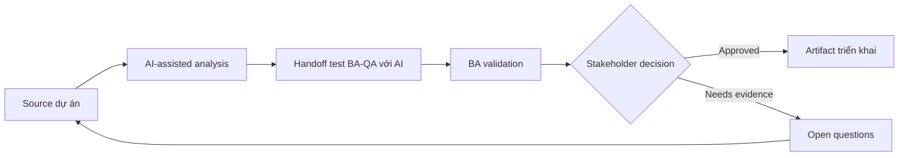

# Handoff test BA-QA với AI

<div class="case-meta">
  <span>Cross-functional BA Collaboration</span>
  <span>BA and QA</span>
  <span>Use case dự án</span>
</div>

## Project context

QA nhận story muộn và phải tạo test cho UI state, API error, permission và integration failure. BA muốn cải thiện handoff quality trước khi test design bắt đầu. Trong môi trường delivery thật, tình huống này thường xuất hiện dưới áp lực thời gian: stakeholder cần clarity, delivery cần backlog, QA cần behavior test được, operations cần process chịu được exception. BA dùng AI để tăng tốc analysis và synthesis, nhưng BA vẫn chịu trách nhiệm về evidence, business meaning, stakeholder decisioning và artifact quality.

## BA challenge

BA phải cung cấp cho QA behavior traceable, không chỉ story text. AI có thể generate test idea, nhưng BA và QA phải validate source support, risk và expected result. Khó khăn thực tế là AI có thể làm material ban đầu trông hoàn chỉnh hơn mức thật sự. BA giỏi giữ output ở trạng thái reviewable bằng cách tách source-backed fact, assumption, unsupported claim, decision gap và recommended next action. Mục tiêu không phải làm document dài hơn; mục tiêu là làm project decision rõ hơn và an toàn hơn.

## Where AI fits

<div class="ba-workbench-panel">
AI hữu ích trong use case này khi được giới hạn vào analysis support, pattern detection, structured drafting và critique. AI không được approve scope, invent policy, quyết định business trade-off hoặc thay thế judgment của stakeholder chịu trách nhiệm.
</div>

- Generate test scenario từ acceptance criteria và use case flow.
- Identify missing negative, boundary, permission và API failure case.
- Draft test data need và expected result.
- Tạo QA handoff checklist và risk priority.

## Inputs to prepare

- User stories
- Acceptance criteria
- Process flow
- API contract
- Permission matrix

BA nên label các input này trước khi dùng AI: source owner, source date, approval status, sensitivity level, và source đó là fact, opinion, policy, draft hay historical evidence. Việc chuẩn bị này ngăn model xem mọi input đều current và authoritative như nhau.

## BA workflow

1. Yêu cầu AI derive scenario từ từng acceptance criterion.
2. Classify scenario theo positive, negative, boundary, permission, error và integration type.
3. Review unsupported scenario với QA và remove invented rule.
4. Thêm expected result, source, priority và test data need.
5. Tạo handoff note cho automation và manual testing.
6. Update story nếu test generation làm lộ requirement gap.

Workflow hiệu quả nhất khi dùng AI theo từng stage: trước hết organize evidence, sau đó yêu cầu analysis, tiếp theo tạo artifact, rồi chạy critique pass. BA nên giữ decision log visible xuyên suốt để suggestion do AI sinh ra không âm thầm trở thành approved scope.

## Diagram



## Deliverables

| Deliverable | Nội dung | Owner | Done signal |
| --- | --- | --- | --- |
| QA handoff matrix | Requirement, scenario, type, priority, source và expected result | BA và QA | QA design được test |
| Test data requirements | Data state, role, API condition và setup owner | QA | Test data ready |
| Gap list | Missing rule, missing criteria, unclear expected result và owner | BA | Requirement gap resolved |
| Automation candidate list | Stable scenario, data need và automation value | QA lead | Automation scope rõ |

Các deliverable này nên được xem là artifact do BA own. AI có thể draft, nhưng BA phải validate source support, stakeholder meaning, traceability và artifact đã sẵn sàng handoff hay chưa.

## Prompt to try

```text
Hãy đóng vai senior Business Analyst hiểu AI. Hỗ trợ tôi áp dụng use case "Handoff test BA-QA với AI" vào dự án. Trước hết hỏi source evidence và constraint. Sau đó tạo structured analysis gồm project context, assumption, AI-fit boundary, workflow step, deliverable, risk, control, open question và stakeholder decision. Không tự bịa policy, threshold hoặc approval.
```

## Review checklist

- Mọi statement do AI hỗ trợ đều gắn với source, assumption hoặc validation question.
- BA đã tách drafting assistance khỏi business approval.
- Workflow step có human owner cho decision, review và exception.
- Deliverable trace được về project input và review được bởi QA, product hoặc operations.
- Risk control đủ thực tế để dùng trong meeting dự án thật.
- Success metric: QA nhận scenario source-backed, prioritized, có expected result và test data need.

## Risks and controls

| Rủi ro | Vì sao quan trọng | Control của BA |
| --- | --- | --- |
| Invented test expectation | AI tạo expected behavior chưa approve | Tie scenario với source và criteria |
| Test overload | Quá nhiều scenario giảm focus | Prioritize theo risk và business impact |
| Missing data | QA không execute được nếu thiếu data setup | Define test data sớm |
| Late gap discovery | Requirement gap phát hiện lúc testing rất costly | Dùng AI scenario generation trước sprint commitment |

Control quan trọng nhất là làm uncertainty visible. Nếu evidence yếu, output nên tạo validation question hoặc decision item, không phải final requirement. Nếu artifact ảnh hưởng delivery, release, compliance, customer experience hoặc operational workload, BA nên yêu cầu human review explicit trước khi handoff.
