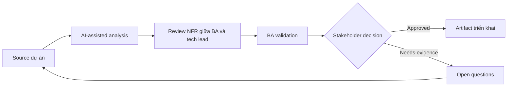

# Review NFR giữa BA và tech lead

<div class="case-meta">
  <span>Cross-functional BA Collaboration</span>
  <span>BA and architecture</span>
  <span>Use case dự án</span>
</div>

## Project context

Feature đã functionally ready cho refinement, nhưng tech lead raise concern về latency, data retention, audit, reliability và supportability. Trong môi trường delivery thật, tình huống này thường xuất hiện dưới áp lực thời gian: stakeholder cần clarity, delivery cần backlog, QA cần behavior test được, operations cần process chịu được exception. BA dùng AI để tăng tốc analysis và synthesis, nhưng BA vẫn chịu trách nhiệm về evidence, business meaning, stakeholder decisioning và artifact quality.

## BA challenge

BA phải chuyển technical concern thành NFR decision business-readable. AI có thể structure question, nhưng threshold và trade-off cần owner agreement. Khó khăn thực tế là AI có thể làm material ban đầu trông hoàn chỉnh hơn mức thật sự. BA giỏi giữ output ở trạng thái reviewable bằng cách tách source-backed fact, assumption, unsupported claim, decision gap và recommended next action. Mục tiêu không phải làm document dài hơn; mục tiêu là làm project decision rõ hơn và an toàn hơn.

## Where AI fits

<div class="ba-workbench-panel">
AI hữu ích trong use case này khi được giới hạn vào analysis support, pattern detection, structured drafting và critique. AI không được approve scope, invent policy, quyết định business trade-off hoặc thay thế judgment của stakeholder chịu trách nhiệm.
</div>

- Generate NFR question theo feature workflow và risk.
- Translate technical concern thành business impact statement.
- Draft measurable threshold và acceptance signal.
- Tạo decision memo cho trade-off.

## Inputs to prepare

- Feature requirements
- Architecture concerns
- Operational constraints
- Compliance needs
- Usage volume estimates

BA nên label các input này trước khi dùng AI: source owner, source date, approval status, sensitivity level, và source đó là fact, opinion, policy, draft hay historical evidence. Việc chuẩn bị này ngăn model xem mọi input đều current và authoritative như nhau.

## BA workflow

1. Collect technical concern và affected user/business outcome.
2. Yêu cầu AI translate concern thành NFR scenario.
3. Define candidate threshold và measurement method.
4. Review trade-off với product, tech lead, operations và compliance.
5. Thêm NFR acceptance criteria và monitoring expectation.
6. Record decision và unresolved risk.

Workflow hiệu quả nhất khi dùng AI theo từng stage: trước hết organize evidence, sau đó yêu cầu analysis, tiếp theo tạo artifact, rồi chạy critique pass. BA nên giữ decision log visible xuyên suốt để suggestion do AI sinh ra không âm thầm trở thành approved scope.

## Diagram



## Deliverables

| Deliverable | Nội dung | Owner | Done signal |
| --- | --- | --- | --- |
| NFR decision table | Attribute, scenario, business impact, threshold, owner và test method | BA và tech lead | NFR measurable |
| Trade-off memo | Option, cost, risk, user impact và recommendation | Product owner | Stakeholder decide được |
| Monitoring requirement | Metric, threshold, alert, owner và response | Operations | NFR observable |
| Risk register update | NFR risk, mitigation, decision và residual risk | Project manager | Risk được track |

Các deliverable này nên được xem là artifact do BA own. AI có thể draft, nhưng BA phải validate source support, stakeholder meaning, traceability và artifact đã sẵn sàng handoff hay chưa.

## Prompt to try

```text
Hãy đóng vai senior Business Analyst hiểu AI. Hỗ trợ tôi áp dụng use case "Review NFR giữa BA và tech lead" vào dự án. Trước hết hỏi source evidence và constraint. Sau đó tạo structured analysis gồm project context, assumption, AI-fit boundary, workflow step, deliverable, risk, control, open question và stakeholder decision. Không tự bịa policy, threshold hoặc approval.
```

## Review checklist

- Mọi statement do AI hỗ trợ đều gắn với source, assumption hoặc validation question.
- BA đã tách drafting assistance khỏi business approval.
- Workflow step có human owner cho decision, review và exception.
- Deliverable trace được về project input và review được bởi QA, product hoặc operations.
- Risk control đủ thực tế để dùng trong meeting dự án thật.
- Success metric: Technical quality concern trở thành business decision và delivery requirement đo được.

## Risks and controls

| Rủi ro | Vì sao quan trọng | Control của BA |
| --- | --- | --- |
| Technical jargon | Business stakeholder không hiểu risk | Translate thành user/business impact |
| Threshold guessing | AI có thể invent number | Validate threshold với owner |
| Late NFR | Quality control khó retrofit | Review trước design lock |
| No monitoring | NFR pass test nhưng fail production | Specify monitoring và response |

Control quan trọng nhất là làm uncertainty visible. Nếu evidence yếu, output nên tạo validation question hoặc decision item, không phải final requirement. Nếu artifact ảnh hưởng delivery, release, compliance, customer experience hoặc operational workload, BA nên yêu cầu human review explicit trước khi handoff.
