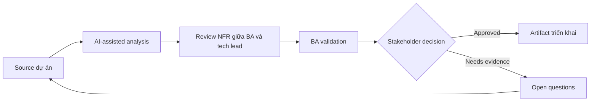

# Review NFR giữa BA và tech lead

<div class="case-meta">
  <span>Cross-functional BA Collaboration</span>
  <span>BA and architecture</span>
  <span>Cross-functional alignment</span>
  <span>Practitioner</span>
  <span>NFR decision table</span>
  <span>Use case dự án</span>
</div>

## Project context

Feature đã functionally ready cho refinement, nhưng tech lead raise concern về latency, data retention, audit, reliability và supportability. Trong BA and architecture, công việc này thường bắt đầu khi mỗi role cần artifact khác nhau, nhưng BA phải giữ decision nhất quán giữa product, design, engineering, QA, data và operations. BA nên xem Feature requirements và Architecture concerns là evidence cần organize, không phải raw material để AI trả lời không kiểm soát. Mục tiêu là làm decision tiếp theo rõ hơn cho người own outcome.

## BA challenge

BA phải chuyển technical concern thành NFR decision business-readable. AI có thể structure question, nhưng threshold và trade-off cần owner agreement. Với Review NFR giữa BA và tech lead, khó khăn thực tế là role misalignment và hidden trade-off. AI có thể tăng tốc role-specific synthesis, decision memo drafting, conflict surfacing và shared artifact critique, nhưng BA vẫn phải làm rõ assumption, approval còn thiếu và điểm cần stakeholder judgment.

## Where AI fits

<div class="ba-workbench-panel">
AI phù hợp với use case Collaboration cross-functional của BA khi được giới hạn vào role-specific synthesis, decision memo drafting, conflict surfacing và shared artifact critique. AI task hữu ích đầu tiên là: Generate NFR question theo feature workflow và risk. AI không được approve scope, invent policy, bỏ qua role feedback, decision log, design note, technical constraint, test concern và support need, hoặc biến draft thành final decision.
</div>

- Generate NFR question theo feature workflow và risk.
- Translate technical concern thành business impact statement.
- Draft measurable threshold và acceptance signal.
- Tạo decision memo cho trade-off.

## Inputs to prepare

- Feature requirements
- Architecture concerns
- Operational constraints
- Compliance needs
- Usage volume estimates

Trước khi prompt cho Review NFR giữa BA và tech lead, hãy label từng input theo owner, date, approval status, sensitivity và vai trò trong decision. Evidence lens quan trọng nhất là role feedback, decision log, design note, technical constraint, test concern và support need; nếu thiếu, AI có thể xem old note, draft design và approved rule có authority như nhau.

## BA workflow

1. Collect technical concern và affected user/business outcome.
2. Yêu cầu AI translate concern thành NFR scenario.
3. Define candidate threshold và measurement method.
4. Review trade-off với product, tech lead, operations và compliance.
5. Thêm NFR acceptance criteria và monitoring expectation.
6. Record decision và unresolved risk.

Chạy workflow như cross-role decision alignment trước handoff: bắt đầu với "Collect technical concern và affected user/business outcome.", sau đó giữ decision log visible khi artifact tiến tới NFR decision table. Cách này ngăn suggestion của AI âm thầm trở thành backlog, design, release hoặc operational commitment.

## Diagram



## Deliverables

| Deliverable | Nội dung | Owner | Done signal |
| --- | --- | --- | --- |
| NFR decision table | Attribute, scenario, business impact, threshold, owner và test method | BA và tech lead | NFR measurable |
| Trade-off memo | Option, cost, risk, user impact và recommendation | Product owner | Stakeholder decide được |
| Monitoring requirement | Metric, threshold, alert, owner và response | Operations | NFR observable |
| Risk register update | NFR risk, mitigation, decision và residual risk | Project manager | Risk được track |

Hãy xem NFR decision table là collaboration decision artifact do BA own. AI có thể draft structure, nhưng BA phải validate "NFR measurable" có thật sự đúng không, artifact có trace được về evidence không và receiving team có hành động được không.

## Prompt to try

```text
Hãy đóng vai senior Business Analyst hiểu AI. Hỗ trợ tôi áp dụng use case "Review NFR giữa BA và tech lead" vào dự án. Trước hết hỏi source evidence và constraint. Sau đó tạo structured analysis gồm project context, assumption, AI-fit boundary, workflow step, deliverable, risk, control, open question và stakeholder decision. Không tự bịa policy, threshold hoặc approval.
```

## Review checklist

- Feature requirements được label owner, date, approval status và sensitivity.
- NFR decision table trace được về source evidence và có human owner rõ.
- AI task nằm trong boundary role-specific synthesis, decision memo drafting, conflict surfacing và shared artifact critique và không approve scope hoặc policy.
- Risk "Technical jargon" có control thực tế: Translate thành user/business impact.
- Open assumption được chuyển thành validation question hoặc stakeholder decision.
- Success metric: Technical quality concern trở thành business decision và delivery requirement đo được.

## Risks and controls

| Rủi ro | Vì sao quan trọng | Control của BA |
| --- | --- | --- |
| Technical jargon | Business stakeholder không hiểu risk | Translate thành user/business impact |
| Threshold guessing | AI có thể invent number | Validate threshold với owner |
| Late NFR | Quality control khó retrofit | Review trước design lock |
| No monitoring | NFR pass test nhưng fail production | Specify monitoring và response |

Control chính cho risk "Technical jargon" là human accountability explicit: Translate thành user/business impact. Nếu evidence yếu, output nên tạo validation question hoặc decision item, không phải final requirement.
