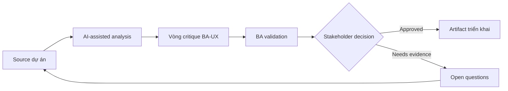

# Vòng critique BA-UX

<div class="case-meta">
  <span>Cross-functional BA Collaboration</span>
  <span>BA and UX</span>
  <span>Use case dự án</span>
</div>

## Project context

UX propose onboarding flow mới. Flow đẹp, nhưng BA thấy có thể có policy gap, missing error path, data field chưa rõ và operational exception. Trong môi trường delivery thật, tình huống này thường xuất hiện dưới áp lực thời gian: stakeholder cần clarity, delivery cần backlog, QA cần behavior test được, operations cần process chịu được exception. BA dùng AI để tăng tốc analysis và synthesis, nhưng BA vẫn chịu trách nhiệm về evidence, business meaning, stakeholder decisioning và artifact quality.

## BA challenge

BA phải critique design một cách xây dựng, không biến UX review thành policing requirement. AI có thể giúp generate critique lens và question, nhưng BA phải ground feedback bằng evidence và user outcome. Khó khăn thực tế là AI có thể làm material ban đầu trông hoàn chỉnh hơn mức thật sự. BA giỏi giữ output ở trạng thái reviewable bằng cách tách source-backed fact, assumption, unsupported claim, decision gap và recommended next action. Mục tiêu không phải làm document dài hơn; mục tiêu là làm project decision rõ hơn và an toàn hơn.

## Where AI fits

<div class="ba-workbench-panel">
AI hữu ích trong use case này khi được giới hạn vào analysis support, pattern detection, structured drafting và critique. AI không được approve scope, invent policy, quyết định business trade-off hoặc thay thế judgment của stakeholder chịu trách nhiệm.
</div>

- Generate critique lens cho rule, data, exception, accessibility, analytics và operations.
- Draft question giữ UX intent nhưng làm lộ gap.
- Identify nơi design imply business rule chưa approve.
- Tạo decision log entry từ design review.

## Inputs to prepare

- Design flow
- User research
- Business rules
- Operations constraints
- Accessibility expectations

BA nên label các input này trước khi dùng AI: source owner, source date, approval status, sensitivity level, và source đó là fact, opinion, policy, draft hay historical evidence. Việc chuẩn bị này ngăn model xem mọi input đều current và authoritative như nhau.

## BA workflow

1. Package design goal, user problem, rule và constraint.
2. Yêu cầu AI critique design bằng BA lens.
3. Chuyển critique thành question, không thành directive.
4. Review với UX để tách design choice, business rule và technical constraint.
5. Capture decision và open gap.
6. Update requirement và design annotation cùng nhau.

Workflow hiệu quả nhất khi dùng AI theo từng stage: trước hết organize evidence, sau đó yêu cầu analysis, tiếp theo tạo artifact, rồi chạy critique pass. BA nên giữ decision log visible xuyên suốt để suggestion do AI sinh ra không âm thầm trở thành approved scope.

## Diagram



## Deliverables

| Deliverable | Nội dung | Owner | Done signal |
| --- | --- | --- | --- |
| BA-UX critique checklist | Lens, question, evidence, impact và owner | BA | Feedback structured |
| Design decision log | Decision, rationale, source, owner và requirement impact | Product và UX | Design decision traceable |
| Gap register | Missing rule, data, state, exception, accessibility hoặc analytics item | BA và UX | Gap có next action |
| Annotated flow updates | Design frame note linked với requirement và decision | UX | Design và requirement aligned |

Các deliverable này nên được xem là artifact do BA own. AI có thể draft, nhưng BA phải validate source support, stakeholder meaning, traceability và artifact đã sẵn sàng handoff hay chưa.

## Prompt to try

```text
Hãy đóng vai senior Business Analyst hiểu AI. Hỗ trợ tôi áp dụng use case "Vòng critique BA-UX" vào dự án. Trước hết hỏi source evidence và constraint. Sau đó tạo structured analysis gồm project context, assumption, AI-fit boundary, workflow step, deliverable, risk, control, open question và stakeholder decision. Không tự bịa policy, threshold hoặc approval.
```

## Review checklist

- Mọi statement do AI hỗ trợ đều gắn với source, assumption hoặc validation question.
- BA đã tách drafting assistance khỏi business approval.
- Workflow step có human owner cho decision, review và exception.
- Deliverable trace được về project input và review được bởi QA, product hoặc operations.
- Risk control đủ thực tế để dùng trong meeting dự án thật.
- Success metric: Review BA và UX tạo design decision rõ hơn mà không mất user-centered intent.

## Risks and controls

| Rủi ro | Vì sao quan trọng | Control của BA |
| --- | --- | --- |
| Critique as opinion | UX feedback có thể cảm giác subjective | Tie critique với evidence và user outcome |
| UX intent loss | BA có thể over-constrain design | Preserve design goal trong khi clarify rule |
| Hidden policy | Design có thể imply policy decision | Identify implied rule và decision owner |
| Untracked review | Discussion tốt nhưng artifact không update | Capture decision và annotation |

Control quan trọng nhất là làm uncertainty visible. Nếu evidence yếu, output nên tạo validation question hoặc decision item, không phải final requirement. Nếu artifact ảnh hưởng delivery, release, compliance, customer experience hoặc operational workload, BA nên yêu cầu human review explicit trước khi handoff.
