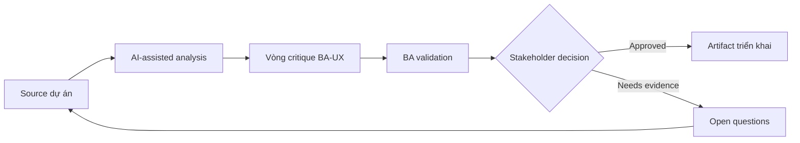

# Vòng critique BA-UX

<div class="case-meta">
  <span>Cross-functional BA Collaboration</span>
  <span>BA and UX</span>
  <span>Cross-functional alignment</span>
  <span>Practitioner</span>
  <span>BA-UX critique checklist</span>
  <span>Use case dự án</span>
</div>

## Project context

UX propose onboarding flow mới. Flow đẹp, nhưng BA thấy có thể có policy gap, missing error path, data field chưa rõ và operational exception. Trong BA and UX, công việc này thường bắt đầu khi mỗi role cần artifact khác nhau, nhưng BA phải giữ decision nhất quán giữa product, design, engineering, QA, data và operations. BA nên xem Design flow và User research là evidence cần organize, không phải raw material để AI trả lời không kiểm soát. Mục tiêu là làm decision tiếp theo rõ hơn cho người own outcome.

## BA challenge

BA phải critique design một cách xây dựng, không biến UX review thành policing requirement. AI có thể giúp generate critique lens và question, nhưng BA phải ground feedback bằng evidence và user outcome. Với Vòng critique BA-UX, khó khăn thực tế là role misalignment và hidden trade-off. AI có thể tăng tốc role-specific synthesis, decision memo drafting, conflict surfacing và shared artifact critique, nhưng BA vẫn phải làm rõ assumption, approval còn thiếu và điểm cần stakeholder judgment.

## Where AI fits

<div class="ba-workbench-panel">
AI phù hợp với use case Collaboration cross-functional của BA khi được giới hạn vào role-specific synthesis, decision memo drafting, conflict surfacing và shared artifact critique. AI task hữu ích đầu tiên là: Generate critique lens cho rule, data, exception, accessibility, analytics và operations. AI không được approve scope, invent policy, bỏ qua role feedback, decision log, design note, technical constraint, test concern và support need, hoặc biến draft thành final decision.
</div>

- Generate critique lens cho rule, data, exception, accessibility, analytics và operations.
- Draft question giữ UX intent nhưng làm lộ gap.
- Identify nơi design imply business rule chưa approve.
- Tạo decision log entry từ design review.

## Inputs to prepare

- Design flow
- User research
- Business rules
- Operations constraints
- Accessibility expectations

Trước khi prompt cho Vòng critique BA-UX, hãy label từng input theo owner, date, approval status, sensitivity và vai trò trong decision. Evidence lens quan trọng nhất là role feedback, decision log, design note, technical constraint, test concern và support need; nếu thiếu, AI có thể xem old note, draft design và approved rule có authority như nhau.

## BA workflow

1. Package design goal, user problem, rule và constraint.
2. Yêu cầu AI critique design bằng BA lens.
3. Chuyển critique thành question, không thành directive.
4. Review với UX để tách design choice, business rule và technical constraint.
5. Capture decision và open gap.
6. Update requirement và design annotation cùng nhau.

Chạy workflow như cross-role decision alignment trước handoff: bắt đầu với "Package design goal, user problem, rule và constraint.", sau đó giữ decision log visible khi artifact tiến tới BA-UX critique checklist. Cách này ngăn suggestion của AI âm thầm trở thành backlog, design, release hoặc operational commitment.

## Diagram



## Deliverables

| Deliverable | Nội dung | Owner | Done signal |
| --- | --- | --- | --- |
| BA-UX critique checklist | Lens, question, evidence, impact và owner | BA | Feedback structured |
| Design decision log | Decision, rationale, source, owner và requirement impact | Product và UX | Design decision traceable |
| Gap register | Missing rule, data, state, exception, accessibility hoặc analytics item | BA và UX | Gap có next action |
| Annotated flow updates | Design frame note linked với requirement và decision | UX | Design và requirement aligned |

Hãy xem BA-UX critique checklist là collaboration decision artifact do BA own. AI có thể draft structure, nhưng BA phải validate "Feedback structured" có thật sự đúng không, artifact có trace được về evidence không và receiving team có hành động được không.

## Prompt to try

```text
Hãy đóng vai senior Business Analyst hiểu AI. Hỗ trợ tôi áp dụng use case "Vòng critique BA-UX" vào dự án. Trước hết hỏi source evidence và constraint. Sau đó tạo structured analysis gồm project context, assumption, AI-fit boundary, workflow step, deliverable, risk, control, open question và stakeholder decision. Không tự bịa policy, threshold hoặc approval.
```

## Review checklist

- Design flow được label owner, date, approval status và sensitivity.
- BA-UX critique checklist trace được về source evidence và có human owner rõ.
- AI task nằm trong boundary role-specific synthesis, decision memo drafting, conflict surfacing và shared artifact critique và không approve scope hoặc policy.
- Risk "Critique as opinion" có control thực tế: Tie critique với evidence và user outcome.
- Open assumption được chuyển thành validation question hoặc stakeholder decision.
- Success metric: Review BA và UX tạo design decision rõ hơn mà không mất user-centered intent.

## Risks and controls

| Rủi ro | Vì sao quan trọng | Control của BA |
| --- | --- | --- |
| Critique as opinion | UX feedback có thể cảm giác subjective | Tie critique với evidence và user outcome |
| UX intent loss | BA có thể over-constrain design | Preserve design goal trong khi clarify rule |
| Hidden policy | Design có thể imply policy decision | Identify implied rule và decision owner |
| Untracked review | Discussion tốt nhưng artifact không update | Capture decision và annotation |

Control chính cho risk "Critique as opinion" là human accountability explicit: Tie critique với evidence và user outcome. Nếu evidence yếu, output nên tạo validation question hoặc decision item, không phải final requirement.
