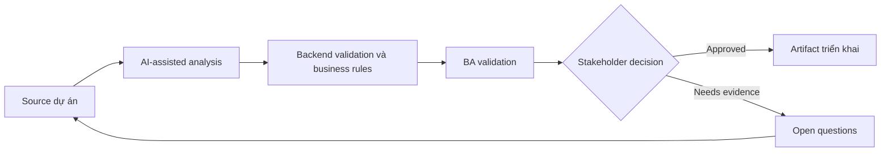

# Backend validation và business rules

<div class="case-meta">
  <span>Backend and API</span>
  <span>Business rules</span>
  <span>Backend/API refinement</span>
  <span>Practitioner</span>
  <span>Backend rule matrix</span>
  <span>Use case dự án</span>
</div>

## Project context

Frontend validation đã có cho quote request form, nhưng backend phải enforce pricing limit, eligibility, approval threshold và fraud-related constraint bất kể UI behavior. Trong Business rules, công việc này thường bắt đầu khi API contract, permission, error, audit và operational behavior phải đủ explicit cho backend delivery. BA nên xem Policy documents và Frontend validation spec là evidence cần organize, không phải raw material để AI trả lời không kiểm soát. Mục tiêu là làm decision tiếp theo rõ hơn cho người own outcome.

## BA challenge

BA phải tách user guidance khỏi authoritative business rule enforcement. Backend validation phải source-backed, testable, auditable và consistent với frontend messaging. Với Backend validation và business rules, khó khăn thực tế là service behavior mơ hồ và security gap. AI có thể tăng tốc contract critique, rule extraction, error taxonomy, permission review và NFR gap detection, nhưng BA vẫn phải làm rõ assumption, approval còn thiếu và điểm cần stakeholder judgment.

## Where AI fits

<div class="ba-workbench-panel">
AI phù hợp với use case Backend và API khi được giới hạn vào contract critique, rule extraction, error taxonomy, permission review và NFR gap detection. AI task hữu ích đầu tiên là: Extract business rule từ policy và story. AI không được approve scope, invent policy, bỏ qua API draft, data model, auth rule, error sample, audit policy và integration need, hoặc biến draft thành final decision.
</div>

- Extract business rule từ policy và story.
- Classify rule là frontend guidance, backend enforcement hoặc cả hai.
- Generate backend validation scenario và error response.
- Identify missing audit requirement cho rule failure.

## Inputs to prepare

- Policy documents
- Frontend validation spec
- Pricing rules
- Eligibility rules
- Audit requirements

Trước khi prompt cho Backend validation và business rules, hãy label từng input theo owner, date, approval status, sensitivity và vai trò trong decision. Evidence lens quan trọng nhất là API draft, data model, auth rule, error sample, audit policy và integration need; nếu thiếu, AI có thể xem old note, draft design và approved rule có authority như nhau.

## BA workflow

1. Inventory mọi validation rule và source evidence.
2. Yêu cầu AI classify rule enforcement location và risk.
3. Define backend validation behavior, error code, audit event và override path.
4. Review rule conflict với product, operations và compliance.
5. Viết API negative test scenario.
6. Align frontend copy với backend rejection reason.

Chạy workflow như contract validation trước implementation: bắt đầu với "Inventory mọi validation rule và source evidence.", sau đó giữ decision log visible khi artifact tiến tới Backend rule matrix. Cách này ngăn suggestion của AI âm thầm trở thành backlog, design, release hoặc operational commitment.

## Diagram



## Deliverables

| Deliverable | Nội dung | Owner | Done signal |
| --- | --- | --- | --- |
| Backend rule matrix | Rule, source, enforcement, error code, audit need và owner | BA và backend | Rule enforceable |
| Validation location map | Frontend guidance, backend enforcement, both hoặc manual review | BA | Ownership rõ |
| Negative API test set | Invalid input, expected rejection, error code và audit | QA | Rule failure testable |
| Frontend-backend message map | Backend reason tới user-facing copy và recovery action | UX và frontend | User hiểu rejection |

Hãy xem Backend rule matrix là backend behavior contract do BA own. AI có thể draft structure, nhưng BA phải validate "Rule enforceable" có thật sự đúng không, artifact có trace được về evidence không và receiving team có hành động được không.

## Prompt to try

```text
Hãy đóng vai senior Business Analyst hiểu AI. Hỗ trợ tôi áp dụng use case "Backend validation và business rules" vào dự án. Trước hết hỏi source evidence và constraint. Sau đó tạo structured analysis gồm project context, assumption, AI-fit boundary, workflow step, deliverable, risk, control, open question và stakeholder decision. Không tự bịa policy, threshold hoặc approval.
```

## Review checklist

- Policy documents được label owner, date, approval status và sensitivity.
- Backend rule matrix trace được về source evidence và có human owner rõ.
- AI task nằm trong boundary contract critique, rule extraction, error taxonomy, permission review và NFR gap detection và không approve scope hoặc policy.
- Risk "Frontend-only validation" có control thực tế: Enforce material rule ở backend.
- Open assumption được chuyển thành validation question hoặc stakeholder decision.
- Success metric: Backend validation authoritative, source-backed và aligned với frontend guidance.

## Risks and controls

| Rủi ro | Vì sao quan trọng | Control của BA |
| --- | --- | --- |
| Frontend-only validation | User hoặc integration có thể bypass UI rule | Enforce material rule ở backend |
| Rule source gap | Backend implement threshold tự bịa | Require source evidence và owner |
| Poor recovery | Backend rejection không giúp user recover | Map error reason tới UI message |
| Audit gap | Rule failure có thể cần evidence | Specify audit event và retention |

Control chính cho risk "Frontend-only validation" là human accountability explicit: Enforce material rule ở backend. Nếu evidence yếu, output nên tạo validation question hoặc decision item, không phải final requirement.
