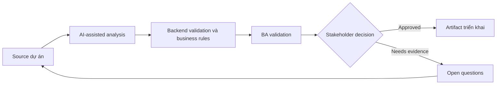

# Backend validation và business rules

<div class="case-meta">
  <span>Backend and API</span>
  <span>Business rules</span>
  <span>Use case dự án</span>
</div>

## Project context

Frontend validation đã có cho quote request form, nhưng backend phải enforce pricing limit, eligibility, approval threshold và fraud-related constraint bất kể UI behavior. Trong môi trường delivery thật, tình huống này thường xuất hiện dưới áp lực thời gian: stakeholder cần clarity, delivery cần backlog, QA cần behavior test được, operations cần process chịu được exception. BA dùng AI để tăng tốc analysis và synthesis, nhưng BA vẫn chịu trách nhiệm về evidence, business meaning, stakeholder decisioning và artifact quality.

## BA challenge

BA phải tách user guidance khỏi authoritative business rule enforcement. Backend validation phải source-backed, testable, auditable và consistent với frontend messaging. Khó khăn thực tế là AI có thể làm material ban đầu trông hoàn chỉnh hơn mức thật sự. BA giỏi giữ output ở trạng thái reviewable bằng cách tách source-backed fact, assumption, unsupported claim, decision gap và recommended next action. Mục tiêu không phải làm document dài hơn; mục tiêu là làm project decision rõ hơn và an toàn hơn.

## Where AI fits

<div class="ba-workbench-panel">
AI hữu ích trong use case này khi được giới hạn vào analysis support, pattern detection, structured drafting và critique. AI không được approve scope, invent policy, quyết định business trade-off hoặc thay thế judgment của stakeholder chịu trách nhiệm.
</div>

- Extract business rule từ policy và story.
- Classify rule là frontend guidance, backend enforcement hoặc cả hai.
- Generate backend validation scenario và error response.
- Identify missing audit requirement cho rule failure.

## Inputs to prepare

- Policy documents
- Frontend validation spec
- Pricing rules
- Eligibility rules
- Audit requirements

BA nên label các input này trước khi dùng AI: source owner, source date, approval status, sensitivity level, và source đó là fact, opinion, policy, draft hay historical evidence. Việc chuẩn bị này ngăn model xem mọi input đều current và authoritative như nhau.

## BA workflow

1. Inventory mọi validation rule và source evidence.
2. Yêu cầu AI classify rule enforcement location và risk.
3. Define backend validation behavior, error code, audit event và override path.
4. Review rule conflict với product, operations và compliance.
5. Viết API negative test scenario.
6. Align frontend copy với backend rejection reason.

Workflow hiệu quả nhất khi dùng AI theo từng stage: trước hết organize evidence, sau đó yêu cầu analysis, tiếp theo tạo artifact, rồi chạy critique pass. BA nên giữ decision log visible xuyên suốt để suggestion do AI sinh ra không âm thầm trở thành approved scope.

## Diagram



## Deliverables

| Deliverable | Nội dung | Owner | Done signal |
| --- | --- | --- | --- |
| Backend rule matrix | Rule, source, enforcement, error code, audit need và owner | BA và backend | Rule enforceable |
| Validation location map | Frontend guidance, backend enforcement, both hoặc manual review | BA | Ownership rõ |
| Negative API test set | Invalid input, expected rejection, error code và audit | QA | Rule failure testable |
| Frontend-backend message map | Backend reason tới user-facing copy và recovery action | UX và frontend | User hiểu rejection |

Các deliverable này nên được xem là artifact do BA own. AI có thể draft, nhưng BA phải validate source support, stakeholder meaning, traceability và artifact đã sẵn sàng handoff hay chưa.

## Prompt to try

```text
Hãy đóng vai senior Business Analyst hiểu AI. Hỗ trợ tôi áp dụng use case "Backend validation và business rules" vào dự án. Trước hết hỏi source evidence và constraint. Sau đó tạo structured analysis gồm project context, assumption, AI-fit boundary, workflow step, deliverable, risk, control, open question và stakeholder decision. Không tự bịa policy, threshold hoặc approval.
```

## Review checklist

- Mọi statement do AI hỗ trợ đều gắn với source, assumption hoặc validation question.
- BA đã tách drafting assistance khỏi business approval.
- Workflow step có human owner cho decision, review và exception.
- Deliverable trace được về project input và review được bởi QA, product hoặc operations.
- Risk control đủ thực tế để dùng trong meeting dự án thật.
- Success metric: Backend validation authoritative, source-backed và aligned với frontend guidance.

## Risks and controls

| Rủi ro | Vì sao quan trọng | Control của BA |
| --- | --- | --- |
| Frontend-only validation | User hoặc integration có thể bypass UI rule | Enforce material rule ở backend |
| Rule source gap | Backend implement threshold tự bịa | Require source evidence và owner |
| Poor recovery | Backend rejection không giúp user recover | Map error reason tới UI message |
| Audit gap | Rule failure có thể cần evidence | Specify audit event và retention |

Control quan trọng nhất là làm uncertainty visible. Nếu evidence yếu, output nên tạo validation question hoặc decision item, không phải final requirement. Nếu artifact ảnh hưởng delivery, release, compliance, customer experience hoặc operational workload, BA nên yêu cầu human review explicit trước khi handoff.
