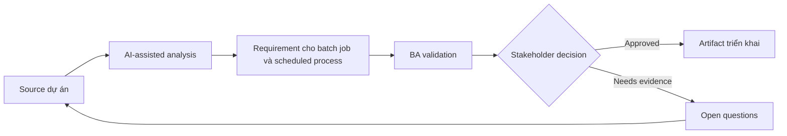

# Requirement cho batch job và scheduled process

<div class="case-meta">
  <span>Backend and API</span>
  <span>Scheduled processing</span>
  <span>Backend/API refinement</span>
  <span>Practitioner</span>
  <span>Batch process spec</span>
  <span>Use case dự án</span>
</div>

## Project context

Nightly job recalculates customer risk score, gửi summary notification và update reporting table. Failure hiện được support team phát hiện muộn. Trong Scheduled processing, công việc này thường bắt đầu khi API contract, permission, error, audit và operational behavior phải đủ explicit cho backend delivery. BA nên xem Process purpose và Schedule rules là evidence cần organize, không phải raw material để AI trả lời không kiểm soát. Mục tiêu là làm decision tiếp theo rõ hơn cho người own outcome.

## BA challenge

BA phải specify scheduled process behavior mà user có thể không thấy trực tiếp: trigger, schedule, input eligibility, processing rule, failure handling, rerun, audit và operational monitoring. Với Requirement cho batch job và scheduled process, khó khăn thực tế là service behavior mơ hồ và security gap. AI có thể tăng tốc contract critique, rule extraction, error taxonomy, permission review và NFR gap detection, nhưng BA vẫn phải làm rõ assumption, approval còn thiếu và điểm cần stakeholder judgment.

## Where AI fits

<div class="ba-workbench-panel">
AI phù hợp với use case Backend và API khi được giới hạn vào contract critique, rule extraction, error taxonomy, permission review và NFR gap detection. AI task hữu ích đầu tiên là: Generate batch process requirement checklist. AI không được approve scope, invent policy, bỏ qua API draft, data model, auth rule, error sample, audit policy và integration need, hoặc biến draft thành final decision.
</div>

- Generate batch process requirement checklist.
- Identify failure, partial success, rerun và notification scenario.
- Draft operational monitoring và alert rule.
- Tạo acceptance criteria cho data freshness và audit.

## Inputs to prepare

- Process purpose
- Schedule rules
- Input data definitions
- Output consumers
- Operations runbook

Trước khi prompt cho Requirement cho batch job và scheduled process, hãy label từng input theo owner, date, approval status, sensitivity và vai trò trong decision. Evidence lens quan trọng nhất là API draft, data model, auth rule, error sample, audit policy và integration need; nếu thiếu, AI có thể xem old note, draft design và approved rule có authority như nhau.

## BA workflow

1. Define business purpose và downstream consumer của scheduled job.
2. Yêu cầu AI draft scenario cho success, partial success, skipped item và failure.
3. Specify schedule, eligibility, processing rule, output, notification và audit.
4. Review rerun và rollback need với backend và operations.
5. Define monitoring, alert, SLA và support escalation.
6. Viết acceptance criteria cho data freshness và failure handling.

Chạy workflow như contract validation trước implementation: bắt đầu với "Define business purpose và downstream consumer của scheduled job.", sau đó giữ decision log visible khi artifact tiến tới Batch process spec. Cách này ngăn suggestion của AI âm thầm trở thành backlog, design, release hoặc operational commitment.

## Diagram



## Deliverables

| Deliverable | Nội dung | Owner | Done signal |
| --- | --- | --- | --- |
| Batch process spec | Schedule, trigger, eligibility, input, output và processing rule | BA và backend | Job behavior explicit |
| Failure handling matrix | Failure type, user impact, retry, rerun, alert và owner | Operations | Failure có action path |
| Data freshness requirement | Output, consumer, freshness target và alert threshold | Product owner | Freshness measurable |
| Operational runbook requirements | Monitor, alert, rerun, rollback và support communication | Operations | Support respond được |

Hãy xem Batch process spec là backend behavior contract do BA own. AI có thể draft structure, nhưng BA phải validate "Job behavior explicit" có thật sự đúng không, artifact có trace được về evidence không và receiving team có hành động được không.

## Prompt to try

```text
Hãy đóng vai senior Business Analyst hiểu AI. Hỗ trợ tôi áp dụng use case "Requirement cho batch job và scheduled process" vào dự án. Trước hết hỏi source evidence và constraint. Sau đó tạo structured analysis gồm project context, assumption, AI-fit boundary, workflow step, deliverable, risk, control, open question và stakeholder decision. Không tự bịa policy, threshold hoặc approval.
```

## Review checklist

- Process purpose được label owner, date, approval status và sensitivity.
- Batch process spec trace được về source evidence và có human owner rõ.
- AI task nằm trong boundary contract critique, rule extraction, error taxonomy, permission review và NFR gap detection và không approve scope hoặc policy.
- Risk "Invisible failure" có control thực tế: Define monitoring và freshness alert.
- Open assumption được chuyển thành validation question hoặc stakeholder decision.
- Success metric: Scheduled backend work có business rule, monitoring, rerun behavior và operational ownership rõ.

## Risks and controls

| Rủi ro | Vì sao quan trọng | Control của BA |
| --- | --- | --- |
| Invisible failure | User thấy data sai trước khi ai biết job fail | Define monitoring và freshness alert |
| Partial success ambiguity | Một số record update còn số khác không | Specify partial success và reconciliation |
| Unsafe rerun | Rerun có thể duplicate notification hoặc update | Define idempotent rerun behavior |
| No owner | Operations không biết ai respond | Assign alert owner và SLA |

Control chính cho risk "Invisible failure" là human accountability explicit: Define monitoring và freshness alert. Nếu evidence yếu, output nên tạo validation question hoặc decision item, không phải final requirement.
