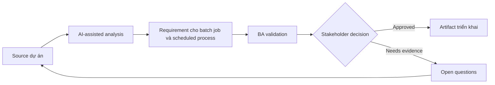

# Requirement cho batch job và scheduled process

<div class="case-meta">
  <span>Backend and API</span>
  <span>Scheduled processing</span>
  <span>Use case dự án</span>
</div>

## Project context

Nightly job recalculates customer risk score, gửi summary notification và update reporting table. Failure hiện được support team phát hiện muộn. Trong môi trường delivery thật, tình huống này thường xuất hiện dưới áp lực thời gian: stakeholder cần clarity, delivery cần backlog, QA cần behavior test được, operations cần process chịu được exception. BA dùng AI để tăng tốc analysis và synthesis, nhưng BA vẫn chịu trách nhiệm về evidence, business meaning, stakeholder decisioning và artifact quality.

## BA challenge

BA phải specify scheduled process behavior mà user có thể không thấy trực tiếp: trigger, schedule, input eligibility, processing rule, failure handling, rerun, audit và operational monitoring. Khó khăn thực tế là AI có thể làm material ban đầu trông hoàn chỉnh hơn mức thật sự. BA giỏi giữ output ở trạng thái reviewable bằng cách tách source-backed fact, assumption, unsupported claim, decision gap và recommended next action. Mục tiêu không phải làm document dài hơn; mục tiêu là làm project decision rõ hơn và an toàn hơn.

## Where AI fits

<div class="ba-workbench-panel">
AI hữu ích trong use case này khi được giới hạn vào analysis support, pattern detection, structured drafting và critique. AI không được approve scope, invent policy, quyết định business trade-off hoặc thay thế judgment của stakeholder chịu trách nhiệm.
</div>

- Generate batch process requirement checklist.
- Identify failure, partial success, rerun và notification scenario.
- Draft operational monitoring và alert rule.
- Tạo acceptance criteria cho data freshness và audit.

## Inputs to prepare

- Process purpose
- Schedule rules
- Input data definitions
- Output consumers
- Operations runbook

BA nên label các input này trước khi dùng AI: source owner, source date, approval status, sensitivity level, và source đó là fact, opinion, policy, draft hay historical evidence. Việc chuẩn bị này ngăn model xem mọi input đều current và authoritative như nhau.

## BA workflow

1. Define business purpose và downstream consumer của scheduled job.
2. Yêu cầu AI draft scenario cho success, partial success, skipped item và failure.
3. Specify schedule, eligibility, processing rule, output, notification và audit.
4. Review rerun và rollback need với backend và operations.
5. Define monitoring, alert, SLA và support escalation.
6. Viết acceptance criteria cho data freshness và failure handling.

Workflow hiệu quả nhất khi dùng AI theo từng stage: trước hết organize evidence, sau đó yêu cầu analysis, tiếp theo tạo artifact, rồi chạy critique pass. BA nên giữ decision log visible xuyên suốt để suggestion do AI sinh ra không âm thầm trở thành approved scope.

## Diagram



## Deliverables

| Deliverable | Nội dung | Owner | Done signal |
| --- | --- | --- | --- |
| Batch process spec | Schedule, trigger, eligibility, input, output và processing rule | BA và backend | Job behavior explicit |
| Failure handling matrix | Failure type, user impact, retry, rerun, alert và owner | Operations | Failure có action path |
| Data freshness requirement | Output, consumer, freshness target và alert threshold | Product owner | Freshness measurable |
| Operational runbook requirements | Monitor, alert, rerun, rollback và support communication | Operations | Support respond được |

Các deliverable này nên được xem là artifact do BA own. AI có thể draft, nhưng BA phải validate source support, stakeholder meaning, traceability và artifact đã sẵn sàng handoff hay chưa.

## Prompt to try

```text
Hãy đóng vai senior Business Analyst hiểu AI. Hỗ trợ tôi áp dụng use case "Requirement cho batch job và scheduled process" vào dự án. Trước hết hỏi source evidence và constraint. Sau đó tạo structured analysis gồm project context, assumption, AI-fit boundary, workflow step, deliverable, risk, control, open question và stakeholder decision. Không tự bịa policy, threshold hoặc approval.
```

## Review checklist

- Mọi statement do AI hỗ trợ đều gắn với source, assumption hoặc validation question.
- BA đã tách drafting assistance khỏi business approval.
- Workflow step có human owner cho decision, review và exception.
- Deliverable trace được về project input và review được bởi QA, product hoặc operations.
- Risk control đủ thực tế để dùng trong meeting dự án thật.
- Success metric: Scheduled backend work có business rule, monitoring, rerun behavior và operational ownership rõ.

## Risks and controls

| Rủi ro | Vì sao quan trọng | Control của BA |
| --- | --- | --- |
| Invisible failure | User thấy data sai trước khi ai biết job fail | Define monitoring và freshness alert |
| Partial success ambiguity | Một số record update còn số khác không | Specify partial success và reconciliation |
| Unsafe rerun | Rerun có thể duplicate notification hoặc update | Define idempotent rerun behavior |
| No owner | Operations không biết ai respond | Assign alert owner và SLA |

Control quan trọng nhất là làm uncertainty visible. Nếu evidence yếu, output nên tạo validation question hoặc decision item, không phải final requirement. Nếu artifact ảnh hưởng delivery, release, compliance, customer experience hoặc operational workload, BA nên yêu cầu human review explicit trước khi handoff.
