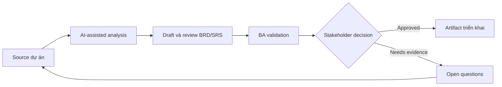

# Draft và review BRD/SRS

<div class="case-meta">
  <span>Requirements and backlog</span>
  <span>Formal requirements documentation</span>
  <span>Use case dự án</span>
</div>

## Project context

Một dự án regulated cần BRD và SRS cho customer data consent module. Stakeholder muốn formal documentation, nhưng source material nằm rải rác trong policy note, discovery workshop, legal comment và architecture constraint. Trong môi trường delivery thật, tình huống này thường xuất hiện dưới áp lực thời gian: stakeholder cần clarity, delivery cần backlog, QA cần behavior test được, operations cần process chịu được exception. BA dùng AI để tăng tốc analysis và synthesis, nhưng BA vẫn chịu trách nhiệm về evidence, business meaning, stakeholder decisioning và artifact quality.

## BA challenge

BA phải dùng AI để draft nhanh hơn nhưng không cho AI invent decision, policy hoặc system behavior. Document phải giữ evidence, versioning, assumption, open decision và approval checkpoint visible. Khó khăn thực tế là AI có thể làm material ban đầu trông hoàn chỉnh hơn mức thật sự. BA giỏi giữ output ở trạng thái reviewable bằng cách tách source-backed fact, assumption, unsupported claim, decision gap và recommended next action. Mục tiêu không phải làm document dài hơn; mục tiêu là làm project decision rõ hơn và an toàn hơn.

## Where AI fits

<div class="ba-workbench-panel">
AI hữu ích trong use case này khi được giới hạn vào analysis support, pattern detection, structured drafting và critique. AI không được approve scope, invent policy, quyết định business trade-off hoặc thay thế judgment của stakeholder chịu trách nhiệm.
</div>

- Tạo document outline từ source inventory.
- Draft section chỉ từ supplied evidence.
- Review contradiction, missing rule và unsupported claim.
- Generate executive summary, requirement table và decision log entry.

## Inputs to prepare

- Policy notes
- Workshop outputs
- Legal review comments
- Architecture constraints
- Existing consent flows

BA nên label các input này trước khi dùng AI: source owner, source date, approval status, sensitivity level, và source đó là fact, opinion, policy, draft hay historical evidence. Việc chuẩn bị này ngăn model xem mọi input đều current và authoritative như nhau.

## BA workflow

1. Build source map và decision log trước khi drafting.
2. Yêu cầu AI tạo outline kèm evidence required cho từng section.
3. Draft từng section và bắt unsupported claim được label.
4. Chạy AI critique pass cho ambiguity, conflict và missing NFR.
5. Validate section nhiều decision với legal, product và architecture owner.
6. Publish BRD hoặc SRS với assumption và open decision còn nguyên.

Workflow hiệu quả nhất khi dùng AI theo từng stage: trước hết organize evidence, sau đó yêu cầu analysis, tiếp theo tạo artifact, rồi chạy critique pass. BA nên giữ decision log visible xuyên suốt để suggestion do AI sinh ra không âm thầm trở thành approved scope.

## Diagram



## Deliverables

| Deliverable | Nội dung | Owner | Done signal |
| --- | --- | --- | --- |
| BRD hoặc SRS outline | Section, purpose, evidence source và approval owner | BA | Không section nào thiếu evidence expectation |
| Requirement table | Requirement ID, statement, source, assumption, owner, priority và testability | BA | Requirement traceable |
| Decision log | Policy và scope decision với option và impact | Product owner | Open decision không bị giấu |
| Review findings | Ambiguity, conflict, NFR gap, unsupported claim và fix | BA và reviewer | Finding được resolve hoặc assigned |

Các deliverable này nên được xem là artifact do BA own. AI có thể draft, nhưng BA phải validate source support, stakeholder meaning, traceability và artifact đã sẵn sàng handoff hay chưa.

## Prompt to try

```text
Hãy đóng vai senior Business Analyst hiểu AI. Hỗ trợ tôi áp dụng use case "Draft và review BRD/SRS" vào dự án. Trước hết hỏi source evidence và constraint. Sau đó tạo structured analysis gồm project context, assumption, AI-fit boundary, workflow step, deliverable, risk, control, open question và stakeholder decision. Không tự bịa policy, threshold hoặc approval.
```

## Review checklist

- Mọi statement do AI hỗ trợ đều gắn với source, assumption hoặc validation question.
- BA đã tách drafting assistance khỏi business approval.
- Workflow step có human owner cho decision, review và exception.
- Deliverable trace được về project input và review được bởi QA, product hoặc operations.
- Risk control đủ thực tế để dùng trong meeting dự án thật.
- Success metric: BRD hoặc SRS được draft nhanh hơn nhưng vẫn traceable, reviewable và approved bởi đúng owner.

## Risks and controls

| Rủi ro | Vì sao quan trọng | Control của BA |
| --- | --- | --- |
| Polished invention | AI có thể tạo text thuyết phục nhưng không có source support | Draft từ source ID và label unsupported claim |
| Approval confusion | Reader có thể xem draft text là approved policy | Dùng version status và approval checkpoint |
| Document bloat | AI có thể thêm section generic làm loãng decision chính | Giữ section gắn với project decision và compliance need |
| Lost assumptions | Làm document sạch quá có thể che uncertainty | Giữ assumption và open decision visible |

Control quan trọng nhất là làm uncertainty visible. Nếu evidence yếu, output nên tạo validation question hoặc decision item, không phải final requirement. Nếu artifact ảnh hưởng delivery, release, compliance, customer experience hoặc operational workload, BA nên yêu cầu human review explicit trước khi handoff.
