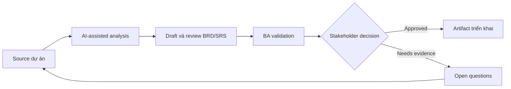

# Draft và review BRD/SRS

<div class="case-meta">
  <span>Requirements and backlog</span>
  <span>Formal requirements documentation</span>
  <span>Refinement</span>
  <span>Core</span>
  <span>BRD hoặc SRS outline</span>
  <span>Use case dự án</span>
</div>

## Project context

Một dự án regulated cần BRD và SRS cho customer data consent module. Stakeholder muốn formal documentation, nhưng source material nằm rải rác trong policy note, discovery workshop, legal comment và architecture constraint. Trong Formal requirements documentation, công việc này thường bắt đầu khi story phải test được mà không mất business rule, exception, data need hoặc NFR. BA nên xem Policy notes và Workshop outputs là evidence cần organize, không phải raw material để AI trả lời không kiểm soát. Mục tiêu là làm decision tiếp theo rõ hơn cho người own outcome.

## BA challenge

BA phải dùng AI để draft nhanh hơn nhưng không cho AI invent decision, policy hoặc system behavior. Document phải giữ evidence, versioning, assumption, open decision và approval checkpoint visible. Với Draft và review BRD/SRS, khó khăn thực tế là criteria mơ hồ và assumption không owner. AI có thể tăng tốc gap finding, rewrite critique, edge-case expansion và acceptance-criteria drafting, nhưng BA vẫn phải làm rõ assumption, approval còn thiếu và điểm cần stakeholder judgment.

## Where AI fits

<div class="ba-workbench-panel">
AI phù hợp với use case Requirements và backlog khi được giới hạn vào gap finding, rewrite critique, edge-case expansion và acceptance-criteria drafting. AI task hữu ích đầu tiên là: Tạo document outline từ source inventory. AI không được approve scope, invent policy, bỏ qua rule đã approve, example, edge case và expectation của QA, hoặc biến draft thành final decision.
</div>

- Tạo document outline từ source inventory.
- Draft section chỉ từ supplied evidence.
- Review contradiction, missing rule và unsupported claim.
- Generate executive summary, requirement table và decision log entry.

## Inputs to prepare

- Policy notes
- Workshop outputs
- Legal review comments
- Architecture constraints
- Existing consent flows

Trước khi prompt cho Draft và review BRD/SRS, hãy label từng input theo owner, date, approval status, sensitivity và vai trò trong decision. Evidence lens quan trọng nhất là rule đã approve, example, edge case và expectation của QA; nếu thiếu, AI có thể xem old note, draft design và approved rule có authority như nhau.

## BA workflow

1. Build source map và decision log trước khi drafting.
2. Yêu cầu AI tạo outline kèm evidence required cho từng section.
3. Draft từng section và bắt unsupported claim được label.
4. Chạy AI critique pass cho ambiguity, conflict và missing NFR.
5. Validate section nhiều decision với legal, product và architecture owner.
6. Publish BRD hoặc SRS với assumption và open decision còn nguyên.

Chạy workflow như clarify requirement trước khi commit sprint: bắt đầu với "Build source map và decision log trước khi drafting.", sau đó giữ decision log visible khi artifact tiến tới BRD hoặc SRS outline. Cách này ngăn suggestion của AI âm thầm trở thành backlog, design, release hoặc operational commitment.

## Diagram



## Deliverables

| Deliverable | Nội dung | Owner | Done signal |
| --- | --- | --- | --- |
| BRD hoặc SRS outline | Section, purpose, evidence source và approval owner | BA | Không section nào thiếu evidence expectation |
| Requirement table | Requirement ID, statement, source, assumption, owner, priority và testability | BA | Requirement traceable |
| Decision log | Policy và scope decision với option và impact | Product owner | Open decision không bị giấu |
| Review findings | Ambiguity, conflict, NFR gap, unsupported claim và fix | BA và reviewer | Finding được resolve hoặc assigned |

Hãy xem BRD hoặc SRS outline là delivery-ready backlog artifact do BA own. AI có thể draft structure, nhưng BA phải validate "Không section nào thiếu evidence expectation" có thật sự đúng không, artifact có trace được về evidence không và receiving team có hành động được không.

## Prompt to try

```text
Hãy đóng vai senior Business Analyst hiểu AI. Hỗ trợ tôi áp dụng use case "Draft và review BRD/SRS" vào dự án. Trước hết hỏi source evidence và constraint. Sau đó tạo structured analysis gồm project context, assumption, AI-fit boundary, workflow step, deliverable, risk, control, open question và stakeholder decision. Không tự bịa policy, threshold hoặc approval.
```

## Review checklist

- Policy notes được label owner, date, approval status và sensitivity.
- BRD hoặc SRS outline trace được về source evidence và có human owner rõ.
- AI task nằm trong boundary gap finding, rewrite critique, edge-case expansion và acceptance-criteria drafting và không approve scope hoặc policy.
- Risk "Polished invention" có control thực tế: Draft từ source ID và label unsupported claim.
- Open assumption được chuyển thành validation question hoặc stakeholder decision.
- Success metric: BRD hoặc SRS được draft nhanh hơn nhưng vẫn traceable, reviewable và approved bởi đúng owner.

## Risks and controls

| Rủi ro | Vì sao quan trọng | Control của BA |
| --- | --- | --- |
| Polished invention | AI có thể tạo text thuyết phục nhưng không có source support | Draft từ source ID và label unsupported claim |
| Approval confusion | Reader có thể xem draft text là approved policy | Dùng version status và approval checkpoint |
| Document bloat | AI có thể thêm section generic làm loãng decision chính | Giữ section gắn với project decision và compliance need |
| Lost assumptions | Làm document sạch quá có thể che uncertainty | Giữ assumption và open decision visible |

Control chính cho risk "Polished invention" là human accountability explicit: Draft từ source ID và label unsupported claim. Nếu evidence yếu, output nên tạo validation question hoặc decision item, không phải final requirement.
