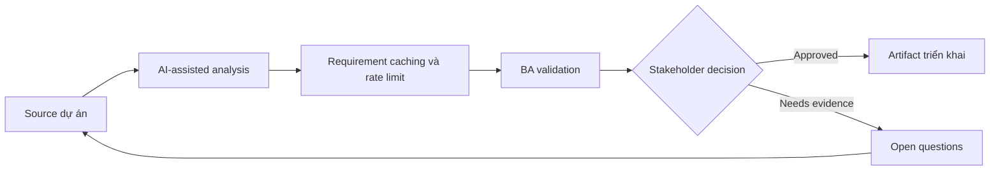

# Requirement caching và rate limit

<div class="case-meta">
  <span>Backend and API</span>
  <span>Performance controls</span>
  <span>Backend/API refinement</span>
  <span>Practitioner</span>
  <span>Freshness requirement matrix</span>
  <span>Use case dự án</span>
</div>

## Project context

Search-heavy API chậm khi peak usage. Engineering đề xuất caching và rate limit, nhưng product lo stale data và enterprise customer hit limit. Trong Performance controls, công việc này thường bắt đầu khi API contract, permission, error, audit và operational behavior phải đủ explicit cho backend delivery. BA nên xem Performance data và Customer tiers là evidence cần organize, không phải raw material để AI trả lời không kiểm soát. Mục tiêu là làm decision tiếp theo rõ hơn cho người own outcome.

## BA challenge

BA phải dịch technical control thành business behavior: freshness expectation, user messaging, limit tier, burst behavior, support exception và monitoring. Với Requirement caching và rate limit, khó khăn thực tế là service behavior mơ hồ và security gap. AI có thể tăng tốc contract critique, rule extraction, error taxonomy, permission review và NFR gap detection, nhưng BA vẫn phải làm rõ assumption, approval còn thiếu và điểm cần stakeholder judgment.

## Where AI fits

<div class="ba-workbench-panel">
AI phù hợp với use case Backend và API khi được giới hạn vào contract critique, rule extraction, error taxonomy, permission review và NFR gap detection. AI task hữu ích đầu tiên là: Generate business question cho caching và rate limit. AI không được approve scope, invent policy, bỏ qua API draft, data model, auth rule, error sample, audit policy và integration need, hoặc biến draft thành final decision.
</div>

- Generate business question cho caching và rate limit.
- Draft acceptance criteria cho freshness và stale data.
- Tạo rate limit tier matrix và user messaging.
- Identify support và monitoring requirement.

## Inputs to prepare

- Performance data
- Customer tiers
- Data freshness needs
- API usage analytics
- Support commitments

Trước khi prompt cho Requirement caching và rate limit, hãy label từng input theo owner, date, approval status, sensitivity và vai trò trong decision. Evidence lens quan trọng nhất là API draft, data model, auth rule, error sample, audit policy và integration need; nếu thiếu, AI có thể xem old note, draft design và approved rule có authority như nhau.

## BA workflow

1. Define user task và data freshness sensitivity.
2. Yêu cầu AI propose caching và rate limit question theo customer tier.
3. Specify cache duration, invalidation, stale display và force refresh behavior.
4. Define rate limit threshold, burst rule, error message và support path.
5. Review trade-off với product, backend, support và enterprise account owner.
6. Thêm monitoring và acceptance criteria cho performance và limit behavior.

Chạy workflow như contract validation trước implementation: bắt đầu với "Define user task và data freshness sensitivity.", sau đó giữ decision log visible khi artifact tiến tới Freshness requirement matrix. Cách này ngăn suggestion của AI âm thầm trở thành backlog, design, release hoặc operational commitment.

## Diagram



## Deliverables

| Deliverable | Nội dung | Owner | Done signal |
| --- | --- | --- | --- |
| Freshness requirement matrix | Data type, freshness target, cache duration, stale display và owner | BA và product | Stale behavior explicit |
| Rate limit tier table | Customer tier, threshold, burst, error response và exception path | Product owner | Limit match business model |
| User messaging spec | Stale data notice, rate limit message, retry guidance và support path | UX | User hiểu limit |
| Performance monitoring spec | Latency, cache hit rate, rate limit event và alert owner | Operations | Control observable |

Hãy xem Freshness requirement matrix là backend behavior contract do BA own. AI có thể draft structure, nhưng BA phải validate "Stale behavior explicit" có thật sự đúng không, artifact có trace được về evidence không và receiving team có hành động được không.

## Prompt to try

```text
Hãy đóng vai senior Business Analyst hiểu AI. Hỗ trợ tôi áp dụng use case "Requirement caching và rate limit" vào dự án. Trước hết hỏi source evidence và constraint. Sau đó tạo structured analysis gồm project context, assumption, AI-fit boundary, workflow step, deliverable, risk, control, open question và stakeholder decision. Không tự bịa policy, threshold hoặc approval.
```

## Review checklist

- Performance data được label owner, date, approval status và sensitivity.
- Freshness requirement matrix trace được về source evidence và có human owner rõ.
- AI task nằm trong boundary contract critique, rule extraction, error taxonomy, permission review và NFR gap detection và không approve scope hoặc policy.
- Risk "Stale decision" có control thực tế: Define freshness và stale label.
- Open assumption được chuyển thành validation question hoặc stakeholder decision.
- Success metric: Caching và rate limit cải thiện performance mà không che freshness hoặc customer impact trade-off.

## Risks and controls

| Rủi ro | Vì sao quan trọng | Control của BA |
| --- | --- | --- |
| Stale decision | Cached data có thể dẫn tới user action sai | Define freshness và stale label |
| Customer friction | Rate limit block legitimate usage | Align limit với tier và support exception |
| Hidden throttling | User không biết vì sao request fail | Dùng clear error và retry guidance |
| Unmeasured control | Caching có thể không cải thiện experience thật | Monitor latency và cache hit rate |

Control chính cho risk "Stale decision" là human accountability explicit: Define freshness và stale label. Nếu evidence yếu, output nên tạo validation question hoặc decision item, không phải final requirement.
