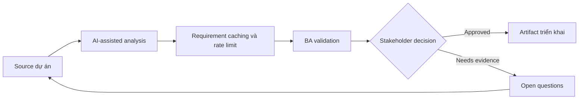

# Requirement caching và rate limit

<div class="case-meta">
  <span>Backend and API</span>
  <span>Performance controls</span>
  <span>Use case dự án</span>
</div>

## Project context

Search-heavy API chậm khi peak usage. Engineering đề xuất caching và rate limit, nhưng product lo stale data và enterprise customer hit limit. Trong môi trường delivery thật, tình huống này thường xuất hiện dưới áp lực thời gian: stakeholder cần clarity, delivery cần backlog, QA cần behavior test được, operations cần process chịu được exception. BA dùng AI để tăng tốc analysis và synthesis, nhưng BA vẫn chịu trách nhiệm về evidence, business meaning, stakeholder decisioning và artifact quality.

## BA challenge

BA phải dịch technical control thành business behavior: freshness expectation, user messaging, limit tier, burst behavior, support exception và monitoring. Khó khăn thực tế là AI có thể làm material ban đầu trông hoàn chỉnh hơn mức thật sự. BA giỏi giữ output ở trạng thái reviewable bằng cách tách source-backed fact, assumption, unsupported claim, decision gap và recommended next action. Mục tiêu không phải làm document dài hơn; mục tiêu là làm project decision rõ hơn và an toàn hơn.

## Where AI fits

<div class="ba-workbench-panel">
AI hữu ích trong use case này khi được giới hạn vào analysis support, pattern detection, structured drafting và critique. AI không được approve scope, invent policy, quyết định business trade-off hoặc thay thế judgment của stakeholder chịu trách nhiệm.
</div>

- Generate business question cho caching và rate limit.
- Draft acceptance criteria cho freshness và stale data.
- Tạo rate limit tier matrix và user messaging.
- Identify support và monitoring requirement.

## Inputs to prepare

- Performance data
- Customer tiers
- Data freshness needs
- API usage analytics
- Support commitments

BA nên label các input này trước khi dùng AI: source owner, source date, approval status, sensitivity level, và source đó là fact, opinion, policy, draft hay historical evidence. Việc chuẩn bị này ngăn model xem mọi input đều current và authoritative như nhau.

## BA workflow

1. Define user task và data freshness sensitivity.
2. Yêu cầu AI propose caching và rate limit question theo customer tier.
3. Specify cache duration, invalidation, stale display và force refresh behavior.
4. Define rate limit threshold, burst rule, error message và support path.
5. Review trade-off với product, backend, support và enterprise account owner.
6. Thêm monitoring và acceptance criteria cho performance và limit behavior.

Workflow hiệu quả nhất khi dùng AI theo từng stage: trước hết organize evidence, sau đó yêu cầu analysis, tiếp theo tạo artifact, rồi chạy critique pass. BA nên giữ decision log visible xuyên suốt để suggestion do AI sinh ra không âm thầm trở thành approved scope.

## Diagram



## Deliverables

| Deliverable | Nội dung | Owner | Done signal |
| --- | --- | --- | --- |
| Freshness requirement matrix | Data type, freshness target, cache duration, stale display và owner | BA và product | Stale behavior explicit |
| Rate limit tier table | Customer tier, threshold, burst, error response và exception path | Product owner | Limit match business model |
| User messaging spec | Stale data notice, rate limit message, retry guidance và support path | UX | User hiểu limit |
| Performance monitoring spec | Latency, cache hit rate, rate limit event và alert owner | Operations | Control observable |

Các deliverable này nên được xem là artifact do BA own. AI có thể draft, nhưng BA phải validate source support, stakeholder meaning, traceability và artifact đã sẵn sàng handoff hay chưa.

## Prompt to try

```text
Hãy đóng vai senior Business Analyst hiểu AI. Hỗ trợ tôi áp dụng use case "Requirement caching và rate limit" vào dự án. Trước hết hỏi source evidence và constraint. Sau đó tạo structured analysis gồm project context, assumption, AI-fit boundary, workflow step, deliverable, risk, control, open question và stakeholder decision. Không tự bịa policy, threshold hoặc approval.
```

## Review checklist

- Mọi statement do AI hỗ trợ đều gắn với source, assumption hoặc validation question.
- BA đã tách drafting assistance khỏi business approval.
- Workflow step có human owner cho decision, review và exception.
- Deliverable trace được về project input và review được bởi QA, product hoặc operations.
- Risk control đủ thực tế để dùng trong meeting dự án thật.
- Success metric: Caching và rate limit cải thiện performance mà không che freshness hoặc customer impact trade-off.

## Risks and controls

| Rủi ro | Vì sao quan trọng | Control của BA |
| --- | --- | --- |
| Stale decision | Cached data có thể dẫn tới user action sai | Define freshness và stale label |
| Customer friction | Rate limit block legitimate usage | Align limit với tier và support exception |
| Hidden throttling | User không biết vì sao request fail | Dùng clear error và retry guidance |
| Unmeasured control | Caching có thể không cải thiện experience thật | Monitor latency và cache hit rate |

Control quan trọng nhất là làm uncertainty visible. Nếu evidence yếu, output nên tạo validation question hoặc decision item, không phải final requirement. Nếu artifact ảnh hưởng delivery, release, compliance, customer experience hoặc operational workload, BA nên yêu cầu human review explicit trước khi handoff.
