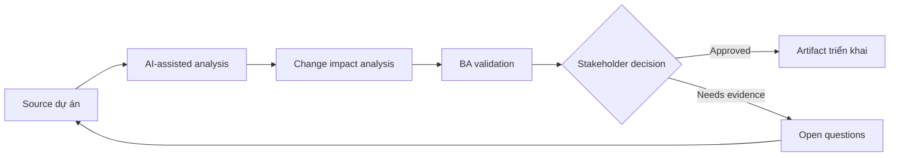

# Change impact analysis

<div class="case-meta">
  <span>Delivery and QA</span>
  <span>Change control</span>
  <span>Delivery validation</span>
  <span>Core</span>
  <span>Impact matrix</span>
  <span>Use case dự án</span>
</div>

## Project context

Giữa sprint, compliance thay đổi rule về document retention. Change ảnh hưởng onboarding form, storage, notification, audit log, reporting và support script. Team cần clarity về impact trước khi accept change. Trong Change control, công việc này thường bắt đầu khi delivery decision, test evidence và release readiness phải còn nối với intent ban đầu. BA nên xem Change request và Requirement repository là evidence cần organize, không phải raw material để AI trả lời không kiểm soát. Mục tiêu là làm decision tiếp theo rõ hơn cho người own outcome.

## BA challenge

BA phải phân tích impact qua requirement, process, system, data, test, user và release scope. AI có thể search artifact liên quan, nhưng BA phải confirm dependency meaning và decision impact. Với Change impact analysis, khó khăn thực tế là optimistic status và late requirement discovery. AI có thể tăng tốc scenario generation, defect triage support, readiness synthesis và risk surfacing, nhưng BA vẫn phải làm rõ assumption, approval còn thiếu và điểm cần stakeholder judgment.

## Where AI fits

<div class="ba-workbench-panel">
AI phù hợp với use case Delivery và QA khi được giới hạn vào scenario generation, defect triage support, readiness synthesis và risk surfacing. AI task hữu ích đầu tiên là: Search requirement và process artifact cho concept affected. AI không được approve scope, invent policy, bỏ qua requirement baseline, test result, defect history và release decision, hoặc biến draft thành final decision.
</div>

- Search requirement và process artifact cho concept affected.
- Draft impact matrix qua business, data, system, test và operations area.
- Generate question cho compliance, architecture, QA và support.
- Summarize option accept, defer hoặc split release.

## Inputs to prepare

- Change request
- Requirement repository
- Process diagrams
- Data model notes
- Test cases và release plan

Trước khi prompt cho Change impact analysis, hãy label từng input theo owner, date, approval status, sensitivity và vai trò trong decision. Evidence lens quan trọng nhất là requirement baseline, test result, defect history và release decision; nếu thiếu, AI có thể xem old note, draft design và approved rule có authority như nhau.

## BA workflow

1. Restate change và identify policy rule difference chính xác.
2. Yêu cầu AI tìm artifact có thể affected và rank confidence.
3. Verify thủ công high-impact link với artifact owner.
4. Map impact tới scope, data, integration, test, training và operations.
5. Prepare option có timeline, risk và dependency implication.
6. Record decision và update affected artifact.

Chạy workflow như quality review trước release hoặc rework decision: bắt đầu với "Restate change và identify policy rule difference chính xác.", sau đó giữ decision log visible khi artifact tiến tới Impact matrix. Cách này ngăn suggestion của AI âm thầm trở thành backlog, design, release hoặc operational commitment.

## Diagram



## Deliverables

| Deliverable | Nội dung | Owner | Done signal |
| --- | --- | --- | --- |
| Impact matrix | Artifact, affected area, change needed, risk, owner và effort signal | BA | Impact cover business và technical area |
| Decision options | Accept now, defer, split hoặc reject với trade-off | Product owner | Option gồm risk và release impact |
| Artifact update list | Requirement, test, diagram, script và report cần update | BA và QA | Không affected artifact nào thiếu owner |
| Stakeholder questions | Question cho compliance, architecture, support và QA | BA | Open question tập trung decision |

Hãy xem Impact matrix là QA và delivery handoff artifact do BA own. AI có thể draft structure, nhưng BA phải validate "Impact cover business và technical area" có thật sự đúng không, artifact có trace được về evidence không và receiving team có hành động được không.

## Prompt to try

```text
Hãy đóng vai senior Business Analyst hiểu AI. Hỗ trợ tôi áp dụng use case "Change impact analysis" vào dự án. Trước hết hỏi source evidence và constraint. Sau đó tạo structured analysis gồm project context, assumption, AI-fit boundary, workflow step, deliverable, risk, control, open question và stakeholder decision. Không tự bịa policy, threshold hoặc approval.
```

## Review checklist

- Change request được label owner, date, approval status và sensitivity.
- Impact matrix trace được về source evidence và có human owner rõ.
- AI task nằm trong boundary scenario generation, defect triage support, readiness synthesis và risk surfacing và không approve scope hoặc policy.
- Risk "Keyword-only impact" có control thực tế: Verify meaning, không chỉ word match.
- Open assumption được chuyển thành validation question hoặc stakeholder decision.
- Success metric: Team accept, defer hoặc split change với impact và artifact owner visible.

## Risks and controls

| Rủi ro | Vì sao quan trọng | Control của BA |
| --- | --- | --- |
| Keyword-only impact | AI có thể miss semantic dependency hoặc flag match irrelevant | Verify meaning, không chỉ word match |
| Hidden operational impact | Support và training change có thể bị quên | Include operations và customer communication |
| Decision pressure | Team có thể accept change mà chưa trade-off release | Present option và consequence |
| Traceability drift | Artifact changed có thể lệch nhau | Update traceability matrix sau decision |

Control chính cho risk "Keyword-only impact" là human accountability explicit: Verify meaning, không chỉ word match. Nếu evidence yếu, output nên tạo validation question hoặc decision item, không phải final requirement.
