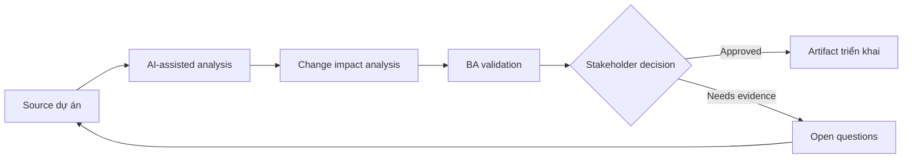

# Change impact analysis

<div class="case-meta">
  <span>Delivery and QA</span>
  <span>Change control</span>
  <span>Use case dự án</span>
</div>

## Project context

Giữa sprint, compliance thay đổi rule về document retention. Change ảnh hưởng onboarding form, storage, notification, audit log, reporting và support script. Team cần clarity về impact trước khi accept change. Trong môi trường delivery thật, tình huống này thường xuất hiện dưới áp lực thời gian: stakeholder cần clarity, delivery cần backlog, QA cần behavior test được, operations cần process chịu được exception. BA dùng AI để tăng tốc analysis và synthesis, nhưng BA vẫn chịu trách nhiệm về evidence, business meaning, stakeholder decisioning và artifact quality.

## BA challenge

BA phải phân tích impact qua requirement, process, system, data, test, user và release scope. AI có thể search artifact liên quan, nhưng BA phải confirm dependency meaning và decision impact. Khó khăn thực tế là AI có thể làm material ban đầu trông hoàn chỉnh hơn mức thật sự. BA giỏi giữ output ở trạng thái reviewable bằng cách tách source-backed fact, assumption, unsupported claim, decision gap và recommended next action. Mục tiêu không phải làm document dài hơn; mục tiêu là làm project decision rõ hơn và an toàn hơn.

## Where AI fits

<div class="ba-workbench-panel">
AI hữu ích trong use case này khi được giới hạn vào analysis support, pattern detection, structured drafting và critique. AI không được approve scope, invent policy, quyết định business trade-off hoặc thay thế judgment của stakeholder chịu trách nhiệm.
</div>

- Search requirement và process artifact cho concept affected.
- Draft impact matrix qua business, data, system, test và operations area.
- Generate question cho compliance, architecture, QA và support.
- Summarize option accept, defer hoặc split release.

## Inputs to prepare

- Change request
- Requirement repository
- Process diagrams
- Data model notes
- Test cases và release plan

BA nên label các input này trước khi dùng AI: source owner, source date, approval status, sensitivity level, và source đó là fact, opinion, policy, draft hay historical evidence. Việc chuẩn bị này ngăn model xem mọi input đều current và authoritative như nhau.

## BA workflow

1. Restate change và identify policy rule difference chính xác.
2. Yêu cầu AI tìm artifact có thể affected và rank confidence.
3. Verify thủ công high-impact link với artifact owner.
4. Map impact tới scope, data, integration, test, training và operations.
5. Prepare option có timeline, risk và dependency implication.
6. Record decision và update affected artifact.

Workflow hiệu quả nhất khi dùng AI theo từng stage: trước hết organize evidence, sau đó yêu cầu analysis, tiếp theo tạo artifact, rồi chạy critique pass. BA nên giữ decision log visible xuyên suốt để suggestion do AI sinh ra không âm thầm trở thành approved scope.

## Diagram



## Deliverables

| Deliverable | Nội dung | Owner | Done signal |
| --- | --- | --- | --- |
| Impact matrix | Artifact, affected area, change needed, risk, owner và effort signal | BA | Impact cover business và technical area |
| Decision options | Accept now, defer, split hoặc reject với trade-off | Product owner | Option gồm risk và release impact |
| Artifact update list | Requirement, test, diagram, script và report cần update | BA và QA | Không affected artifact nào thiếu owner |
| Stakeholder questions | Question cho compliance, architecture, support và QA | BA | Open question tập trung decision |

Các deliverable này nên được xem là artifact do BA own. AI có thể draft, nhưng BA phải validate source support, stakeholder meaning, traceability và artifact đã sẵn sàng handoff hay chưa.

## Prompt to try

```text
Hãy đóng vai senior Business Analyst hiểu AI. Hỗ trợ tôi áp dụng use case "Change impact analysis" vào dự án. Trước hết hỏi source evidence và constraint. Sau đó tạo structured analysis gồm project context, assumption, AI-fit boundary, workflow step, deliverable, risk, control, open question và stakeholder decision. Không tự bịa policy, threshold hoặc approval.
```

## Review checklist

- Mọi statement do AI hỗ trợ đều gắn với source, assumption hoặc validation question.
- BA đã tách drafting assistance khỏi business approval.
- Workflow step có human owner cho decision, review và exception.
- Deliverable trace được về project input và review được bởi QA, product hoặc operations.
- Risk control đủ thực tế để dùng trong meeting dự án thật.
- Success metric: Team accept, defer hoặc split change với impact và artifact owner visible.

## Risks and controls

| Rủi ro | Vì sao quan trọng | Control của BA |
| --- | --- | --- |
| Keyword-only impact | AI có thể miss semantic dependency hoặc flag match irrelevant | Verify meaning, không chỉ word match |
| Hidden operational impact | Support và training change có thể bị quên | Include operations và customer communication |
| Decision pressure | Team có thể accept change mà chưa trade-off release | Present option và consequence |
| Traceability drift | Artifact changed có thể lệch nhau | Update traceability matrix sau decision |

Control quan trọng nhất là làm uncertainty visible. Nếu evidence yếu, output nên tạo validation question hoặc decision item, không phải final requirement. Nếu artifact ảnh hưởng delivery, release, compliance, customer experience hoặc operational workload, BA nên yêu cầu human review explicit trước khi handoff.
