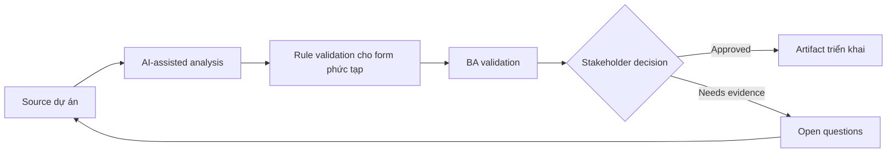

# Rule validation cho form phức tạp

<div class="case-meta">
  <span>Frontend, UI, and UX</span>
  <span>Forms and validation</span>
  <span>Frontend/UI refinement</span>
  <span>Practitioner</span>
  <span>Validation matrix</span>
  <span>Use case dự án</span>
</div>

## Project context

Customer profile form có conditional field, dependent dropdown, tax identifier theo country, file attachment và validation rule khác nhau giữa individual và business account. Trong Forms and validation, công việc này thường bắt đầu khi screen behavior, accessibility, design state, analytics và user feedback phải thành requirement implement được. BA nên xem Form design và Field list là evidence cần organize, không phải raw material để AI trả lời không kiểm soát. Mục tiêu là làm decision tiếp theo rõ hơn cho người own outcome.

## BA challenge

BA phải đặc tả validation để frontend và backend implement consistent. Phần khó là tách client-side guidance, server-side enforcement, conditional display, error copy và evidence source cho từng rule. Với Rule validation cho form phức tạp, khó khăn thực tế là missing state và UX không đo được. AI có thể tăng tốc UI-state analysis, content critique, accessibility review, event taxonomy và edge-case discovery, nhưng BA vẫn phải làm rõ assumption, approval còn thiếu và điểm cần stakeholder judgment.

## Where AI fits

<div class="ba-workbench-panel">
AI phù hợp với use case Frontend, UI và UX khi được giới hạn vào UI-state analysis, content critique, accessibility review, event taxonomy và edge-case discovery. AI task hữu ích đầu tiên là: Generate validation rule matrix từ policy và form design. AI không được approve scope, invent policy, bỏ qua wireframe, design token, user journey, analytics question và accessibility expectation, hoặc biến draft thành final decision.
</div>

- Generate validation rule matrix từ policy và form design.
- Identify missing conditional field rule và dependent dropdown rule.
- Draft error message bằng ngôn ngữ thân thiện.
- Compare frontend validation với backend enforcement need.

## Inputs to prepare

- Form design
- Field list
- Policy rules
- Country-specific requirements
- Backend validation constraints

Trước khi prompt cho Rule validation cho form phức tạp, hãy label từng input theo owner, date, approval status, sensitivity và vai trò trong decision. Evidence lens quan trọng nhất là wireframe, design token, user journey, analytics question và accessibility expectation; nếu thiếu, AI có thể xem old note, draft design và approved rule có authority như nhau.

## BA workflow

1. Inventory field, field type, source rule và dependency.
2. Yêu cầu AI draft validation matrix gồm client và server behavior.
3. Review rule với product, compliance, frontend, backend và QA.
4. Define error message, helper text và khi nào validation trigger.
5. Thêm negative và boundary acceptance criteria.
6. Tạo test data set cho country, account type và attachment variation.

Chạy workflow như screen-state review trước frontend build: bắt đầu với "Inventory field, field type, source rule và dependency.", sau đó giữ decision log visible khi artifact tiến tới Validation matrix. Cách này ngăn suggestion của AI âm thầm trở thành backlog, design, release hoặc operational commitment.

## Diagram



## Deliverables

| Deliverable | Nội dung | Owner | Done signal |
| --- | --- | --- | --- |
| Validation matrix | Field, condition, rule, client behavior, server behavior, source và error copy | BA | Mọi field rule traceable |
| Conditional field map | Trigger field, dependent field, display rule và reset behavior | Frontend | Dynamic form behavior rõ |
| Error copy catalog | Validation message, severity và recovery instruction | UX writer | Message giúp user recover |
| Test data set | Country, account type, file và boundary example | QA | Validation case executable |

Hãy xem Validation matrix là frontend requirement specification do BA own. AI có thể draft structure, nhưng BA phải validate "Mọi field rule traceable" có thật sự đúng không, artifact có trace được về evidence không và receiving team có hành động được không.

## Prompt to try

```text
Hãy đóng vai senior Business Analyst hiểu AI. Hỗ trợ tôi áp dụng use case "Rule validation cho form phức tạp" vào dự án. Trước hết hỏi source evidence và constraint. Sau đó tạo structured analysis gồm project context, assumption, AI-fit boundary, workflow step, deliverable, risk, control, open question và stakeholder decision. Không tự bịa policy, threshold hoặc approval.
```

## Review checklist

- Form design được label owner, date, approval status và sensitivity.
- Validation matrix trace được về source evidence và có human owner rõ.
- AI task nằm trong boundary UI-state analysis, content critique, accessibility review, event taxonomy và edge-case discovery và không approve scope hoặc policy.
- Risk "Client-server mismatch" có control thực tế: Define cả client guidance và server enforcement.
- Open assumption được chuyển thành validation question hoặc stakeholder decision.
- Success metric: Form validation được implement consistent giữa frontend, backend và QA với business rule traceable.

## Risks and controls

| Rủi ro | Vì sao quan trọng | Control của BA |
| --- | --- | --- |
| Client-server mismatch | Frontend accept data nhưng backend reject | Define cả client guidance và server enforcement |
| Policy invention | AI có thể invent country rule | Require source evidence cho từng rule |
| Poor error recovery | User không biết sửa input ra sao | Viết error copy actionable |
| Conditional reset gap | Hidden field có thể giữ stale value | Specify reset và persistence behavior |

Control chính cho risk "Client-server mismatch" là human accountability explicit: Define cả client guidance và server enforcement. Nếu evidence yếu, output nên tạo validation question hoặc decision item, không phải final requirement.
