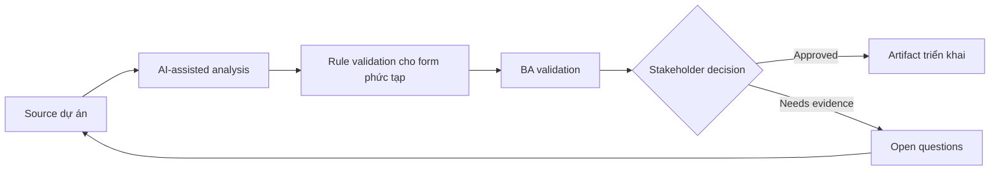

# Rule validation cho form phức tạp

<div class="case-meta">
  <span>Frontend, UI, and UX</span>
  <span>Forms and validation</span>
  <span>Use case dự án</span>
</div>

## Project context

Customer profile form có conditional field, dependent dropdown, tax identifier theo country, file attachment và validation rule khác nhau giữa individual và business account. Trong môi trường delivery thật, tình huống này thường xuất hiện dưới áp lực thời gian: stakeholder cần clarity, delivery cần backlog, QA cần behavior test được, operations cần process chịu được exception. BA dùng AI để tăng tốc analysis và synthesis, nhưng BA vẫn chịu trách nhiệm về evidence, business meaning, stakeholder decisioning và artifact quality.

## BA challenge

BA phải đặc tả validation để frontend và backend implement consistent. Phần khó là tách client-side guidance, server-side enforcement, conditional display, error copy và evidence source cho từng rule. Khó khăn thực tế là AI có thể làm material ban đầu trông hoàn chỉnh hơn mức thật sự. BA giỏi giữ output ở trạng thái reviewable bằng cách tách source-backed fact, assumption, unsupported claim, decision gap và recommended next action. Mục tiêu không phải làm document dài hơn; mục tiêu là làm project decision rõ hơn và an toàn hơn.

## Where AI fits

<div class="ba-workbench-panel">
AI hữu ích trong use case này khi được giới hạn vào analysis support, pattern detection, structured drafting và critique. AI không được approve scope, invent policy, quyết định business trade-off hoặc thay thế judgment của stakeholder chịu trách nhiệm.
</div>

- Generate validation rule matrix từ policy và form design.
- Identify missing conditional field rule và dependent dropdown rule.
- Draft error message bằng ngôn ngữ thân thiện.
- Compare frontend validation với backend enforcement need.

## Inputs to prepare

- Form design
- Field list
- Policy rules
- Country-specific requirements
- Backend validation constraints

BA nên label các input này trước khi dùng AI: source owner, source date, approval status, sensitivity level, và source đó là fact, opinion, policy, draft hay historical evidence. Việc chuẩn bị này ngăn model xem mọi input đều current và authoritative như nhau.

## BA workflow

1. Inventory field, field type, source rule và dependency.
2. Yêu cầu AI draft validation matrix gồm client và server behavior.
3. Review rule với product, compliance, frontend, backend và QA.
4. Define error message, helper text và khi nào validation trigger.
5. Thêm negative và boundary acceptance criteria.
6. Tạo test data set cho country, account type và attachment variation.

Workflow hiệu quả nhất khi dùng AI theo từng stage: trước hết organize evidence, sau đó yêu cầu analysis, tiếp theo tạo artifact, rồi chạy critique pass. BA nên giữ decision log visible xuyên suốt để suggestion do AI sinh ra không âm thầm trở thành approved scope.

## Diagram



## Deliverables

| Deliverable | Nội dung | Owner | Done signal |
| --- | --- | --- | --- |
| Validation matrix | Field, condition, rule, client behavior, server behavior, source và error copy | BA | Mọi field rule traceable |
| Conditional field map | Trigger field, dependent field, display rule và reset behavior | Frontend | Dynamic form behavior rõ |
| Error copy catalog | Validation message, severity và recovery instruction | UX writer | Message giúp user recover |
| Test data set | Country, account type, file và boundary example | QA | Validation case executable |

Các deliverable này nên được xem là artifact do BA own. AI có thể draft, nhưng BA phải validate source support, stakeholder meaning, traceability và artifact đã sẵn sàng handoff hay chưa.

## Prompt to try

```text
Hãy đóng vai senior Business Analyst hiểu AI. Hỗ trợ tôi áp dụng use case "Rule validation cho form phức tạp" vào dự án. Trước hết hỏi source evidence và constraint. Sau đó tạo structured analysis gồm project context, assumption, AI-fit boundary, workflow step, deliverable, risk, control, open question và stakeholder decision. Không tự bịa policy, threshold hoặc approval.
```

## Review checklist

- Mọi statement do AI hỗ trợ đều gắn với source, assumption hoặc validation question.
- BA đã tách drafting assistance khỏi business approval.
- Workflow step có human owner cho decision, review và exception.
- Deliverable trace được về project input và review được bởi QA, product hoặc operations.
- Risk control đủ thực tế để dùng trong meeting dự án thật.
- Success metric: Form validation được implement consistent giữa frontend, backend và QA với business rule traceable.

## Risks and controls

| Rủi ro | Vì sao quan trọng | Control của BA |
| --- | --- | --- |
| Client-server mismatch | Frontend accept data nhưng backend reject | Define cả client guidance và server enforcement |
| Policy invention | AI có thể invent country rule | Require source evidence cho từng rule |
| Poor error recovery | User không biết sửa input ra sao | Viết error copy actionable |
| Conditional reset gap | Hidden field có thể giữ stale value | Specify reset và persistence behavior |

Control quan trọng nhất là làm uncertainty visible. Nếu evidence yếu, output nên tạo validation question hoặc decision item, không phải final requirement. Nếu artifact ảnh hưởng delivery, release, compliance, customer experience hoặc operational workload, BA nên yêu cầu human review explicit trước khi handoff.
