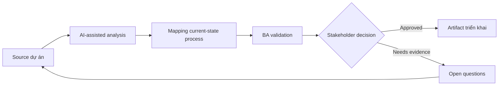

# Mapping current-state process

<div class="case-meta">
  <span>Discovery and alignment</span>
  <span>Operations analysis</span>
  <span>Discovery</span>
  <span>Core</span>
  <span>Current-state process map</span>
  <span>Use case dự án</span>
</div>

## Project context

Operations team muốn giảm turnaround time của request, nhưng current process nằm rải rác trong email, spreadsheet, ticket comment và tribal knowledge. Các team mô tả cùng một process theo cách khác nhau. Trong Operations analysis, công việc này thường bắt đầu khi stakeholder mô tả cùng một vấn đề từ incentive và mức chi tiết khác nhau. BA nên xem SOP và Interview notes là evidence cần organize, không phải raw material để AI trả lời không kiểm soát. Mục tiêu là làm decision tiếp theo rõ hơn cho người own outcome.

## BA challenge

BA phải xây current-state process thể hiện actor, system, decision, queue, exception path, handoff và pain point. AI có thể biến text thành diagram draft, nhưng BA phải validate operational reality với người làm việc thật. Với Mapping current-state process, khó khăn thực tế là false consensus và invented scope. AI có thể tăng tốc sensemaking, contradiction detection, question generation và workshop preparation, nhưng BA vẫn phải làm rõ assumption, approval còn thiếu và điểm cần stakeholder judgment.

## Where AI fits

<div class="ba-workbench-panel">
AI phù hợp với use case Discovery và alignment khi được giới hạn vào sensemaking, contradiction detection, question generation và workshop preparation. AI task hữu ích đầu tiên là: Extract process step từ interview và SOP. AI không được approve scope, invent policy, bỏ qua speaker attribution, decision authority và source freshness, hoặc biến draft thành final decision.
</div>

- Extract process step từ interview và SOP.
- Generate candidate flowchart và swimlane diagram.
- Identify missing decision rule và exception path.
- So sánh mô tả process giữa các stakeholder group.

## Inputs to prepare

- SOP
- Interview notes
- Ticket sample
- Spreadsheet tracker
- System screenshot

Trước khi prompt cho Mapping current-state process, hãy label từng input theo owner, date, approval status, sensitivity và vai trò trong decision. Evidence lens quan trọng nhất là speaker attribution, decision authority và source freshness; nếu thiếu, AI có thể xem old note, draft design và approved rule có authority như nhau.

## BA workflow

1. Tạo source ID cho mọi process description.
2. Yêu cầu AI list step, actor, system, decision, input, output và exception.
3. Generate draft flowchart và swimlane view.
4. Review diagram với frontline user và mark correction.
5. Tách current-state fact khỏi improvement idea.
6. Publish process map đã validate kèm pain point và rule gap.

Chạy workflow như gom evidence trước khi bàn solution: bắt đầu với "Tạo source ID cho mọi process description.", sau đó giữ decision log visible khi artifact tiến tới Current-state process map. Cách này ngăn suggestion của AI âm thầm trở thành backlog, design, release hoặc operational commitment.

## Diagram



## Deliverables

| Deliverable | Nội dung | Owner | Done signal |
| --- | --- | --- | --- |
| Current-state process map | Step, decision, actor, system, queue và exception path | BA | Frontline user confirm đúng reality |
| Rule gap register | Threshold, approval rule, routing rule và ownership gap còn thiếu | Operations owner | Mỗi gap có owner và next action |
| Pain point heatmap | Delay, rework, handoff và user-friction point | BA | Pain point link tới process step |
| Future-state questions | Question cần có trước redesign | Product owner | Question prioritized theo impact |

Hãy xem Current-state process map là alignment artifact do BA own. AI có thể draft structure, nhưng BA phải validate "Frontline user confirm đúng reality" có thật sự đúng không, artifact có trace được về evidence không và receiving team có hành động được không.

## Prompt to try

```text
Hãy đóng vai senior Business Analyst hiểu AI. Hỗ trợ tôi áp dụng use case "Mapping current-state process" vào dự án. Trước hết hỏi source evidence và constraint. Sau đó tạo structured analysis gồm project context, assumption, AI-fit boundary, workflow step, deliverable, risk, control, open question và stakeholder decision. Không tự bịa policy, threshold hoặc approval.
```

## Review checklist

- SOP được label owner, date, approval status và sensitivity.
- Current-state process map trace được về source evidence và có human owner rõ.
- AI task nằm trong boundary sensemaking, contradiction detection, question generation và workshop preparation và không approve scope hoặc policy.
- Risk "Idealized process" có control thực tế: Dùng ticket sample và frontline validation.
- Open assumption được chuyển thành validation question hoặc stakeholder decision.
- Success metric: Process map đã validate chỉ ra delay point và decision gap để ưu tiên redesign.

## Risks and controls

| Rủi ro | Vì sao quan trọng | Control của BA |
| --- | --- | --- |
| Idealized process | Stakeholder có thể mô tả policy thay vì actual work | Dùng ticket sample và frontline validation |
| Exception blindness | Case hiếm có thể tạo nhiều effort nhất | Yêu cầu AI đề xuất exception category và validate volume |
| Diagram overconfidence | Diagram gọn có thể che uncertainty | Label step và assumption chưa validate |
| Solution bias | Improvement idea có thể lẫn với current-state fact | Tách current-state và future-state artifact |

Control chính cho risk "Idealized process" là human accountability explicit: Dùng ticket sample và frontline validation. Nếu evidence yếu, output nên tạo validation question hoặc decision item, không phải final requirement.
