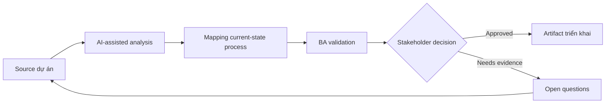

# Mapping current-state process

<div class="case-meta">
  <span>Discovery and alignment</span>
  <span>Operations analysis</span>
  <span>Use case dự án</span>
</div>

## Project context

Operations team muốn giảm turnaround time của request, nhưng current process nằm rải rác trong email, spreadsheet, ticket comment và tribal knowledge. Các team mô tả cùng một process theo cách khác nhau. Trong môi trường delivery thật, tình huống này thường xuất hiện dưới áp lực thời gian: stakeholder cần clarity, delivery cần backlog, QA cần behavior test được, operations cần process chịu được exception. BA dùng AI để tăng tốc analysis và synthesis, nhưng BA vẫn chịu trách nhiệm về evidence, business meaning, stakeholder decisioning và artifact quality.

## BA challenge

BA phải xây current-state process thể hiện actor, system, decision, queue, exception path, handoff và pain point. AI có thể biến text thành diagram draft, nhưng BA phải validate operational reality với người làm việc thật. Khó khăn thực tế là AI có thể làm material ban đầu trông hoàn chỉnh hơn mức thật sự. BA giỏi giữ output ở trạng thái reviewable bằng cách tách source-backed fact, assumption, unsupported claim, decision gap và recommended next action. Mục tiêu không phải làm document dài hơn; mục tiêu là làm project decision rõ hơn và an toàn hơn.

## Where AI fits

<div class="ba-workbench-panel">
AI hữu ích trong use case này khi được giới hạn vào analysis support, pattern detection, structured drafting và critique. AI không được approve scope, invent policy, quyết định business trade-off hoặc thay thế judgment của stakeholder chịu trách nhiệm.
</div>

- Extract process step từ interview và SOP.
- Generate candidate flowchart và swimlane diagram.
- Identify missing decision rule và exception path.
- So sánh mô tả process giữa các stakeholder group.

## Inputs to prepare

- SOP
- Interview notes
- Ticket sample
- Spreadsheet tracker
- System screenshot

BA nên label các input này trước khi dùng AI: source owner, source date, approval status, sensitivity level, và source đó là fact, opinion, policy, draft hay historical evidence. Việc chuẩn bị này ngăn model xem mọi input đều current và authoritative như nhau.

## BA workflow

1. Tạo source ID cho mọi process description.
2. Yêu cầu AI list step, actor, system, decision, input, output và exception.
3. Generate draft flowchart và swimlane view.
4. Review diagram với frontline user và mark correction.
5. Tách current-state fact khỏi improvement idea.
6. Publish process map đã validate kèm pain point và rule gap.

Workflow hiệu quả nhất khi dùng AI theo từng stage: trước hết organize evidence, sau đó yêu cầu analysis, tiếp theo tạo artifact, rồi chạy critique pass. BA nên giữ decision log visible xuyên suốt để suggestion do AI sinh ra không âm thầm trở thành approved scope.

## Diagram



## Deliverables

| Deliverable | Nội dung | Owner | Done signal |
| --- | --- | --- | --- |
| Current-state process map | Step, decision, actor, system, queue và exception path | BA | Frontline user confirm đúng reality |
| Rule gap register | Threshold, approval rule, routing rule và ownership gap còn thiếu | Operations owner | Mỗi gap có owner và next action |
| Pain point heatmap | Delay, rework, handoff và user-friction point | BA | Pain point link tới process step |
| Future-state questions | Question cần có trước redesign | Product owner | Question prioritized theo impact |

Các deliverable này nên được xem là artifact do BA own. AI có thể draft, nhưng BA phải validate source support, stakeholder meaning, traceability và artifact đã sẵn sàng handoff hay chưa.

## Prompt to try

```text
Hãy đóng vai senior Business Analyst hiểu AI. Hỗ trợ tôi áp dụng use case "Mapping current-state process" vào dự án. Trước hết hỏi source evidence và constraint. Sau đó tạo structured analysis gồm project context, assumption, AI-fit boundary, workflow step, deliverable, risk, control, open question và stakeholder decision. Không tự bịa policy, threshold hoặc approval.
```

## Review checklist

- Mọi statement do AI hỗ trợ đều gắn với source, assumption hoặc validation question.
- BA đã tách drafting assistance khỏi business approval.
- Workflow step có human owner cho decision, review và exception.
- Deliverable trace được về project input và review được bởi QA, product hoặc operations.
- Risk control đủ thực tế để dùng trong meeting dự án thật.
- Success metric: Process map đã validate chỉ ra delay point và decision gap để ưu tiên redesign.

## Risks and controls

| Rủi ro | Vì sao quan trọng | Control của BA |
| --- | --- | --- |
| Idealized process | Stakeholder có thể mô tả policy thay vì actual work | Dùng ticket sample và frontline validation |
| Exception blindness | Case hiếm có thể tạo nhiều effort nhất | Yêu cầu AI đề xuất exception category và validate volume |
| Diagram overconfidence | Diagram gọn có thể che uncertainty | Label step và assumption chưa validate |
| Solution bias | Improvement idea có thể lẫn với current-state fact | Tách current-state và future-state artifact |

Control quan trọng nhất là làm uncertainty visible. Nếu evidence yếu, output nên tạo validation question hoặc decision item, không phải final requirement. Nếu artifact ảnh hưởng delivery, release, compliance, customer experience hoặc operational workload, BA nên yêu cầu human review explicit trước khi handoff.
