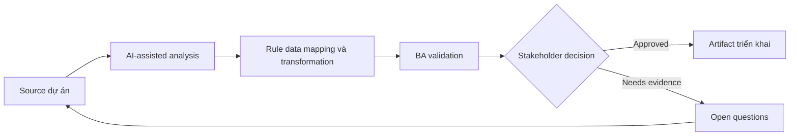

# Rule data mapping và transformation

<div class="case-meta">
  <span>Data and Integration</span>
  <span>Data mapping</span>
  <span>Use case dự án</span>
</div>

## Project context

CRM-to-billing integration cần map customer, contract, tax và billing contact data. Field name nhìn giống nhau nhưng meaning khác giữa các system. Trong môi trường delivery thật, tình huống này thường xuất hiện dưới áp lực thời gian: stakeholder cần clarity, delivery cần backlog, QA cần behavior test được, operations cần process chịu được exception. BA dùng AI để tăng tốc analysis và synthesis, nhưng BA vẫn chịu trách nhiệm về evidence, business meaning, stakeholder decisioning và artifact quality.

## BA challenge

BA phải define data mapping theo business meaning, không theo field label. Transformation rule, default, null handling, source precedence và exception handling phải explicit. Khó khăn thực tế là AI có thể làm material ban đầu trông hoàn chỉnh hơn mức thật sự. BA giỏi giữ output ở trạng thái reviewable bằng cách tách source-backed fact, assumption, unsupported claim, decision gap và recommended next action. Mục tiêu không phải làm document dài hơn; mục tiêu là làm project decision rõ hơn và an toàn hơn.

## Where AI fits

<div class="ba-workbench-panel">
AI hữu ích trong use case này khi được giới hạn vào analysis support, pattern detection, structured drafting và critique. AI không được approve scope, invent policy, quyết định business trade-off hoặc thay thế judgment của stakeholder chịu trách nhiệm.
</div>

- Compare source và target field để tìm semantic mismatch.
- Draft mapping table và transformation question.
- Identify null, default, format và source precedence gap.
- Generate data quality test scenario.

## Inputs to prepare

- Source field list
- Target field list
- Business glossary
- Sample records
- Integration requirements

BA nên label các input này trước khi dùng AI: source owner, source date, approval status, sensitivity level, và source đó là fact, opinion, policy, draft hay historical evidence. Việc chuẩn bị này ngăn model xem mọi input đều current và authoritative như nhau.

## BA workflow

1. Inventory source và target field có business definition.
2. Yêu cầu AI propose mapping và flag semantic mismatch.
3. Define transformation, format, default, null và precedence rule.
4. Review exception với data owner và operations.
5. Tạo sample record cho normal, boundary và bad data.
6. Publish mapping có test case và ownership.

Workflow hiệu quả nhất khi dùng AI theo từng stage: trước hết organize evidence, sau đó yêu cầu analysis, tiếp theo tạo artifact, rồi chạy critique pass. BA nên giữ decision log visible xuyên suốt để suggestion do AI sinh ra không âm thầm trở thành approved scope.

## Diagram



## Deliverables

| Deliverable | Nội dung | Owner | Done signal |
| --- | --- | --- | --- |
| Data mapping matrix | Source, target, meaning, transform, default, null rule và owner | BA và data owner | Mọi field có mapping decision |
| Transformation rule catalog | Rule, example, source, exception và validation | Data engineer | Rule implementable |
| Data quality test set | Sample record, expected output và failure condition | QA | Mapping testable |
| Exception handling plan | Bad data, missing data, conflict, owner và remediation | Operations | Data issue có path |

Các deliverable này nên được xem là artifact do BA own. AI có thể draft, nhưng BA phải validate source support, stakeholder meaning, traceability và artifact đã sẵn sàng handoff hay chưa.

## Prompt to try

```text
Hãy đóng vai senior Business Analyst hiểu AI. Hỗ trợ tôi áp dụng use case "Rule data mapping và transformation" vào dự án. Trước hết hỏi source evidence và constraint. Sau đó tạo structured analysis gồm project context, assumption, AI-fit boundary, workflow step, deliverable, risk, control, open question và stakeholder decision. Không tự bịa policy, threshold hoặc approval.
```

## Review checklist

- Mọi statement do AI hỗ trợ đều gắn với source, assumption hoặc validation question.
- BA đã tách drafting assistance khỏi business approval.
- Workflow step có human owner cho decision, review và exception.
- Deliverable trace được về project input và review được bởi QA, product hoặc operations.
- Risk control đủ thực tế để dùng trong meeting dự án thật.
- Success metric: Integration mapping dựa trên business semantics và validate bằng realistic data case.

## Risks and controls

| Rủi ro | Vì sao quan trọng | Control của BA |
| --- | --- | --- |
| Name-based mapping | Field label giống nhau nhưng meaning khác | Map theo business definition |
| Null ambiguity | Blank value có thể là unknown, not applicable hoặc missing | Define null semantics |
| Source conflict | System có thể disagree | Define source precedence |
| No data tests | Integration chỉ pass với sample sạch | Dùng realistic bad-data case |

Control quan trọng nhất là làm uncertainty visible. Nếu evidence yếu, output nên tạo validation question hoặc decision item, không phải final requirement. Nếu artifact ảnh hưởng delivery, release, compliance, customer experience hoặc operational workload, BA nên yêu cầu human review explicit trước khi handoff.
