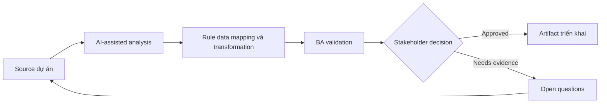

# Rule data mapping và transformation

<div class="case-meta">
  <span>Data and Integration</span>
  <span>Data mapping</span>
  <span>Use case dự án</span>
</div>

## Project context

CRM-to-billing integration cần map customer, contract, tax và billing contact data. Field name nhìn giống nhau nhưng meaning khác giữa các system. Trong Data mapping, công việc này thường bắt đầu khi data movement, mapping, reconciliation, privacy và lineage decision ảnh hưởng nhiều system và owner. BA nên xem Source field list và Target field list là evidence cần organize, không phải raw material để AI trả lời không kiểm soát. Mục tiêu là làm decision tiếp theo rõ hơn cho người own outcome.

## BA challenge

BA phải define data mapping theo business meaning, không theo field label. Transformation rule, default, null handling, source precedence và exception handling phải explicit. Với Rule data mapping và transformation, khó khăn thực tế là silent data loss và lineage yếu. AI có thể tăng tốc field mapping, rule comparison, reconciliation design, lineage review và exception analysis, nhưng BA vẫn phải làm rõ assumption, approval còn thiếu và điểm cần stakeholder judgment.

## Where AI fits

<div class="ba-workbench-panel">
AI phù hợp với use case Data và Integration khi được giới hạn vào field mapping, rule comparison, reconciliation design, lineage review và exception analysis. AI task hữu ích đầu tiên là: Compare source và target field để tìm semantic mismatch. AI không được approve scope, invent policy, bỏ qua source schema, sample payload, mapping rule, data-quality report và ownership matrix, hoặc biến draft thành final decision.
</div>

- Compare source và target field để tìm semantic mismatch.
- Draft mapping table và transformation question.
- Identify null, default, format và source precedence gap.
- Generate data quality test scenario.

## Inputs to prepare

- Source field list
- Target field list
- Business glossary
- Sample records
- Integration requirements

Trước khi prompt cho Rule data mapping và transformation, hãy label từng input theo owner, date, approval status, sensitivity và vai trò trong decision. Evidence lens quan trọng nhất là source schema, sample payload, mapping rule, data-quality report và ownership matrix; nếu thiếu, AI có thể xem old note, draft design và approved rule có authority như nhau.

## BA workflow

1. Inventory source và target field có business definition.
2. Yêu cầu AI propose mapping và flag semantic mismatch.
3. Define transformation, format, default, null và precedence rule.
4. Review exception với data owner và operations.
5. Tạo sample record cho normal, boundary và bad data.
6. Publish mapping có test case và ownership.

Chạy workflow như data contract review trước integration build: bắt đầu với "Inventory source và target field có business definition.", sau đó giữ decision log visible khi artifact tiến tới Data mapping matrix. Cách này ngăn suggestion của AI âm thầm trở thành backlog, design, release hoặc operational commitment.

## Diagram



## Deliverables

| Deliverable | Nội dung | Owner | Done signal |
| --- | --- | --- | --- |
| Data mapping matrix | Source, target, meaning, transform, default, null rule và owner | BA và data owner | Mọi field có mapping decision |
| Transformation rule catalog | Rule, example, source, exception và validation | Data engineer | Rule implementable |
| Data quality test set | Sample record, expected output và failure condition | QA | Mapping testable |
| Exception handling plan | Bad data, missing data, conflict, owner và remediation | Operations | Data issue có path |

Hãy xem Data mapping matrix là data and integration control pack do BA own. AI có thể draft structure, nhưng BA phải validate "Mọi field có mapping decision" có thật sự đúng không, artifact có trace được về evidence không và receiving team có hành động được không.

## Prompt to try

```text
Hãy đóng vai senior Business Analyst hiểu AI. Hỗ trợ tôi áp dụng use case "Rule data mapping và transformation" vào dự án. Trước hết hỏi source evidence và constraint. Sau đó tạo structured analysis gồm project context, assumption, AI-fit boundary, workflow step, deliverable, risk, control, open question và stakeholder decision. Không tự bịa policy, threshold hoặc approval.
```

## Review checklist

- Source field list được label owner, date, approval status và sensitivity.
- Data mapping matrix trace được về source evidence và có human owner rõ.
- AI task nằm trong boundary field mapping, rule comparison, reconciliation design, lineage review và exception analysis và không approve scope hoặc policy.
- Risk "Name-based mapping" có control thực tế: Map theo business definition.
- Open assumption được chuyển thành validation question hoặc stakeholder decision.
- Success metric: Integration mapping dựa trên business semantics và validate bằng realistic data case.

## Risks and controls

| Rủi ro | Vì sao quan trọng | Control của BA |
| --- | --- | --- |
| Name-based mapping | Field label giống nhau nhưng meaning khác | Map theo business definition |
| Null ambiguity | Blank value có thể là unknown, not applicable hoặc missing | Define null semantics |
| Source conflict | System có thể disagree | Define source precedence |
| No data tests | Integration chỉ pass với sample sạch | Dùng realistic bad-data case |

Control chính cho risk "Name-based mapping" là human accountability explicit: Map theo business definition. Nếu evidence yếu, output nên tạo validation question hoặc decision item, không phải final requirement.
