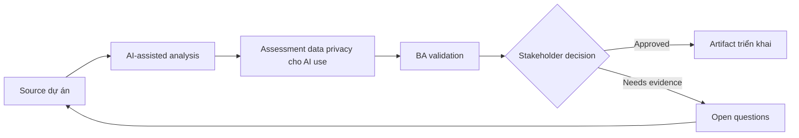

# Assessment data privacy cho AI use

<div class="case-meta">
  <span>Governance and adoption</span>
  <span>Privacy and compliance</span>
  <span>Use case dự án</span>
</div>

## Project context

Project team muốn dùng AI summarize customer interview, analyze support ticket và draft requirement. Data có customer name, account detail, complaint và thông tin có thể sensitive. Trong Privacy and compliance, công việc này thường bắt đầu khi cách dùng AI phải scale qua nhiều team mà không leak sensitive data hoặc tạo decision không review được. BA nên xem Data inventory và Privacy policy là evidence cần organize, không phải raw material để AI trả lời không kiểm soát. Mục tiêu là làm decision tiếp theo rõ hơn cho người own outcome.

## BA challenge

BA phải giúp define data nào được dùng với AI, data nào phải redact, tool nào approved và review control nào required. Productivity từ AI không được đánh đổi privacy hoặc trust. Với Assessment data privacy cho AI use, khó khăn thực tế là shadow AI use và accountability yếu. AI có thể tăng tốc portfolio analysis, policy drafting, risk-tiering, playbook creation và adoption measurement, nhưng BA vẫn phải làm rõ assumption, approval còn thiếu và điểm cần stakeholder judgment.

## Where AI fits

<div class="ba-workbench-panel">
AI phù hợp với use case Governance và adoption khi được giới hạn vào portfolio analysis, policy drafting, risk-tiering, playbook creation và adoption measurement. AI task hữu ích đầu tiên là: Classify BA data type theo sensitivity và approved use. AI không được approve scope, invent policy, bỏ qua data policy, approved tool, risk appetite, audit need và capability của team, hoặc biến draft thành final decision.
</div>

- Classify BA data type theo sensitivity và approved use.
- Generate redaction checklist và safe prompt pattern.
- Draft AI usage rule theo risk tier.
- Tạo review question cho legal, security và project owner.

## Inputs to prepare

- Data inventory
- Privacy policy
- Approved tool list
- Project artifacts
- Customer data examples

Trước khi prompt cho Assessment data privacy cho AI use, hãy label từng input theo owner, date, approval status, sensitivity và vai trò trong decision. Evidence lens quan trọng nhất là data policy, approved tool, risk appetite, audit need và capability của team; nếu thiếu, AI có thể xem old note, draft design và approved rule có authority như nhau.

## BA workflow

1. Inventory data type dùng trong BA work và nơi chúng xuất hiện.
2. Yêu cầu AI propose sensitivity category, sau đó validate với privacy owner.
3. Define prohibited data, redaction rule, approved tool và storage expectation.
4. Tạo safe prompt pattern cho low-risk drafting và review task.
5. Set review gate cho sensitive hoặc customer-identifiable data.
6. Publish project AI data-use checklist.

Chạy workflow như governance design trước rollout rộng: bắt đầu với "Inventory data type dùng trong BA work và nơi chúng xuất hiện.", sau đó giữ decision log visible khi artifact tiến tới AI data-use matrix. Cách này ngăn suggestion của AI âm thầm trở thành backlog, design, release hoặc operational commitment.

## Diagram



## Deliverables

| Deliverable | Nội dung | Owner | Done signal |
| --- | --- | --- | --- |
| AI data-use matrix | Data type, sensitivity, allowed tool, redaction và approval need | BA và privacy owner | Team biết điều gì allowed |
| Redaction checklist | Field cần remove, transform, mask hoặc avoid | BA | Sensitive data được xử lý consistent |
| Risk-tier policy | Low, medium và high-risk AI task với control | Compliance | Control match sensitivity |
| Safe prompt guide | Approved prompt pattern và prohibited example | BA lead | BA làm việc an toàn |

Hãy xem AI data-use matrix là AI adoption control pack do BA own. AI có thể draft structure, nhưng BA phải validate "Team biết điều gì allowed" có thật sự đúng không, artifact có trace được về evidence không và receiving team có hành động được không.

## Prompt to try

```text
Hãy đóng vai senior Business Analyst hiểu AI. Hỗ trợ tôi áp dụng use case "Assessment data privacy cho AI use" vào dự án. Trước hết hỏi source evidence và constraint. Sau đó tạo structured analysis gồm project context, assumption, AI-fit boundary, workflow step, deliverable, risk, control, open question và stakeholder decision. Không tự bịa policy, threshold hoặc approval.
```

## Review checklist

- Data inventory được label owner, date, approval status và sensitivity.
- AI data-use matrix trace được về source evidence và có human owner rõ.
- AI task nằm trong boundary portfolio analysis, policy drafting, risk-tiering, playbook creation và adoption measurement và không approve scope hoặc policy.
- Risk "PII leakage" có control thực tế: Dùng approved tool và redaction rule.
- Open assumption được chuyển thành validation question hoặc stakeholder decision.
- Success metric: BA team dùng AI với data boundary rõ, approved tool và privacy control thực tế.

## Risks and controls

| Rủi ro | Vì sao quan trọng | Control của BA |
| --- | --- | --- |
| PII leakage | Customer data có thể gửi vào unapproved tool | Dùng approved tool và redaction rule |
| Over-redaction | Remove quá nhiều context làm giảm analysis quality | Balance privacy với source-safe summary |
| Policy ambiguity | Team có thể interpret rule khác nhau | Tạo example allowed và prohibited use |
| Shadow AI use | Người dùng có thể bypass control nếu guidance không practical | Cung cấp workflow an toàn usable |

Control chính cho risk "PII leakage" là human accountability explicit: Dùng approved tool và redaction rule. Nếu evidence yếu, output nên tạo validation question hoặc decision item, không phải final requirement.
