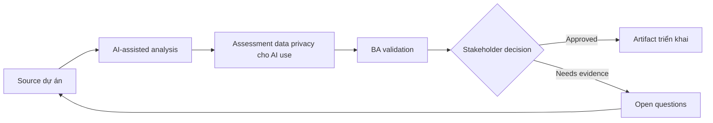

# Assessment data privacy cho AI use

<div class="case-meta">
  <span>Governance and adoption</span>
  <span>Privacy and compliance</span>
  <span>Use case dự án</span>
</div>

## Project context

Project team muốn dùng AI summarize customer interview, analyze support ticket và draft requirement. Data có customer name, account detail, complaint và thông tin có thể sensitive. Trong môi trường delivery thật, tình huống này thường xuất hiện dưới áp lực thời gian: stakeholder cần clarity, delivery cần backlog, QA cần behavior test được, operations cần process chịu được exception. BA dùng AI để tăng tốc analysis và synthesis, nhưng BA vẫn chịu trách nhiệm về evidence, business meaning, stakeholder decisioning và artifact quality.

## BA challenge

BA phải giúp define data nào được dùng với AI, data nào phải redact, tool nào approved và review control nào required. Productivity từ AI không được đánh đổi privacy hoặc trust. Khó khăn thực tế là AI có thể làm material ban đầu trông hoàn chỉnh hơn mức thật sự. BA giỏi giữ output ở trạng thái reviewable bằng cách tách source-backed fact, assumption, unsupported claim, decision gap và recommended next action. Mục tiêu không phải làm document dài hơn; mục tiêu là làm project decision rõ hơn và an toàn hơn.

## Where AI fits

<div class="ba-workbench-panel">
AI hữu ích trong use case này khi được giới hạn vào analysis support, pattern detection, structured drafting và critique. AI không được approve scope, invent policy, quyết định business trade-off hoặc thay thế judgment của stakeholder chịu trách nhiệm.
</div>

- Classify BA data type theo sensitivity và approved use.
- Generate redaction checklist và safe prompt pattern.
- Draft AI usage rule theo risk tier.
- Tạo review question cho legal, security và project owner.

## Inputs to prepare

- Data inventory
- Privacy policy
- Approved tool list
- Project artifacts
- Customer data examples

BA nên label các input này trước khi dùng AI: source owner, source date, approval status, sensitivity level, và source đó là fact, opinion, policy, draft hay historical evidence. Việc chuẩn bị này ngăn model xem mọi input đều current và authoritative như nhau.

## BA workflow

1. Inventory data type dùng trong BA work và nơi chúng xuất hiện.
2. Yêu cầu AI propose sensitivity category, sau đó validate với privacy owner.
3. Define prohibited data, redaction rule, approved tool và storage expectation.
4. Tạo safe prompt pattern cho low-risk drafting và review task.
5. Set review gate cho sensitive hoặc customer-identifiable data.
6. Publish project AI data-use checklist.

Workflow hiệu quả nhất khi dùng AI theo từng stage: trước hết organize evidence, sau đó yêu cầu analysis, tiếp theo tạo artifact, rồi chạy critique pass. BA nên giữ decision log visible xuyên suốt để suggestion do AI sinh ra không âm thầm trở thành approved scope.

## Diagram



## Deliverables

| Deliverable | Nội dung | Owner | Done signal |
| --- | --- | --- | --- |
| AI data-use matrix | Data type, sensitivity, allowed tool, redaction và approval need | BA và privacy owner | Team biết điều gì allowed |
| Redaction checklist | Field cần remove, transform, mask hoặc avoid | BA | Sensitive data được xử lý consistent |
| Risk-tier policy | Low, medium và high-risk AI task với control | Compliance | Control match sensitivity |
| Safe prompt guide | Approved prompt pattern và prohibited example | BA lead | BA làm việc an toàn |

Các deliverable này nên được xem là artifact do BA own. AI có thể draft, nhưng BA phải validate source support, stakeholder meaning, traceability và artifact đã sẵn sàng handoff hay chưa.

## Prompt to try

```text
Hãy đóng vai senior Business Analyst hiểu AI. Hỗ trợ tôi áp dụng use case "Assessment data privacy cho AI use" vào dự án. Trước hết hỏi source evidence và constraint. Sau đó tạo structured analysis gồm project context, assumption, AI-fit boundary, workflow step, deliverable, risk, control, open question và stakeholder decision. Không tự bịa policy, threshold hoặc approval.
```

## Review checklist

- Mọi statement do AI hỗ trợ đều gắn với source, assumption hoặc validation question.
- BA đã tách drafting assistance khỏi business approval.
- Workflow step có human owner cho decision, review và exception.
- Deliverable trace được về project input và review được bởi QA, product hoặc operations.
- Risk control đủ thực tế để dùng trong meeting dự án thật.
- Success metric: BA team dùng AI với data boundary rõ, approved tool và privacy control thực tế.

## Risks and controls

| Rủi ro | Vì sao quan trọng | Control của BA |
| --- | --- | --- |
| PII leakage | Customer data có thể gửi vào unapproved tool | Dùng approved tool và redaction rule |
| Over-redaction | Remove quá nhiều context làm giảm analysis quality | Balance privacy với source-safe summary |
| Policy ambiguity | Team có thể interpret rule khác nhau | Tạo example allowed và prohibited use |
| Shadow AI use | Người dùng có thể bypass control nếu guidance không practical | Cung cấp workflow an toàn usable |

Control quan trọng nhất là làm uncertainty visible. Nếu evidence yếu, output nên tạo validation question hoặc decision item, không phải final requirement. Nếu artifact ảnh hưởng delivery, release, compliance, customer experience hoặc operational workload, BA nên yêu cầu human review explicit trước khi handoff.
