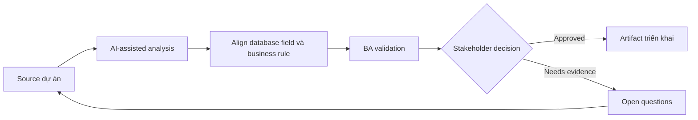

# Align database field và business rule

<div class="case-meta">
  <span>Data and Integration</span>
  <span>Data model alignment</span>
  <span>Use case dự án</span>
</div>

## Project context

Team thêm database field mới cho customer risk review. Business owner hiểu concept, nhưng database field đang được đặt tên và model trước khi rule được hiểu đầy đủ. Trong Data model alignment, công việc này thường bắt đầu khi data movement, mapping, reconciliation, privacy và lineage decision ảnh hưởng nhiều system và owner. BA nên xem Data model draft và Business glossary là evidence cần organize, không phải raw material để AI trả lời không kiểm soát. Mục tiêu là làm decision tiếp theo rõ hơn cho người own outcome.

## BA challenge

BA phải đảm bảo data model field represent đúng business concept, gồm source, lifecycle, ownership, sensitivity, allowed value và update rule. Với Align database field và business rule, khó khăn thực tế là silent data loss và lineage yếu. AI có thể tăng tốc field mapping, rule comparison, reconciliation design, lineage review và exception analysis, nhưng BA vẫn phải làm rõ assumption, approval còn thiếu và điểm cần stakeholder judgment.

## Where AI fits

<div class="ba-workbench-panel">
AI phù hợp với use case Data và Integration khi được giới hạn vào field mapping, rule comparison, reconciliation design, lineage review và exception analysis. AI task hữu ích đầu tiên là: Translate proposed database field thành business definition. AI không được approve scope, invent policy, bỏ qua source schema, sample payload, mapping rule, data-quality report và ownership matrix, hoặc biến draft thành final decision.
</div>

- Translate proposed database field thành business definition.
- Identify field missing ownership, sensitivity hoặc update rule.
- Generate question cho data model review.
- Draft acceptance criteria cho create, update và audit behavior.

## Inputs to prepare

- Data model draft
- Business glossary
- Risk policy
- Update workflows
- Audit và privacy rules

Trước khi prompt cho Align database field và business rule, hãy label từng input theo owner, date, approval status, sensitivity và vai trò trong decision. Evidence lens quan trọng nhất là source schema, sample payload, mapping rule, data-quality report và ownership matrix; nếu thiếu, AI có thể xem old note, draft design và approved rule có authority như nhau.

## BA workflow

1. List proposed field và business purpose.
2. Yêu cầu AI identify definition unclear và rule gap.
3. Define source of truth, allowed value, update rule, sensitivity và retention.
4. Review với data modeler, backend, compliance và business owner.
5. Map field behavior tới UI, API, reporting và audit.
6. Tạo test example và migration question.

Chạy workflow như data contract review trước integration build: bắt đầu với "List proposed field và business purpose.", sau đó giữ decision log visible khi artifact tiến tới Field definition catalog. Cách này ngăn suggestion của AI âm thầm trở thành backlog, design, release hoặc operational commitment.

## Diagram



## Deliverables

| Deliverable | Nội dung | Owner | Done signal |
| --- | --- | --- | --- |
| Field definition catalog | Field, business meaning, source, owner, allowed value và sensitivity | BA và data owner | Field có business meaning |
| Update rule matrix | Field, ai được change, khi nào, validation, audit và workflow | Backend | Update behavior rõ |
| Downstream impact map | UI, API, report, integration và audit use of field | BA | Field usage visible |
| Data migration questions | Existing value, default, cleanup và validation | Data team | Migration risk known |

Hãy xem Field definition catalog là data and integration control pack do BA own. AI có thể draft structure, nhưng BA phải validate "Field có business meaning" có thật sự đúng không, artifact có trace được về evidence không và receiving team có hành động được không.

## Prompt to try

```text
Hãy đóng vai senior Business Analyst hiểu AI. Hỗ trợ tôi áp dụng use case "Align database field và business rule" vào dự án. Trước hết hỏi source evidence và constraint. Sau đó tạo structured analysis gồm project context, assumption, AI-fit boundary, workflow step, deliverable, risk, control, open question và stakeholder decision. Không tự bịa policy, threshold hoặc approval.
```

## Review checklist

- Data model draft được label owner, date, approval status và sensitivity.
- Field definition catalog trace được về source evidence và có human owner rõ.
- AI task nằm trong boundary field mapping, rule comparison, reconciliation design, lineage review và exception analysis và không approve scope hoặc policy.
- Risk "Technical naming drift" có control thực tế: Define business meaning và example.
- Open assumption được chuyển thành validation question hoặc stakeholder decision.
- Success metric: Database field gắn với business rule trước implementation và migration decision visible.

## Risks and controls

| Rủi ro | Vì sao quan trọng | Control của BA |
| --- | --- | --- |
| Technical naming drift | Field name không match business concept | Define business meaning và example |
| Source-of-truth conflict | Nhiều system update cùng field | Define owner và update rule |
| Sensitivity miss | Risk field có thể expose sensitive info | Classify sensitivity và access |
| Migration surprise | Existing record có thể không fit model mới | Plan default và cleanup |

Control chính cho risk "Technical naming drift" là human accountability explicit: Define business meaning và example. Nếu evidence yếu, output nên tạo validation question hoặc decision item, không phải final requirement.
