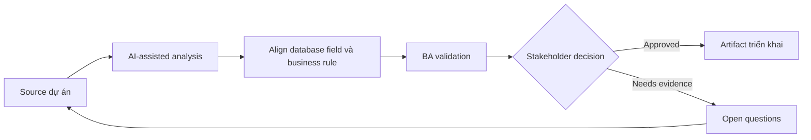

# Align database field và business rule

<div class="case-meta">
  <span>Data and Integration</span>
  <span>Data model alignment</span>
  <span>Use case dự án</span>
</div>

## Project context

Team thêm database field mới cho customer risk review. Business owner hiểu concept, nhưng database field đang được đặt tên và model trước khi rule được hiểu đầy đủ. Trong môi trường delivery thật, tình huống này thường xuất hiện dưới áp lực thời gian: stakeholder cần clarity, delivery cần backlog, QA cần behavior test được, operations cần process chịu được exception. BA dùng AI để tăng tốc analysis và synthesis, nhưng BA vẫn chịu trách nhiệm về evidence, business meaning, stakeholder decisioning và artifact quality.

## BA challenge

BA phải đảm bảo data model field represent đúng business concept, gồm source, lifecycle, ownership, sensitivity, allowed value và update rule. Khó khăn thực tế là AI có thể làm material ban đầu trông hoàn chỉnh hơn mức thật sự. BA giỏi giữ output ở trạng thái reviewable bằng cách tách source-backed fact, assumption, unsupported claim, decision gap và recommended next action. Mục tiêu không phải làm document dài hơn; mục tiêu là làm project decision rõ hơn và an toàn hơn.

## Where AI fits

<div class="ba-workbench-panel">
AI hữu ích trong use case này khi được giới hạn vào analysis support, pattern detection, structured drafting và critique. AI không được approve scope, invent policy, quyết định business trade-off hoặc thay thế judgment của stakeholder chịu trách nhiệm.
</div>

- Translate proposed database field thành business definition.
- Identify field missing ownership, sensitivity hoặc update rule.
- Generate question cho data model review.
- Draft acceptance criteria cho create, update và audit behavior.

## Inputs to prepare

- Data model draft
- Business glossary
- Risk policy
- Update workflows
- Audit và privacy rules

BA nên label các input này trước khi dùng AI: source owner, source date, approval status, sensitivity level, và source đó là fact, opinion, policy, draft hay historical evidence. Việc chuẩn bị này ngăn model xem mọi input đều current và authoritative như nhau.

## BA workflow

1. List proposed field và business purpose.
2. Yêu cầu AI identify definition unclear và rule gap.
3. Define source of truth, allowed value, update rule, sensitivity và retention.
4. Review với data modeler, backend, compliance và business owner.
5. Map field behavior tới UI, API, reporting và audit.
6. Tạo test example và migration question.

Workflow hiệu quả nhất khi dùng AI theo từng stage: trước hết organize evidence, sau đó yêu cầu analysis, tiếp theo tạo artifact, rồi chạy critique pass. BA nên giữ decision log visible xuyên suốt để suggestion do AI sinh ra không âm thầm trở thành approved scope.

## Diagram



## Deliverables

| Deliverable | Nội dung | Owner | Done signal |
| --- | --- | --- | --- |
| Field definition catalog | Field, business meaning, source, owner, allowed value và sensitivity | BA và data owner | Field có business meaning |
| Update rule matrix | Field, ai được change, khi nào, validation, audit và workflow | Backend | Update behavior rõ |
| Downstream impact map | UI, API, report, integration và audit use of field | BA | Field usage visible |
| Data migration questions | Existing value, default, cleanup và validation | Data team | Migration risk known |

Các deliverable này nên được xem là artifact do BA own. AI có thể draft, nhưng BA phải validate source support, stakeholder meaning, traceability và artifact đã sẵn sàng handoff hay chưa.

## Prompt to try

```text
Hãy đóng vai senior Business Analyst hiểu AI. Hỗ trợ tôi áp dụng use case "Align database field và business rule" vào dự án. Trước hết hỏi source evidence và constraint. Sau đó tạo structured analysis gồm project context, assumption, AI-fit boundary, workflow step, deliverable, risk, control, open question và stakeholder decision. Không tự bịa policy, threshold hoặc approval.
```

## Review checklist

- Mọi statement do AI hỗ trợ đều gắn với source, assumption hoặc validation question.
- BA đã tách drafting assistance khỏi business approval.
- Workflow step có human owner cho decision, review và exception.
- Deliverable trace được về project input và review được bởi QA, product hoặc operations.
- Risk control đủ thực tế để dùng trong meeting dự án thật.
- Success metric: Database field gắn với business rule trước implementation và migration decision visible.

## Risks and controls

| Rủi ro | Vì sao quan trọng | Control của BA |
| --- | --- | --- |
| Technical naming drift | Field name không match business concept | Define business meaning và example |
| Source-of-truth conflict | Nhiều system update cùng field | Define owner và update rule |
| Sensitivity miss | Risk field có thể expose sensitive info | Classify sensitivity và access |
| Migration surprise | Existing record có thể không fit model mới | Plan default và cleanup |

Control quan trọng nhất là làm uncertainty visible. Nếu evidence yếu, output nên tạo validation question hoặc decision item, không phải final requirement. Nếu artifact ảnh hưởng delivery, release, compliance, customer experience hoặc operational workload, BA nên yêu cầu human review explicit trước khi handoff.
