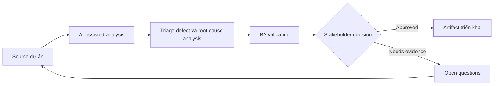

# Triage defect và root-cause analysis

<div class="case-meta">
  <span>Delivery and QA</span>
  <span>Defect management</span>
  <span>Use case dự án</span>
</div>

## Project context

Trong UAT, user report nhiều defect ở search, export, role permission và notification. Một số là bug thật, một số là requirement chưa rõ, số khác là training hoặc data issue. Trong Defect management, công việc này thường bắt đầu khi delivery decision, test evidence và release readiness phải còn nối với intent ban đầu. BA nên xem Defect export và Requirement list là evidence cần organize, không phải raw material để AI trả lời không kiểm soát. Mục tiêu là làm decision tiếp theo rõ hơn cho người own outcome.

## BA challenge

BA phải hỗ trợ triage defect nhanh nhưng không để AI oversimplify root cause. Mục tiêu là classify issue, connect với requirement và test, identify requirement gap và chuẩn bị decision option cho product và delivery lead. Với Triage defect và root-cause analysis, khó khăn thực tế là optimistic status và late requirement discovery. AI có thể tăng tốc scenario generation, defect triage support, readiness synthesis và risk surfacing, nhưng BA vẫn phải làm rõ assumption, approval còn thiếu và điểm cần stakeholder judgment.

## Where AI fits

<div class="ba-workbench-panel">
AI phù hợp với use case Delivery và QA khi được giới hạn vào scenario generation, defect triage support, readiness synthesis và risk surfacing. AI task hữu ích đầu tiên là: Cluster defect description theo symptom và affected workflow. AI không được approve scope, invent policy, bỏ qua requirement baseline, test result, defect history và release decision, hoặc biến draft thành final decision.
</div>

- Cluster defect description theo symptom và affected workflow.
- Map defect với requirement, acceptance criteria và test evidence.
- Tách bug, requirement gap, data issue, training issue và change request.
- Draft triage note và stakeholder question.

## Inputs to prepare

- Defect export
- Requirement list
- Acceptance criteria
- Test evidence
- UAT notes

Trước khi prompt cho Triage defect và root-cause analysis, hãy label từng input theo owner, date, approval status, sensitivity và vai trò trong decision. Evidence lens quan trọng nhất là requirement baseline, test result, defect history và release decision; nếu thiếu, AI có thể xem old note, draft design và approved rule có authority như nhau.

## BA workflow

1. Normalize defect description và remove duplicate cẩn thận.
2. Yêu cầu AI classify issue có confidence và evidence.
3. Review thủ công high-severity và ambiguous classification.
4. Map từng defect tới requirement, test hoặc missing requirement.
5. Identify pattern chỉ ra root cause.
6. Chuẩn bị triage board update có recommendation và owner.

Chạy workflow như quality review trước release hoặc rework decision: bắt đầu với "Normalize defect description và remove duplicate cẩn thận.", sau đó giữ decision log visible khi artifact tiến tới Defect classification board. Cách này ngăn suggestion của AI âm thầm trở thành backlog, design, release hoặc operational commitment.

## Diagram



## Deliverables

| Deliverable | Nội dung | Owner | Done signal |
| --- | --- | --- | --- |
| Defect classification board | Defect, category, severity, evidence, requirement link và owner | BA và QA | Mọi UAT issue có triage status |
| Root-cause summary | Pattern requirement gap, build defect, data issue, training issue hoặc change request | BA | Pattern được evidence support |
| Decision options | Fix now, defer, clarify, train hoặc raise change request | Product owner | Mỗi option có impact |
| Requirement improvement list | Requirement thiếu hoặc chưa rõ lộ ra từ defect | BA | Backlog được update theo root cause |

Hãy xem Defect classification board là QA và delivery handoff artifact do BA own. AI có thể draft structure, nhưng BA phải validate "Mọi UAT issue có triage status" có thật sự đúng không, artifact có trace được về evidence không và receiving team có hành động được không.

## Prompt to try

```text
Hãy đóng vai senior Business Analyst hiểu AI. Hỗ trợ tôi áp dụng use case "Triage defect và root-cause analysis" vào dự án. Trước hết hỏi source evidence và constraint. Sau đó tạo structured analysis gồm project context, assumption, AI-fit boundary, workflow step, deliverable, risk, control, open question và stakeholder decision. Không tự bịa policy, threshold hoặc approval.
```

## Review checklist

- Defect export được label owner, date, approval status và sensitivity.
- Defect classification board trace được về source evidence và có human owner rõ.
- AI task nằm trong boundary scenario generation, defect triage support, readiness synthesis và risk surfacing và không approve scope hoặc policy.
- Risk "Misclassification" có control thực tế: Review bằng requirement evidence và test intent.
- Open assumption được chuyển thành validation question hoặc stakeholder decision.
- Success metric: Triage decision nhanh hơn nhưng root cause vẫn evidence-based và actionable.

## Risks and controls

| Rủi ro | Vì sao quan trọng | Control của BA |
| --- | --- | --- |
| Misclassification | AI có thể label requirement gap thành bug | Review bằng requirement evidence và test intent |
| Duplicate confusion | Defect giống nhau có thể có cause khác | Cluster nhưng giữ source detail |
| Severity inflation | User report impact không đồng nhất | Dùng business impact rubric |
| Blame framing | Root cause có thể trở thành political | Frame finding quanh process và evidence |

Control chính cho risk "Misclassification" là human accountability explicit: Review bằng requirement evidence và test intent. Nếu evidence yếu, output nên tạo validation question hoặc decision item, không phải final requirement.
