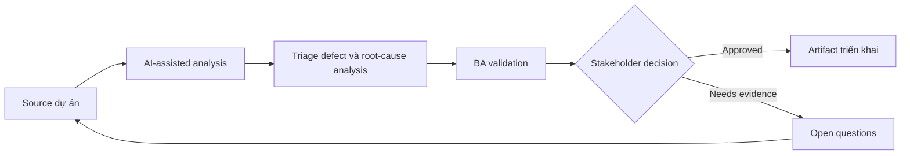

# Triage defect và root-cause analysis

<div class="case-meta">
  <span>Delivery and QA</span>
  <span>Defect management</span>
  <span>Use case dự án</span>
</div>

## Project context

Trong UAT, user report nhiều defect ở search, export, role permission và notification. Một số là bug thật, một số là requirement chưa rõ, số khác là training hoặc data issue. Trong môi trường delivery thật, tình huống này thường xuất hiện dưới áp lực thời gian: stakeholder cần clarity, delivery cần backlog, QA cần behavior test được, operations cần process chịu được exception. BA dùng AI để tăng tốc analysis và synthesis, nhưng BA vẫn chịu trách nhiệm về evidence, business meaning, stakeholder decisioning và artifact quality.

## BA challenge

BA phải hỗ trợ triage defect nhanh nhưng không để AI oversimplify root cause. Mục tiêu là classify issue, connect với requirement và test, identify requirement gap và chuẩn bị decision option cho product và delivery lead. Khó khăn thực tế là AI có thể làm material ban đầu trông hoàn chỉnh hơn mức thật sự. BA giỏi giữ output ở trạng thái reviewable bằng cách tách source-backed fact, assumption, unsupported claim, decision gap và recommended next action. Mục tiêu không phải làm document dài hơn; mục tiêu là làm project decision rõ hơn và an toàn hơn.

## Where AI fits

<div class="ba-workbench-panel">
AI hữu ích trong use case này khi được giới hạn vào analysis support, pattern detection, structured drafting và critique. AI không được approve scope, invent policy, quyết định business trade-off hoặc thay thế judgment của stakeholder chịu trách nhiệm.
</div>

- Cluster defect description theo symptom và affected workflow.
- Map defect với requirement, acceptance criteria và test evidence.
- Tách bug, requirement gap, data issue, training issue và change request.
- Draft triage note và stakeholder question.

## Inputs to prepare

- Defect export
- Requirement list
- Acceptance criteria
- Test evidence
- UAT notes

BA nên label các input này trước khi dùng AI: source owner, source date, approval status, sensitivity level, và source đó là fact, opinion, policy, draft hay historical evidence. Việc chuẩn bị này ngăn model xem mọi input đều current và authoritative như nhau.

## BA workflow

1. Normalize defect description và remove duplicate cẩn thận.
2. Yêu cầu AI classify issue có confidence và evidence.
3. Review thủ công high-severity và ambiguous classification.
4. Map từng defect tới requirement, test hoặc missing requirement.
5. Identify pattern chỉ ra root cause.
6. Chuẩn bị triage board update có recommendation và owner.

Workflow hiệu quả nhất khi dùng AI theo từng stage: trước hết organize evidence, sau đó yêu cầu analysis, tiếp theo tạo artifact, rồi chạy critique pass. BA nên giữ decision log visible xuyên suốt để suggestion do AI sinh ra không âm thầm trở thành approved scope.

## Diagram



## Deliverables

| Deliverable | Nội dung | Owner | Done signal |
| --- | --- | --- | --- |
| Defect classification board | Defect, category, severity, evidence, requirement link và owner | BA và QA | Mọi UAT issue có triage status |
| Root-cause summary | Pattern requirement gap, build defect, data issue, training issue hoặc change request | BA | Pattern được evidence support |
| Decision options | Fix now, defer, clarify, train hoặc raise change request | Product owner | Mỗi option có impact |
| Requirement improvement list | Requirement thiếu hoặc chưa rõ lộ ra từ defect | BA | Backlog được update theo root cause |

Các deliverable này nên được xem là artifact do BA own. AI có thể draft, nhưng BA phải validate source support, stakeholder meaning, traceability và artifact đã sẵn sàng handoff hay chưa.

## Prompt to try

```text
Hãy đóng vai senior Business Analyst hiểu AI. Hỗ trợ tôi áp dụng use case "Triage defect và root-cause analysis" vào dự án. Trước hết hỏi source evidence và constraint. Sau đó tạo structured analysis gồm project context, assumption, AI-fit boundary, workflow step, deliverable, risk, control, open question và stakeholder decision. Không tự bịa policy, threshold hoặc approval.
```

## Review checklist

- Mọi statement do AI hỗ trợ đều gắn với source, assumption hoặc validation question.
- BA đã tách drafting assistance khỏi business approval.
- Workflow step có human owner cho decision, review và exception.
- Deliverable trace được về project input và review được bởi QA, product hoặc operations.
- Risk control đủ thực tế để dùng trong meeting dự án thật.
- Success metric: Triage decision nhanh hơn nhưng root cause vẫn evidence-based và actionable.

## Risks and controls

| Rủi ro | Vì sao quan trọng | Control của BA |
| --- | --- | --- |
| Misclassification | AI có thể label requirement gap thành bug | Review bằng requirement evidence và test intent |
| Duplicate confusion | Defect giống nhau có thể có cause khác | Cluster nhưng giữ source detail |
| Severity inflation | User report impact không đồng nhất | Dùng business impact rubric |
| Blame framing | Root cause có thể trở thành political | Frame finding quanh process và evidence |

Control quan trọng nhất là làm uncertainty visible. Nếu evidence yếu, output nên tạo validation question hoặc decision item, không phải final requirement. Nếu artifact ảnh hưởng delivery, release, compliance, customer experience hoặc operational workload, BA nên yêu cầu human review explicit trước khi handoff.
