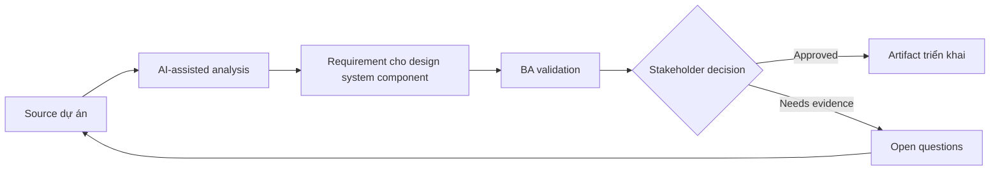

# Requirement cho design system component

<div class="case-meta">
  <span>Frontend, UI, and UX</span>
  <span>Design systems</span>
  <span>Use case dự án</span>
</div>

## Project context

Platform team thêm reusable component cho filter, data table, status chip, action menu và confirmation dialog. Product team cần consistency nhưng vẫn có domain-specific behavior. Trong môi trường delivery thật, tình huống này thường xuất hiện dưới áp lực thời gian: stakeholder cần clarity, delivery cần backlog, QA cần behavior test được, operations cần process chịu được exception. BA dùng AI để tăng tốc analysis và synthesis, nhưng BA vẫn chịu trách nhiệm về evidence, business meaning, stakeholder decisioning và artifact quality.

## BA challenge

BA phải tách reusable component requirement khỏi feature-specific requirement. Component behavior nên cover variant, slot, accessibility, validation, event, constraint và phần product team được configure. Khó khăn thực tế là AI có thể làm material ban đầu trông hoàn chỉnh hơn mức thật sự. BA giỏi giữ output ở trạng thái reviewable bằng cách tách source-backed fact, assumption, unsupported claim, decision gap và recommended next action. Mục tiêu không phải làm document dài hơn; mục tiêu là làm project decision rõ hơn và an toàn hơn.

## Where AI fits

<div class="ba-workbench-panel">
AI hữu ích trong use case này khi được giới hạn vào analysis support, pattern detection, structured drafting và critique. AI không được approve scope, invent policy, quyết định business trade-off hoặc thay thế judgment của stakeholder chịu trách nhiệm.
</div>

- Generate component variant và behavior matrix.
- Identify feature-specific requirement không nên pollute component.
- Draft configuration option và constraint.
- Tạo documentation question cho design và frontend team.

## Inputs to prepare

- Component design
- Existing product examples
- Design system rules
- Accessibility requirements
- Frontend architecture notes

BA nên label các input này trước khi dùng AI: source owner, source date, approval status, sensitivity level, và source đó là fact, opinion, policy, draft hay historical evidence. Việc chuẩn bị này ngăn model xem mọi input đều current và authoritative như nhau.

## BA workflow

1. Collect use case từ nhiều product team.
2. Yêu cầu AI tách common behavior khỏi domain-specific behavior.
3. Define component variant, property, event, validation và accessibility.
4. Review configurability với design và frontend.
5. Tạo acceptance criteria và documentation example.
6. Publish adoption guidance và anti-pattern.

Workflow hiệu quả nhất khi dùng AI theo từng stage: trước hết organize evidence, sau đó yêu cầu analysis, tiếp theo tạo artifact, rồi chạy critique pass. BA nên giữ decision log visible xuyên suốt để suggestion do AI sinh ra không âm thầm trở thành approved scope.

## Diagram



## Deliverables

| Deliverable | Nội dung | Owner | Done signal |
| --- | --- | --- | --- |
| Component behavior spec | Variant, property, event, validation, state và accessibility behavior | Platform BA | Reusable behavior explicit |
| Configuration matrix | Option, allowed value, default, constraint và example | Frontend | Product team biết phần nào đổi được |
| Usage guidance | Khi nào dùng, khi nào không, example và anti-pattern | Design system owner | Adoption consistent |
| Component test scenarios | State, variant, keyboard, accessibility và error scenario | QA | Component test được qua variant |

Các deliverable này nên được xem là artifact do BA own. AI có thể draft, nhưng BA phải validate source support, stakeholder meaning, traceability và artifact đã sẵn sàng handoff hay chưa.

## Prompt to try

```text
Hãy đóng vai senior Business Analyst hiểu AI. Hỗ trợ tôi áp dụng use case "Requirement cho design system component" vào dự án. Trước hết hỏi source evidence và constraint. Sau đó tạo structured analysis gồm project context, assumption, AI-fit boundary, workflow step, deliverable, risk, control, open question và stakeholder decision. Không tự bịa policy, threshold hoặc approval.
```

## Review checklist

- Mọi statement do AI hỗ trợ đều gắn với source, assumption hoặc validation question.
- BA đã tách drafting assistance khỏi business approval.
- Workflow step có human owner cho decision, review và exception.
- Deliverable trace được về project input và review được bởi QA, product hoặc operations.
- Risk control đủ thực tế để dùng trong meeting dự án thật.
- Success metric: Reusable component có behavior boundary rõ và product team adopt consistent.

## Risks and controls

| Rủi ro | Vì sao quan trọng | Control của BA |
| --- | --- | --- |
| Over-configurable component | Quá nhiều option làm system khó maintain | Define supported variant và constraint |
| Feature leakage | Special rule của một product pollute shared component | Tách common và feature-specific behavior |
| Accessibility drift | Component reuse nhưng thiếu accessible behavior | Bake accessibility vào component spec |
| Adoption confusion | Team có thể recreate component | Provide usage guidance và example |

Control quan trọng nhất là làm uncertainty visible. Nếu evidence yếu, output nên tạo validation question hoặc decision item, không phải final requirement. Nếu artifact ảnh hưởng delivery, release, compliance, customer experience hoặc operational workload, BA nên yêu cầu human review explicit trước khi handoff.
