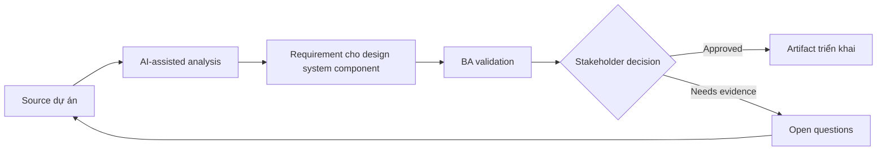

# Requirement cho design system component

<div class="case-meta">
  <span>Frontend, UI, and UX</span>
  <span>Design systems</span>
  <span>Use case dự án</span>
</div>

## Project context

Platform team thêm reusable component cho filter, data table, status chip, action menu và confirmation dialog. Product team cần consistency nhưng vẫn có domain-specific behavior. Trong Design systems, công việc này thường bắt đầu khi screen behavior, accessibility, design state, analytics và user feedback phải thành requirement implement được. BA nên xem Component design và Existing product examples là evidence cần organize, không phải raw material để AI trả lời không kiểm soát. Mục tiêu là làm decision tiếp theo rõ hơn cho người own outcome.

## BA challenge

BA phải tách reusable component requirement khỏi feature-specific requirement. Component behavior nên cover variant, slot, accessibility, validation, event, constraint và phần product team được configure. Với Requirement cho design system component, khó khăn thực tế là missing state và UX không đo được. AI có thể tăng tốc UI-state analysis, content critique, accessibility review, event taxonomy và edge-case discovery, nhưng BA vẫn phải làm rõ assumption, approval còn thiếu và điểm cần stakeholder judgment.

## Where AI fits

<div class="ba-workbench-panel">
AI phù hợp với use case Frontend, UI và UX khi được giới hạn vào UI-state analysis, content critique, accessibility review, event taxonomy và edge-case discovery. AI task hữu ích đầu tiên là: Generate component variant và behavior matrix. AI không được approve scope, invent policy, bỏ qua wireframe, design token, user journey, analytics question và accessibility expectation, hoặc biến draft thành final decision.
</div>

- Generate component variant và behavior matrix.
- Identify feature-specific requirement không nên pollute component.
- Draft configuration option và constraint.
- Tạo documentation question cho design và frontend team.

## Inputs to prepare

- Component design
- Existing product examples
- Design system rules
- Accessibility requirements
- Frontend architecture notes

Trước khi prompt cho Requirement cho design system component, hãy label từng input theo owner, date, approval status, sensitivity và vai trò trong decision. Evidence lens quan trọng nhất là wireframe, design token, user journey, analytics question và accessibility expectation; nếu thiếu, AI có thể xem old note, draft design và approved rule có authority như nhau.

## BA workflow

1. Collect use case từ nhiều product team.
2. Yêu cầu AI tách common behavior khỏi domain-specific behavior.
3. Define component variant, property, event, validation và accessibility.
4. Review configurability với design và frontend.
5. Tạo acceptance criteria và documentation example.
6. Publish adoption guidance và anti-pattern.

Chạy workflow như screen-state review trước frontend build: bắt đầu với "Collect use case từ nhiều product team.", sau đó giữ decision log visible khi artifact tiến tới Component behavior spec. Cách này ngăn suggestion của AI âm thầm trở thành backlog, design, release hoặc operational commitment.

## Diagram



## Deliverables

| Deliverable | Nội dung | Owner | Done signal |
| --- | --- | --- | --- |
| Component behavior spec | Variant, property, event, validation, state và accessibility behavior | Platform BA | Reusable behavior explicit |
| Configuration matrix | Option, allowed value, default, constraint và example | Frontend | Product team biết phần nào đổi được |
| Usage guidance | Khi nào dùng, khi nào không, example và anti-pattern | Design system owner | Adoption consistent |
| Component test scenarios | State, variant, keyboard, accessibility và error scenario | QA | Component test được qua variant |

Hãy xem Component behavior spec là frontend requirement specification do BA own. AI có thể draft structure, nhưng BA phải validate "Reusable behavior explicit" có thật sự đúng không, artifact có trace được về evidence không và receiving team có hành động được không.

## Prompt to try

```text
Hãy đóng vai senior Business Analyst hiểu AI. Hỗ trợ tôi áp dụng use case "Requirement cho design system component" vào dự án. Trước hết hỏi source evidence và constraint. Sau đó tạo structured analysis gồm project context, assumption, AI-fit boundary, workflow step, deliverable, risk, control, open question và stakeholder decision. Không tự bịa policy, threshold hoặc approval.
```

## Review checklist

- Component design được label owner, date, approval status và sensitivity.
- Component behavior spec trace được về source evidence và có human owner rõ.
- AI task nằm trong boundary UI-state analysis, content critique, accessibility review, event taxonomy và edge-case discovery và không approve scope hoặc policy.
- Risk "Over-configurable component" có control thực tế: Define supported variant và constraint.
- Open assumption được chuyển thành validation question hoặc stakeholder decision.
- Success metric: Reusable component có behavior boundary rõ và product team adopt consistent.

## Risks and controls

| Rủi ro | Vì sao quan trọng | Control của BA |
| --- | --- | --- |
| Over-configurable component | Quá nhiều option làm system khó maintain | Define supported variant và constraint |
| Feature leakage | Special rule của một product pollute shared component | Tách common và feature-specific behavior |
| Accessibility drift | Component reuse nhưng thiếu accessible behavior | Bake accessibility vào component spec |
| Adoption confusion | Team có thể recreate component | Provide usage guidance và example |

Control chính cho risk "Over-configurable component" là human accountability explicit: Define supported variant và constraint. Nếu evidence yếu, output nên tạo validation question hoặc decision item, không phải final requirement.
