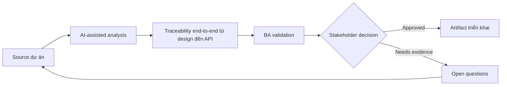

# Traceability end-to-end từ design đến API

<div class="case-meta">
  <span>Cross-functional BA Collaboration</span>
  <span>Traceability</span>
  <span>Cross-functional alignment</span>
  <span>Practitioner</span>
  <span>End-to-end trace matrix</span>
  <span>Use case dự án</span>
</div>

## Project context

Một feature trải qua Figma frame, user story, API contract, database field, analytics event và QA test. Trong delivery, team mất dấu artifact nào own behavior nào. Trong Traceability, công việc này thường bắt đầu khi mỗi role cần artifact khác nhau, nhưng BA phải giữ decision nhất quán giữa product, design, engineering, QA, data và operations. BA nên xem Figma frame list và User stories là evidence cần organize, không phải raw material để AI trả lời không kiểm soát. Mục tiêu là làm decision tiếp theo rõ hơn cho người own outcome.

## BA challenge

BA phải tạo traceability lightweight qua design, frontend behavior, backend contract, data field, analytics và test. Mục tiêu là delivery clarity, không phải documentation overhead. Với Traceability end-to-end từ design đến API, khó khăn thực tế là role misalignment và hidden trade-off. AI có thể tăng tốc role-specific synthesis, decision memo drafting, conflict surfacing và shared artifact critique, nhưng BA vẫn phải làm rõ assumption, approval còn thiếu và điểm cần stakeholder judgment.

## Where AI fits

<div class="ba-workbench-panel">
AI phù hợp với use case Collaboration cross-functional của BA khi được giới hạn vào role-specific synthesis, decision memo drafting, conflict surfacing và shared artifact critique. AI task hữu ích đầu tiên là: Generate trace link giữa design frame, story, API operation và test. AI không được approve scope, invent policy, bỏ qua role feedback, decision log, design note, technical constraint, test concern và support need, hoặc biến draft thành final decision.
</div>

- Generate trace link giữa design frame, story, API operation và test.
- Identify orphan behavior thiếu API hoặc test coverage.
- Draft traceability matrix và gap report.
- Tạo change impact question cho late design/API change.

## Inputs to prepare

- Figma frame list
- User stories
- API contract
- Data mapping
- Test scenarios

Trước khi prompt cho Traceability end-to-end từ design đến API, hãy label từng input theo owner, date, approval status, sensitivity và vai trò trong decision. Evidence lens quan trọng nhất là role feedback, decision log, design note, technical constraint, test concern và support need; nếu thiếu, AI có thể xem old note, draft design và approved rule có authority như nhau.

## BA workflow

1. Define trace dimension: design, story, UI behavior, API, data, analytics và test.
2. Yêu cầu AI propose trace link và confidence.
3. Verify thủ công high-risk link với artifact owner.
4. Identify orphan design element, API behavior chưa test và missing analytics.
5. Update artifact và decision log.
6. Dùng traceability cho change impact và release readiness.

Chạy workflow như cross-role decision alignment trước handoff: bắt đầu với "Define trace dimension: design, story, UI behavior, API, data, analytics và test.", sau đó giữ decision log visible khi artifact tiến tới End-to-end trace matrix. Cách này ngăn suggestion của AI âm thầm trở thành backlog, design, release hoặc operational commitment.

## Diagram



## Deliverables

| Deliverable | Nội dung | Owner | Done signal |
| --- | --- | --- | --- |
| End-to-end trace matrix | Design frame, story, UI behavior, API, data field, analytics và test | BA | Behavior có trace coverage |
| Gap report | Orphan design, missing API, missing test, missing analytics và owner | BA và QA | Gap actionable |
| Change impact checklist | Artifact changed, affected link, owner và update needed | BA | Late change controlled |
| Release trace summary | Coverage, exception, accepted risk và sign-off note | Product owner | Release decision có evidence |

Hãy xem End-to-end trace matrix là collaboration decision artifact do BA own. AI có thể draft structure, nhưng BA phải validate "Behavior có trace coverage" có thật sự đúng không, artifact có trace được về evidence không và receiving team có hành động được không.

## Prompt to try

```text
Hãy đóng vai senior Business Analyst hiểu AI. Hỗ trợ tôi áp dụng use case "Traceability end-to-end từ design đến API" vào dự án. Trước hết hỏi source evidence và constraint. Sau đó tạo structured analysis gồm project context, assumption, AI-fit boundary, workflow step, deliverable, risk, control, open question và stakeholder decision. Không tự bịa policy, threshold hoặc approval.
```

## Review checklist

- Figma frame list được label owner, date, approval status và sensitivity.
- End-to-end trace matrix trace được về source evidence và có human owner rõ.
- AI task nằm trong boundary role-specific synthesis, decision memo drafting, conflict surfacing và shared artifact critique và không approve scope hoặc policy.
- Risk "Traceability overhead" có control thực tế: Trace material behavior và high-risk item.
- Open assumption được chuyển thành validation question hoặc stakeholder decision.
- Success metric: Critical feature behavior traceable từ design qua API, data, analytics và test.

## Risks and controls

| Rủi ro | Vì sao quan trọng | Control của BA |
| --- | --- | --- |
| Traceability overhead | Matrix có thể quá nặng để maintain | Trace material behavior và high-risk item |
| False AI link | AI link artifact theo wording giống, không phải meaning | Verify high-risk link thủ công |
| Orphan design behavior | Design interaction không nằm trong story/API | Identify orphan element |
| Release blind spot | Backend behavior chưa test có thể ship | Dùng trace summary cho readiness |

Control chính cho risk "Traceability overhead" là human accountability explicit: Trace material behavior và high-risk item. Nếu evidence yếu, output nên tạo validation question hoặc decision item, không phải final requirement.
