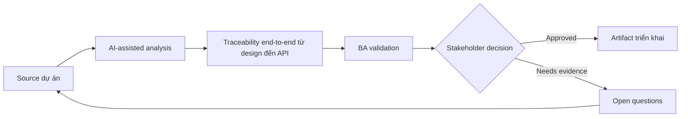

# Traceability end-to-end từ design đến API

<div class="case-meta">
  <span>Cross-functional BA Collaboration</span>
  <span>Traceability</span>
  <span>Use case dự án</span>
</div>

## Project context

Một feature trải qua Figma frame, user story, API contract, database field, analytics event và QA test. Trong delivery, team mất dấu artifact nào own behavior nào. Trong môi trường delivery thật, tình huống này thường xuất hiện dưới áp lực thời gian: stakeholder cần clarity, delivery cần backlog, QA cần behavior test được, operations cần process chịu được exception. BA dùng AI để tăng tốc analysis và synthesis, nhưng BA vẫn chịu trách nhiệm về evidence, business meaning, stakeholder decisioning và artifact quality.

## BA challenge

BA phải tạo traceability lightweight qua design, frontend behavior, backend contract, data field, analytics và test. Mục tiêu là delivery clarity, không phải documentation overhead. Khó khăn thực tế là AI có thể làm material ban đầu trông hoàn chỉnh hơn mức thật sự. BA giỏi giữ output ở trạng thái reviewable bằng cách tách source-backed fact, assumption, unsupported claim, decision gap và recommended next action. Mục tiêu không phải làm document dài hơn; mục tiêu là làm project decision rõ hơn và an toàn hơn.

## Where AI fits

<div class="ba-workbench-panel">
AI hữu ích trong use case này khi được giới hạn vào analysis support, pattern detection, structured drafting và critique. AI không được approve scope, invent policy, quyết định business trade-off hoặc thay thế judgment của stakeholder chịu trách nhiệm.
</div>

- Generate trace link giữa design frame, story, API operation và test.
- Identify orphan behavior thiếu API hoặc test coverage.
- Draft traceability matrix và gap report.
- Tạo change impact question cho late design/API change.

## Inputs to prepare

- Figma frame list
- User stories
- API contract
- Data mapping
- Test scenarios

BA nên label các input này trước khi dùng AI: source owner, source date, approval status, sensitivity level, và source đó là fact, opinion, policy, draft hay historical evidence. Việc chuẩn bị này ngăn model xem mọi input đều current và authoritative như nhau.

## BA workflow

1. Define trace dimension: design, story, UI behavior, API, data, analytics và test.
2. Yêu cầu AI propose trace link và confidence.
3. Verify thủ công high-risk link với artifact owner.
4. Identify orphan design element, API behavior chưa test và missing analytics.
5. Update artifact và decision log.
6. Dùng traceability cho change impact và release readiness.

Workflow hiệu quả nhất khi dùng AI theo từng stage: trước hết organize evidence, sau đó yêu cầu analysis, tiếp theo tạo artifact, rồi chạy critique pass. BA nên giữ decision log visible xuyên suốt để suggestion do AI sinh ra không âm thầm trở thành approved scope.

## Diagram



## Deliverables

| Deliverable | Nội dung | Owner | Done signal |
| --- | --- | --- | --- |
| End-to-end trace matrix | Design frame, story, UI behavior, API, data field, analytics và test | BA | Behavior có trace coverage |
| Gap report | Orphan design, missing API, missing test, missing analytics và owner | BA và QA | Gap actionable |
| Change impact checklist | Artifact changed, affected link, owner và update needed | BA | Late change controlled |
| Release trace summary | Coverage, exception, accepted risk và sign-off note | Product owner | Release decision có evidence |

Các deliverable này nên được xem là artifact do BA own. AI có thể draft, nhưng BA phải validate source support, stakeholder meaning, traceability và artifact đã sẵn sàng handoff hay chưa.

## Prompt to try

```text
Hãy đóng vai senior Business Analyst hiểu AI. Hỗ trợ tôi áp dụng use case "Traceability end-to-end từ design đến API" vào dự án. Trước hết hỏi source evidence và constraint. Sau đó tạo structured analysis gồm project context, assumption, AI-fit boundary, workflow step, deliverable, risk, control, open question và stakeholder decision. Không tự bịa policy, threshold hoặc approval.
```

## Review checklist

- Mọi statement do AI hỗ trợ đều gắn với source, assumption hoặc validation question.
- BA đã tách drafting assistance khỏi business approval.
- Workflow step có human owner cho decision, review và exception.
- Deliverable trace được về project input và review được bởi QA, product hoặc operations.
- Risk control đủ thực tế để dùng trong meeting dự án thật.
- Success metric: Critical feature behavior traceable từ design qua API, data, analytics và test.

## Risks and controls

| Rủi ro | Vì sao quan trọng | Control của BA |
| --- | --- | --- |
| Traceability overhead | Matrix có thể quá nặng để maintain | Trace material behavior và high-risk item |
| False AI link | AI link artifact theo wording giống, không phải meaning | Verify high-risk link thủ công |
| Orphan design behavior | Design interaction không nằm trong story/API | Identify orphan element |
| Release blind spot | Backend behavior chưa test có thể ship | Dùng trace summary cho readiness |

Control quan trọng nhất là làm uncertainty visible. Nếu evidence yếu, output nên tạo validation question hoặc decision item, không phải final requirement. Nếu artifact ảnh hưởng delivery, release, compliance, customer experience hoặc operational workload, BA nên yêu cầu human review explicit trước khi handoff.
