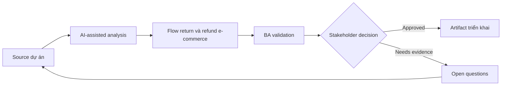

# Flow return và refund e-commerce

<div class="case-meta">
  <span>Domain project scenarios</span>
  <span>E-commerce</span>
  <span>Domain workflow</span>
  <span>Core</span>
  <span>Return eligibility matrix</span>
  <span>Use case dự án</span>
</div>

## Project context

E-commerce platform redesign return và refund flow để giảm support contact. Project gồm eligibility check, return reason capture, shipping label generation, refund timing và exception handling. Trong E-commerce, công việc này thường bắt đầu khi domain policy, operational exception và regulatory expectation quyết định product có thể làm gì an toàn. BA nên xem Return policy và Order state model là evidence cần organize, không phải raw material để AI trả lời không kiểm soát. Mục tiêu là làm decision tiếp theo rõ hơn cho người own outcome.

## BA challenge

BA phải define business rule thay đổi theo product type, order status, region, promotion, payment method và fraud risk. AI có thể expand scenario, nhưng policy decision phải traceable. Với Flow return và refund e-commerce, khó khăn thực tế là policy hallucination và exception blindness. AI có thể tăng tốc domain-rule extraction, exception mapping, safe-message drafting và owner review, nhưng BA vẫn phải làm rõ assumption, approval còn thiếu và điểm cần stakeholder judgment.

## Where AI fits

<div class="ba-workbench-panel">
AI phù hợp với use case Tình huống theo domain khi được giới hạn vào domain-rule extraction, exception mapping, safe-message drafting và owner review. AI task hữu ích đầu tiên là: Generate return scenario từ policy và order state. AI không được approve scope, invent policy, bỏ qua policy source, operational sample, compliance constraint và domain-owner decision, hoặc biến draft thành final decision.
</div>

- Generate return scenario từ policy và order state.
- Identify edge case qua payment, shipping, promotion và inventory.
- Draft customer messaging và support script.
- Tạo rule matrix và acceptance criteria.

## Inputs to prepare

- Return policy
- Order state model
- Payment rules
- Shipping carrier rules
- Support ticket themes

Trước khi prompt cho Flow return và refund e-commerce, hãy label từng input theo owner, date, approval status, sensitivity và vai trò trong decision. Evidence lens quan trọng nhất là policy source, operational sample, compliance constraint và domain-owner decision; nếu thiếu, AI có thể xem old note, draft design và approved rule có authority như nhau.

## BA workflow

1. Map order và return state từ purchase tới refund completion.
2. Yêu cầu AI generate scenario combination và missing rule.
3. Tạo eligibility matrix theo product, region, payment và time window.
4. Review high-impact exception với finance, fraud, logistics và customer support.
5. Draft acceptance criteria cho customer và support experience.
6. Prepare rollout support script và monitoring metric.

Chạy workflow như domain validation trước implementation detail: bắt đầu với "Map order và return state từ purchase tới refund completion.", sau đó giữ decision log visible khi artifact tiến tới Return eligibility matrix. Cách này ngăn suggestion của AI âm thầm trở thành backlog, design, release hoặc operational commitment.

## Diagram



## Deliverables

| Deliverable | Nội dung | Owner | Done signal |
| --- | --- | --- | --- |
| Return eligibility matrix | Condition, rule, source, customer message và exception path | BA | Eligibility rule testable |
| State transition diagram | Order, return, refund, exception và cancellation state | BA và engineering | State change explicit |
| Support script pack | Customer explanation, exception handling và escalation | Support lead | Agent explain được outcome |
| Acceptance criteria set | Positive, negative, boundary và fraud-risk case | BA và QA | Key scenario covered |

Hãy xem Return eligibility matrix là domain-specific requirement pack do BA own. AI có thể draft structure, nhưng BA phải validate "Eligibility rule testable" có thật sự đúng không, artifact có trace được về evidence không và receiving team có hành động được không.

## Prompt to try

```text
Hãy đóng vai senior Business Analyst hiểu AI. Hỗ trợ tôi áp dụng use case "Flow return và refund e-commerce" vào dự án. Trước hết hỏi source evidence và constraint. Sau đó tạo structured analysis gồm project context, assumption, AI-fit boundary, workflow step, deliverable, risk, control, open question và stakeholder decision. Không tự bịa policy, threshold hoặc approval.
```

## Review checklist

- Return policy được label owner, date, approval status và sensitivity.
- Return eligibility matrix trace được về source evidence và có human owner rõ.
- AI task nằm trong boundary domain-rule extraction, exception mapping, safe-message drafting và owner review và không approve scope hoặc policy.
- Risk "Policy conflict" có control thực tế: Dùng source hierarchy và conflict resolution.
- Open assumption được chuyển thành validation question hoặc stakeholder decision.
- Success metric: Customer hoàn thành eligible return với ít support contact hơn và refund expectation rõ hơn.

## Risks and controls

| Rủi ro | Vì sao quan trọng | Control của BA |
| --- | --- | --- |
| Policy conflict | Regional hoặc promotion rule có thể conflict generic policy | Dùng source hierarchy và conflict resolution |
| Refund timing ambiguity | Customer không biết khi nào tiền về | Specify status message và timing theo payment method |
| Fraud loophole | Rule quá đơn giản có thể bị exploit | Include fraud review trigger |
| Inventory mismatch | Return acceptance có thể không align inventory process | Review logistics và warehouse state |

Control chính cho risk "Policy conflict" là human accountability explicit: Dùng source hierarchy và conflict resolution. Nếu evidence yếu, output nên tạo validation question hoặc decision item, không phải final requirement.
