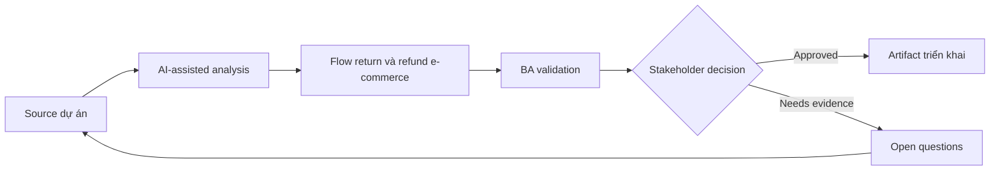

# Flow return và refund e-commerce

<div class="case-meta">
  <span>Domain project scenarios</span>
  <span>E-commerce</span>
  <span>Use case dự án</span>
</div>

## Project context

E-commerce platform redesign return và refund flow để giảm support contact. Project gồm eligibility check, return reason capture, shipping label generation, refund timing và exception handling. Trong môi trường delivery thật, tình huống này thường xuất hiện dưới áp lực thời gian: stakeholder cần clarity, delivery cần backlog, QA cần behavior test được, operations cần process chịu được exception. BA dùng AI để tăng tốc analysis và synthesis, nhưng BA vẫn chịu trách nhiệm về evidence, business meaning, stakeholder decisioning và artifact quality.

## BA challenge

BA phải define business rule thay đổi theo product type, order status, region, promotion, payment method và fraud risk. AI có thể expand scenario, nhưng policy decision phải traceable. Khó khăn thực tế là AI có thể làm material ban đầu trông hoàn chỉnh hơn mức thật sự. BA giỏi giữ output ở trạng thái reviewable bằng cách tách source-backed fact, assumption, unsupported claim, decision gap và recommended next action. Mục tiêu không phải làm document dài hơn; mục tiêu là làm project decision rõ hơn và an toàn hơn.

## Where AI fits

<div class="ba-workbench-panel">
AI hữu ích trong use case này khi được giới hạn vào analysis support, pattern detection, structured drafting và critique. AI không được approve scope, invent policy, quyết định business trade-off hoặc thay thế judgment của stakeholder chịu trách nhiệm.
</div>

- Generate return scenario từ policy và order state.
- Identify edge case qua payment, shipping, promotion và inventory.
- Draft customer messaging và support script.
- Tạo rule matrix và acceptance criteria.

## Inputs to prepare

- Return policy
- Order state model
- Payment rules
- Shipping carrier rules
- Support ticket themes

BA nên label các input này trước khi dùng AI: source owner, source date, approval status, sensitivity level, và source đó là fact, opinion, policy, draft hay historical evidence. Việc chuẩn bị này ngăn model xem mọi input đều current và authoritative như nhau.

## BA workflow

1. Map order và return state từ purchase tới refund completion.
2. Yêu cầu AI generate scenario combination và missing rule.
3. Tạo eligibility matrix theo product, region, payment và time window.
4. Review high-impact exception với finance, fraud, logistics và customer support.
5. Draft acceptance criteria cho customer và support experience.
6. Prepare rollout support script và monitoring metric.

Workflow hiệu quả nhất khi dùng AI theo từng stage: trước hết organize evidence, sau đó yêu cầu analysis, tiếp theo tạo artifact, rồi chạy critique pass. BA nên giữ decision log visible xuyên suốt để suggestion do AI sinh ra không âm thầm trở thành approved scope.

## Diagram



## Deliverables

| Deliverable | Nội dung | Owner | Done signal |
| --- | --- | --- | --- |
| Return eligibility matrix | Condition, rule, source, customer message và exception path | BA | Eligibility rule testable |
| State transition diagram | Order, return, refund, exception và cancellation state | BA và engineering | State change explicit |
| Support script pack | Customer explanation, exception handling và escalation | Support lead | Agent explain được outcome |
| Acceptance criteria set | Positive, negative, boundary và fraud-risk case | BA và QA | Key scenario covered |

Các deliverable này nên được xem là artifact do BA own. AI có thể draft, nhưng BA phải validate source support, stakeholder meaning, traceability và artifact đã sẵn sàng handoff hay chưa.

## Prompt to try

```text
Hãy đóng vai senior Business Analyst hiểu AI. Hỗ trợ tôi áp dụng use case "Flow return và refund e-commerce" vào dự án. Trước hết hỏi source evidence và constraint. Sau đó tạo structured analysis gồm project context, assumption, AI-fit boundary, workflow step, deliverable, risk, control, open question và stakeholder decision. Không tự bịa policy, threshold hoặc approval.
```

## Review checklist

- Mọi statement do AI hỗ trợ đều gắn với source, assumption hoặc validation question.
- BA đã tách drafting assistance khỏi business approval.
- Workflow step có human owner cho decision, review và exception.
- Deliverable trace được về project input và review được bởi QA, product hoặc operations.
- Risk control đủ thực tế để dùng trong meeting dự án thật.
- Success metric: Customer hoàn thành eligible return với ít support contact hơn và refund expectation rõ hơn.

## Risks and controls

| Rủi ro | Vì sao quan trọng | Control của BA |
| --- | --- | --- |
| Policy conflict | Regional hoặc promotion rule có thể conflict generic policy | Dùng source hierarchy và conflict resolution |
| Refund timing ambiguity | Customer không biết khi nào tiền về | Specify status message và timing theo payment method |
| Fraud loophole | Rule quá đơn giản có thể bị exploit | Include fraud review trigger |
| Inventory mismatch | Return acceptance có thể không align inventory process | Review logistics và warehouse state |

Control quan trọng nhất là làm uncertainty visible. Nếu evidence yếu, output nên tạo validation question hoặc decision item, không phải final requirement. Nếu artifact ảnh hưởng delivery, release, compliance, customer experience hoặc operational workload, BA nên yêu cầu human review explicit trước khi handoff.
