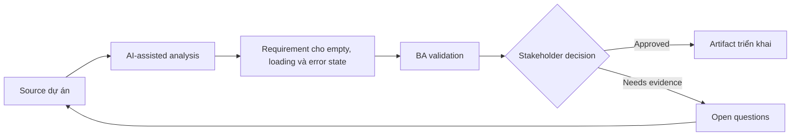

# Requirement cho empty, loading và error state

<div class="case-meta">
  <span>Frontend, UI, and UX</span>
  <span>UI states</span>
  <span>Use case dự án</span>
</div>

## Project context

Reporting page phụ thuộc nhiều API. Story ban đầu cover hiển thị data, nhưng chưa nói user thấy gì khi data missing, loading chậm, partial unavailable hoặc bị permission block. Trong môi trường delivery thật, tình huống này thường xuất hiện dưới áp lực thời gian: stakeholder cần clarity, delivery cần backlog, QA cần behavior test được, operations cần process chịu được exception. BA dùng AI để tăng tốc analysis và synthesis, nhưng BA vẫn chịu trách nhiệm về evidence, business meaning, stakeholder decisioning và artifact quality.

## BA challenge

BA phải define UI state ngoài happy path như functional requirement. Các state này ảnh hưởng trust, support volume và perceived quality, đặc biệt khi backend service chậm hoặc unavailable. Khó khăn thực tế là AI có thể làm material ban đầu trông hoàn chỉnh hơn mức thật sự. BA giỏi giữ output ở trạng thái reviewable bằng cách tách source-backed fact, assumption, unsupported claim, decision gap và recommended next action. Mục tiêu không phải làm document dài hơn; mục tiêu là làm project decision rõ hơn và an toàn hơn.

## Where AI fits

<div class="ba-workbench-panel">
AI hữu ích trong use case này khi được giới hạn vào analysis support, pattern detection, structured drafting và critique. AI không được approve scope, invent policy, quyết định business trade-off hoặc thay thế judgment của stakeholder chịu trách nhiệm.
</div>

- Generate state coverage cho loading, empty, error, permission, partial, stale và retry state.
- Draft user-facing copy cho từng state.
- Identify backend signal cần để phân biệt state.
- Tạo acceptance criteria cho skeleton, retry và fallback message.

## Inputs to prepare

- Screen design
- API dependency list
- Permission rules
- Service reliability notes
- Support ticket examples

BA nên label các input này trước khi dùng AI: source owner, source date, approval status, sensitivity level, và source đó là fact, opinion, policy, draft hay historical evidence. Việc chuẩn bị này ngăn model xem mọi input đều current và authoritative như nhau.

## BA workflow

1. List từng data dependency và response condition có thể xảy ra.
2. Yêu cầu AI generate UI state matrix và missing signal.
3. Define copy, icon, action, retry và escalation cho từng state.
4. Review backend feasibility cho partial và stale data signal.
5. Viết acceptance criteria cho slow loading, empty data, failure, permission và partial result.
6. Thêm analytics event cho state frequency và user retry behavior.

Workflow hiệu quả nhất khi dùng AI theo từng stage: trước hết organize evidence, sau đó yêu cầu analysis, tiếp theo tạo artifact, rồi chạy critique pass. BA nên giữ decision log visible xuyên suốt để suggestion do AI sinh ra không âm thầm trở thành approved scope.

## Diagram



## Deliverables

| Deliverable | Nội dung | Owner | Done signal |
| --- | --- | --- | --- |
| UI state matrix | State, trigger, backend signal, copy, user action và analytics | BA | Mọi non-happy path có behavior |
| Fallback copy set | Empty, error, permission, stale và retry message | UX writer | Message rõ và actionable |
| Backend signal list | Status, error code, freshness và partial result indicator | Backend lead | Frontend phân biệt được state |
| QA scenario list | Slow API, no data, partial data, error, permission và retry | QA | Non-happy path được test |

Các deliverable này nên được xem là artifact do BA own. AI có thể draft, nhưng BA phải validate source support, stakeholder meaning, traceability và artifact đã sẵn sàng handoff hay chưa.

## Prompt to try

```text
Hãy đóng vai senior Business Analyst hiểu AI. Hỗ trợ tôi áp dụng use case "Requirement cho empty, loading và error state" vào dự án. Trước hết hỏi source evidence và constraint. Sau đó tạo structured analysis gồm project context, assumption, AI-fit boundary, workflow step, deliverable, risk, control, open question và stakeholder decision. Không tự bịa policy, threshold hoặc approval.
```

## Review checklist

- Mọi statement do AI hỗ trợ đều gắn với source, assumption hoặc validation question.
- BA đã tách drafting assistance khỏi business approval.
- Workflow step có human owner cho decision, review và exception.
- Deliverable trace được về project input và review được bởi QA, product hoặc operations.
- Risk control đủ thực tế để dùng trong meeting dự án thật.
- Success metric: User nhận guidance rõ theo từng state và QA cover UI behavior ngoài happy path.

## Risks and controls

| Rủi ro | Vì sao quan trọng | Control của BA |
| --- | --- | --- |
| Generic error message | User không recover hoặc hiểu chuyện gì xảy ra | Dùng state-specific copy và action |
| Backend signal gap | Frontend không phân biệt no data với failure | Specify response signal và error code |
| Support burden | State không rõ tạo ticket | Thêm recovery instruction và status visibility |
| Untested partial data | Page có thể vỡ khi một API fail | Thêm partial availability scenario |

Control quan trọng nhất là làm uncertainty visible. Nếu evidence yếu, output nên tạo validation question hoặc decision item, không phải final requirement. Nếu artifact ảnh hưởng delivery, release, compliance, customer experience hoặc operational workload, BA nên yêu cầu human review explicit trước khi handoff.
