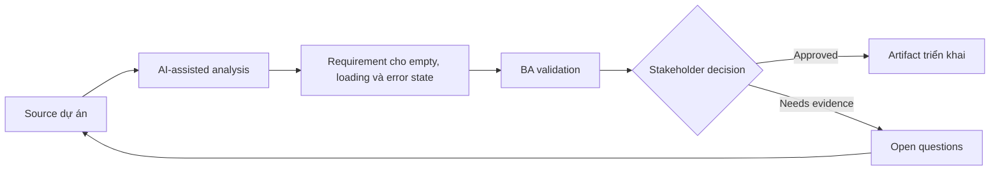

# Requirement cho empty, loading và error state

<div class="case-meta">
  <span>Frontend, UI, and UX</span>
  <span>UI states</span>
  <span>Frontend/UI refinement</span>
  <span>Practitioner</span>
  <span>UI state matrix</span>
  <span>Use case dự án</span>
</div>

## Project context

Reporting page phụ thuộc nhiều API. Story ban đầu cover hiển thị data, nhưng chưa nói user thấy gì khi data missing, loading chậm, partial unavailable hoặc bị permission block. Trong UI states, công việc này thường bắt đầu khi screen behavior, accessibility, design state, analytics và user feedback phải thành requirement implement được. BA nên xem Screen design và API dependency list là evidence cần organize, không phải raw material để AI trả lời không kiểm soát. Mục tiêu là làm decision tiếp theo rõ hơn cho người own outcome.

## BA challenge

BA phải define UI state ngoài happy path như functional requirement. Các state này ảnh hưởng trust, support volume và perceived quality, đặc biệt khi backend service chậm hoặc unavailable. Với Requirement cho empty, loading và error state, khó khăn thực tế là missing state và UX không đo được. AI có thể tăng tốc UI-state analysis, content critique, accessibility review, event taxonomy và edge-case discovery, nhưng BA vẫn phải làm rõ assumption, approval còn thiếu và điểm cần stakeholder judgment.

## Where AI fits

<div class="ba-workbench-panel">
AI phù hợp với use case Frontend, UI và UX khi được giới hạn vào UI-state analysis, content critique, accessibility review, event taxonomy và edge-case discovery. AI task hữu ích đầu tiên là: Generate state coverage cho loading, empty, error, permission, partial, stale và retry state. AI không được approve scope, invent policy, bỏ qua wireframe, design token, user journey, analytics question và accessibility expectation, hoặc biến draft thành final decision.
</div>

- Generate state coverage cho loading, empty, error, permission, partial, stale và retry state.
- Draft user-facing copy cho từng state.
- Identify backend signal cần để phân biệt state.
- Tạo acceptance criteria cho skeleton, retry và fallback message.

## Inputs to prepare

- Screen design
- API dependency list
- Permission rules
- Service reliability notes
- Support ticket examples

Trước khi prompt cho Requirement cho empty, loading và error state, hãy label từng input theo owner, date, approval status, sensitivity và vai trò trong decision. Evidence lens quan trọng nhất là wireframe, design token, user journey, analytics question và accessibility expectation; nếu thiếu, AI có thể xem old note, draft design và approved rule có authority như nhau.

## BA workflow

1. List từng data dependency và response condition có thể xảy ra.
2. Yêu cầu AI generate UI state matrix và missing signal.
3. Define copy, icon, action, retry và escalation cho từng state.
4. Review backend feasibility cho partial và stale data signal.
5. Viết acceptance criteria cho slow loading, empty data, failure, permission và partial result.
6. Thêm analytics event cho state frequency và user retry behavior.

Chạy workflow như screen-state review trước frontend build: bắt đầu với "List từng data dependency và response condition có thể xảy ra.", sau đó giữ decision log visible khi artifact tiến tới UI state matrix. Cách này ngăn suggestion của AI âm thầm trở thành backlog, design, release hoặc operational commitment.

## Diagram



## Deliverables

| Deliverable | Nội dung | Owner | Done signal |
| --- | --- | --- | --- |
| UI state matrix | State, trigger, backend signal, copy, user action và analytics | BA | Mọi non-happy path có behavior |
| Fallback copy set | Empty, error, permission, stale và retry message | UX writer | Message rõ và actionable |
| Backend signal list | Status, error code, freshness và partial result indicator | Backend lead | Frontend phân biệt được state |
| QA scenario list | Slow API, no data, partial data, error, permission và retry | QA | Non-happy path được test |

Hãy xem UI state matrix là frontend requirement specification do BA own. AI có thể draft structure, nhưng BA phải validate "Mọi non-happy path có behavior" có thật sự đúng không, artifact có trace được về evidence không và receiving team có hành động được không.

## Prompt to try

```text
Hãy đóng vai senior Business Analyst hiểu AI. Hỗ trợ tôi áp dụng use case "Requirement cho empty, loading và error state" vào dự án. Trước hết hỏi source evidence và constraint. Sau đó tạo structured analysis gồm project context, assumption, AI-fit boundary, workflow step, deliverable, risk, control, open question và stakeholder decision. Không tự bịa policy, threshold hoặc approval.
```

## Review checklist

- Screen design được label owner, date, approval status và sensitivity.
- UI state matrix trace được về source evidence và có human owner rõ.
- AI task nằm trong boundary UI-state analysis, content critique, accessibility review, event taxonomy và edge-case discovery và không approve scope hoặc policy.
- Risk "Generic error message" có control thực tế: Dùng state-specific copy và action.
- Open assumption được chuyển thành validation question hoặc stakeholder decision.
- Success metric: User nhận guidance rõ theo từng state và QA cover UI behavior ngoài happy path.

## Risks and controls

| Rủi ro | Vì sao quan trọng | Control của BA |
| --- | --- | --- |
| Generic error message | User không recover hoặc hiểu chuyện gì xảy ra | Dùng state-specific copy và action |
| Backend signal gap | Frontend không phân biệt no data với failure | Specify response signal và error code |
| Support burden | State không rõ tạo ticket | Thêm recovery instruction và status visibility |
| Untested partial data | Page có thể vỡ khi một API fail | Thêm partial availability scenario |

Control chính cho risk "Generic error message" là human accountability explicit: Dùng state-specific copy và action. Nếu evidence yếu, output nên tạo validation question hoặc decision item, không phải final requirement.
