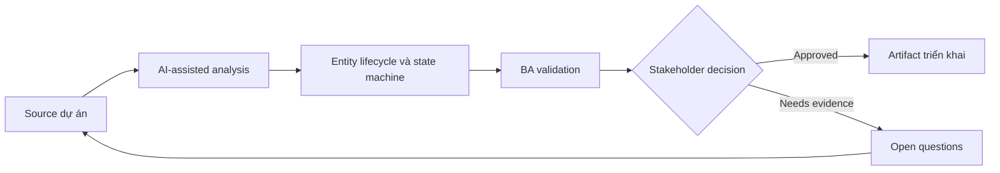

# Entity lifecycle và state machine

<div class="case-meta">
  <span>Data and Integration</span>
  <span>Entity lifecycle</span>
  <span>Use case dự án</span>
</div>

## Project context

Subscription entity đi qua state trial, active, suspended, cancelled, expired và reactivated. Các team chưa thống nhất allowed transition và event nào trigger từng change. Trong môi trường delivery thật, tình huống này thường xuất hiện dưới áp lực thời gian: stakeholder cần clarity, delivery cần backlog, QA cần behavior test được, operations cần process chịu được exception. BA dùng AI để tăng tốc analysis và synthesis, nhưng BA vẫn chịu trách nhiệm về evidence, business meaning, stakeholder decisioning và artifact quality.

## BA challenge

BA phải specify lifecycle state và transition để UI, backend, API, reporting, billing và support dùng cùng một model. Khó khăn thực tế là AI có thể làm material ban đầu trông hoàn chỉnh hơn mức thật sự. BA giỏi giữ output ở trạng thái reviewable bằng cách tách source-backed fact, assumption, unsupported claim, decision gap và recommended next action. Mục tiêu không phải làm document dài hơn; mục tiêu là làm project decision rõ hơn và an toàn hơn.

## Where AI fits

<div class="ba-workbench-panel">
AI hữu ích trong use case này khi được giới hạn vào analysis support, pattern detection, structured drafting và critique. AI không được approve scope, invent policy, quyết định business trade-off hoặc thay thế judgment của stakeholder chịu trách nhiệm.
</div>

- Generate state machine từ process notes.
- Identify missing transition, invalid transition và terminal state.
- Draft transition rule và event trigger.
- Tạo test scenario theo state và transition.

## Inputs to prepare

- Lifecycle notes
- Billing rules
- Support scripts
- API events
- Reporting definitions

BA nên label các input này trước khi dùng AI: source owner, source date, approval status, sensitivity level, và source đó là fact, opinion, policy, draft hay historical evidence. Việc chuẩn bị này ngăn model xem mọi input đều current và authoritative như nhau.

## BA workflow

1. List mọi known state và synonym team đang dùng.
2. Yêu cầu AI propose state machine và transition gap.
3. Define allowed transition, trigger, actor, validation, audit và side effect.
4. Review downstream impact lên UI, billing, reporting và notification.
5. Viết acceptance criteria cho valid và invalid transition.
6. Publish lifecycle model và update glossary.

Workflow hiệu quả nhất khi dùng AI theo từng stage: trước hết organize evidence, sau đó yêu cầu analysis, tiếp theo tạo artifact, rồi chạy critique pass. BA nên giữ decision log visible xuyên suốt để suggestion do AI sinh ra không âm thầm trở thành approved scope.

## Diagram



## Deliverables

| Deliverable | Nội dung | Owner | Done signal |
| --- | --- | --- | --- |
| State model | State, definition, entry rule, exit rule và terminal status | BA | State có shared meaning |
| Transition table | From, to, trigger, actor, validation, side effect và audit | Backend và BA | Transition enforceable |
| Impact map | State impact lên UI, API, billing, reporting và support | Product owner | Downstream behavior aligned |
| Transition test set | Valid transition, invalid transition và edge case | QA | State machine testable |

Các deliverable này nên được xem là artifact do BA own. AI có thể draft, nhưng BA phải validate source support, stakeholder meaning, traceability và artifact đã sẵn sàng handoff hay chưa.

## Prompt to try

```text
Hãy đóng vai senior Business Analyst hiểu AI. Hỗ trợ tôi áp dụng use case "Entity lifecycle và state machine" vào dự án. Trước hết hỏi source evidence và constraint. Sau đó tạo structured analysis gồm project context, assumption, AI-fit boundary, workflow step, deliverable, risk, control, open question và stakeholder decision. Không tự bịa policy, threshold hoặc approval.
```

## Review checklist

- Mọi statement do AI hỗ trợ đều gắn với source, assumption hoặc validation question.
- BA đã tách drafting assistance khỏi business approval.
- Workflow step có human owner cho decision, review và exception.
- Deliverable trace được về project input và review được bởi QA, product hoặc operations.
- Risk control đủ thực tế để dùng trong meeting dự án thật.
- Success metric: Lifecycle behavior shared giữa UI, backend, API, reporting và operations.

## Risks and controls

| Rủi ro | Vì sao quan trọng | Control của BA |
| --- | --- | --- |
| State synonym confusion | Team khác dùng tên khác cho cùng state | Tạo glossary và state definition |
| Invalid transition | System có thể allow lifecycle move impossible | Define và test invalid transition |
| Side-effect gap | Notification hoặc billing không update | Map downstream impact |
| Reporting mismatch | Report count state khác nhau | Align reporting definition với state model |

Control quan trọng nhất là làm uncertainty visible. Nếu evidence yếu, output nên tạo validation question hoặc decision item, không phải final requirement. Nếu artifact ảnh hưởng delivery, release, compliance, customer experience hoặc operational workload, BA nên yêu cầu human review explicit trước khi handoff.
