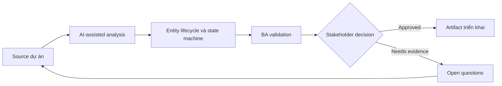

# Entity lifecycle và state machine

<div class="case-meta">
  <span>Data and Integration</span>
  <span>Entity lifecycle</span>
  <span>Data and integration</span>
  <span>Advanced</span>
  <span>State model</span>
  <span>Use case dự án</span>
</div>

## Project context

Subscription entity đi qua state trial, active, suspended, cancelled, expired và reactivated. Các team chưa thống nhất allowed transition và event nào trigger từng change. Trong Entity lifecycle, công việc này thường bắt đầu khi data movement, mapping, reconciliation, privacy và lineage decision ảnh hưởng nhiều system và owner. BA nên xem Lifecycle notes và Billing rules là evidence cần organize, không phải raw material để AI trả lời không kiểm soát. Mục tiêu là làm decision tiếp theo rõ hơn cho người own outcome.

## BA challenge

BA phải specify lifecycle state và transition để UI, backend, API, reporting, billing và support dùng cùng một model. Với Entity lifecycle và state machine, khó khăn thực tế là silent data loss và lineage yếu. AI có thể tăng tốc field mapping, rule comparison, reconciliation design, lineage review và exception analysis, nhưng BA vẫn phải làm rõ assumption, approval còn thiếu và điểm cần stakeholder judgment.

## Where AI fits

<div class="ba-workbench-panel">
AI phù hợp với use case Data và Integration khi được giới hạn vào field mapping, rule comparison, reconciliation design, lineage review và exception analysis. AI task hữu ích đầu tiên là: Generate state machine từ process notes. AI không được approve scope, invent policy, bỏ qua source schema, sample payload, mapping rule, data-quality report và ownership matrix, hoặc biến draft thành final decision.
</div>

- Generate state machine từ process notes.
- Identify missing transition, invalid transition và terminal state.
- Draft transition rule và event trigger.
- Tạo test scenario theo state và transition.

## Inputs to prepare

- Lifecycle notes
- Billing rules
- Support scripts
- API events
- Reporting definitions

Trước khi prompt cho Entity lifecycle và state machine, hãy label từng input theo owner, date, approval status, sensitivity và vai trò trong decision. Evidence lens quan trọng nhất là source schema, sample payload, mapping rule, data-quality report và ownership matrix; nếu thiếu, AI có thể xem old note, draft design và approved rule có authority như nhau.

## BA workflow

1. List mọi known state và synonym team đang dùng.
2. Yêu cầu AI propose state machine và transition gap.
3. Define allowed transition, trigger, actor, validation, audit và side effect.
4. Review downstream impact lên UI, billing, reporting và notification.
5. Viết acceptance criteria cho valid và invalid transition.
6. Publish lifecycle model và update glossary.

Chạy workflow như data contract review trước integration build: bắt đầu với "List mọi known state và synonym team đang dùng.", sau đó giữ decision log visible khi artifact tiến tới State model. Cách này ngăn suggestion của AI âm thầm trở thành backlog, design, release hoặc operational commitment.

## Diagram



## Deliverables

| Deliverable | Nội dung | Owner | Done signal |
| --- | --- | --- | --- |
| State model | State, definition, entry rule, exit rule và terminal status | BA | State có shared meaning |
| Transition table | From, to, trigger, actor, validation, side effect và audit | Backend và BA | Transition enforceable |
| Impact map | State impact lên UI, API, billing, reporting và support | Product owner | Downstream behavior aligned |
| Transition test set | Valid transition, invalid transition và edge case | QA | State machine testable |

Hãy xem State model là data and integration control pack do BA own. AI có thể draft structure, nhưng BA phải validate "State có shared meaning" có thật sự đúng không, artifact có trace được về evidence không và receiving team có hành động được không.

## Prompt to try

```text
Hãy đóng vai senior Business Analyst hiểu AI. Hỗ trợ tôi áp dụng use case "Entity lifecycle và state machine" vào dự án. Trước hết hỏi source evidence và constraint. Sau đó tạo structured analysis gồm project context, assumption, AI-fit boundary, workflow step, deliverable, risk, control, open question và stakeholder decision. Không tự bịa policy, threshold hoặc approval.
```

## Review checklist

- Lifecycle notes được label owner, date, approval status và sensitivity.
- State model trace được về source evidence và có human owner rõ.
- AI task nằm trong boundary field mapping, rule comparison, reconciliation design, lineage review và exception analysis và không approve scope hoặc policy.
- Risk "State synonym confusion" có control thực tế: Tạo glossary và state definition.
- Open assumption được chuyển thành validation question hoặc stakeholder decision.
- Success metric: Lifecycle behavior shared giữa UI, backend, API, reporting và operations.

## Risks and controls

| Rủi ro | Vì sao quan trọng | Control của BA |
| --- | --- | --- |
| State synonym confusion | Team khác dùng tên khác cho cùng state | Tạo glossary và state definition |
| Invalid transition | System có thể allow lifecycle move impossible | Define và test invalid transition |
| Side-effect gap | Notification hoặc billing không update | Map downstream impact |
| Reporting mismatch | Report count state khác nhau | Align reporting definition với state model |

Control chính cho risk "State synonym confusion" là human accountability explicit: Tạo glossary và state definition. Nếu evidence yếu, output nên tạo validation question hoặc decision item, không phải final requirement.
